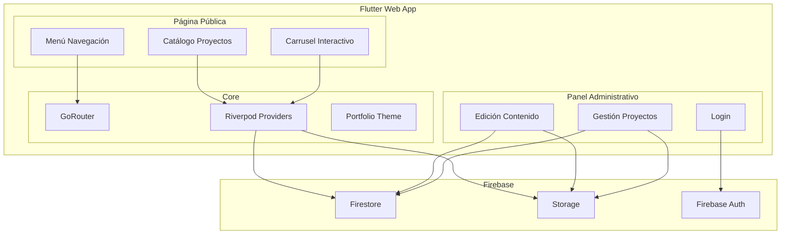

# Documento de Diseño: Flutter Portfolio CMS

## Overview

Este documento describe la arquitectura técnica para un portafolio web en Flutter con CMS integrado. La aplicación se compone de dos áreas: una **Página Pública** para visitantes (con menú de navegación, carrusel interactivo y catálogo de proyectos) y un **Panel Administrativo** protegido por autenticación para gestionar todo el contenido editable.

El diseño se integra al proyecto Flutter existente (`delivery_app`) que ya utiliza:
- **Riverpod** para gestión de estado
- **GoRouter** para navegación y guards de autenticación
- **Glados** para property-based testing
- **Material 3** como sistema de diseño base

La nueva funcionalidad del portafolio se implementará como un módulo independiente dentro del mismo proyecto, reutilizando la infraestructura existente de routing, providers y testing.

### Decisiones de Diseño Clave

| Decisión | Justificación |
|----------|---------------|
| Firebase como backend | Hosting web gratuito, Firestore para datos, Storage para imágenes, Auth para autenticación — todo integrado con Flutter |
| Riverpod + StateNotifier | Consistente con el patrón existente del proyecto; permite reactividad y testabilidad |
| Módulo separado `portfolio/` | Aislamiento del código del portafolio sin afectar la app de delivery existente |
| Paleta pastel como tema alternativo | Se crea un `PortfolioTheme` independiente del `AppTheme` oscuro existente |

## Architecture



### Capas de la Arquitectura

1. **Presentación** (`screens/portfolio/`): Widgets de UI para página pública y panel admin
2. **Estado** (`providers/portfolio/`): Riverpod providers para datos reactivos
3. **Dominio** (`models/portfolio/`): Modelos de datos (Project, EditableContent, CarouselItem)
4. **Datos** (`repositories/portfolio/`): Repositorios abstractos con implementaciones Firebase
5. **Infraestructura** (`core/`): Router, tema, constantes del portafolio

## Components and Interfaces

### Modelos de Dominio

```dart
/// Proyecto del portafolio
class PortfolioProject {
  final String id;
  final String title;          // max 100 chars
  final String description;    // max 500 chars
  final String mainImageUrl;
  final List<String> additionalImageUrls; // max 5
  final String? externalLink;
  final List<String> technologies;
  final bool isFeatured;       // aparece en carrusel
  final DateTime createdAt;
  final DateTime updatedAt;
}

/// Elemento del carrusel
class CarouselItem {
  final String projectId;
  final String title;          // max 60 chars (display)
  final String description;    // max 200 chars (display)
  final String imageUrl;
  final int order;
}

/// Contenido editable de la página
class EditableContent {
  final String id;
  final String section;        // e.g., "hero", "about", "footer"
  final String key;            // e.g., "title", "subtitle", "description"
  final String value;
  final ContentType type;      // text, image, title
  final DateTime updatedAt;
}

enum ContentType { text, image, title }
```

### Repositorios

```dart
/// Interfaz para gestión de proyectos
abstract class PortfolioProjectRepository {
  Future<List<PortfolioProject>> getAllProjects();
  Future<List<PortfolioProject>> getFeaturedProjects();
  Future<PortfolioProject?> getProjectById(String id);
  Future<void> createProject(PortfolioProject project);
  Future<void> updateProject(PortfolioProject project);
  Future<void> deleteProject(String id);
}

/// Interfaz para contenido editable
abstract class EditableContentRepository {
  Future<List<EditableContent>> getAllContent();
  Future<List<EditableContent>> getContentBySection(String section);
  Future<void> updateContent(EditableContent content);
}

/// Interfaz para almacenamiento de imágenes
abstract class ImageStorageRepository {
  Future<String> uploadImage(Uint8List bytes, String filename);
  Future<void> deleteImage(String url);
  Future<bool> validateImage(Uint8List bytes, String filename);
}
```

### Providers (Riverpod)

```dart
/// Provider de proyectos
final allProjectsProvider = StreamProvider<List<PortfolioProject>>((ref) {
  return ref.watch(projectRepositoryProvider).watchAllProjects();
});

final featuredProjectsProvider = StreamProvider<List<PortfolioProject>>((ref) {
  return ref.watch(projectRepositoryProvider).watchFeaturedProjects();
});

/// Provider de contenido editable
final editableContentProvider = StreamProvider.family<List<EditableContent>, String>((ref, section) {
  return ref.watch(contentRepositoryProvider).watchContentBySection(section);
});

/// Provider de autenticación del portafolio
final portfolioAuthProvider = StateNotifierProvider<PortfolioAuthNotifier, PortfolioAuthState>((ref) {
  return PortfolioAuthNotifier(ref.watch(firebaseAuthProvider));
});
```

### Componentes de UI Principales

| Componente | Responsabilidad |
|-----------|----------------|
| `PortfolioNavBar` | Menú fijo con enlaces, colapsa a hamburguesa en móvil |
| `InteractiveCarousel` | Carrusel con auto-avance, gestos, indicadores |
| `ProjectCatalog` | Grid/lista responsiva de proyectos |
| `ProjectDetailView` | Vista completa de un proyecto |
| `AdminProjectForm` | Formulario CRUD de proyectos |
| `ContentEditorPanel` | Editor de contenido por secciones |
| `PortfolioLoginScreen` | Formulario de autenticación con bloqueo |

## Data Models

### Firestore Collections

```
portfolio_projects/
  ├── {projectId}
  │   ├── title: string
  │   ├── description: string
  │   ├── mainImageUrl: string
  │   ├── additionalImageUrls: string[]
  │   ├── externalLink: string?
  │   ├── technologies: string[]
  │   ├── isFeatured: boolean
  │   ├── featuredOrder: number
  │   ├── createdAt: timestamp
  │   └── updatedAt: timestamp

editable_content/
  ├── {contentId}
  │   ├── section: string
  │   ├── key: string
  │   ├── value: string
  │   ├── type: string (text|image|title)
  │   └── updatedAt: timestamp

auth_attempts/
  ├── {attemptId}
  │   ├── timestamp: timestamp
  │   ├── success: boolean
  │   └── ipAddress: string
```

### Firebase Storage Structure

```
portfolio/
  ├── projects/
  │   ├── {projectId}/
  │   │   ├── main.{ext}
  │   │   └── additional_{index}.{ext}
  └── content/
      └── {section}/
          └── {key}.{ext}
```

### Validaciones de Datos

| Campo | Restricción | Validación |
|-------|-------------|------------|
| Project.title | max 100 chars | Requerido, no vacío, trim whitespace |
| Project.description | max 500 chars | Requerido, no vacío |
| CarouselItem.title | max 60 chars | Derivado de Project.title truncado |
| CarouselItem.description | max 200 chars | Derivado de Project.description truncado |
| Catalog description | max 150 chars | Truncado en UI |
| Image format | PNG, JPG, WebP | Validación de extensión y magic bytes |
| Image size | max 5 MB | Validación antes de upload |
| Featured projects | 1-10 | Validación en admin al marcar |
| Additional images | max 5 per project | Validación en formulario |

### Estado de Autenticación

```dart
class PortfolioAuthState {
  final bool isAuthenticated;
  final int failedAttempts;
  final DateTime? lockoutUntil;
  final String? redirectAfterLogin;
}
```

- Sesión expira tras 60 minutos de inactividad
- Bloqueo de 15 minutos tras 5 intentos fallidos consecutivos
- Mensaje genérico de error (no revela qué campo falló)

## Correctness Properties

*A property is a characteristic or behavior that should hold true across all valid executions of a system — essentially, a formal statement about what the system should do. Properties serve as the bridge between human-readable specifications and machine-verifiable correctness guarantees.*

### Property 1: Carousel displays exactly featured projects

*For any* list of portfolio projects where some are marked as featured, the carousel SHALL display exactly and only the projects with `isFeatured == true`, and the count of displayed items SHALL be between 1 and 10 inclusive.

**Validates: Requirements 2.1**

### Property 2: Carousel text truncation

*For any* portfolio project with a title of arbitrary length and a description of arbitrary length, when displayed in the carousel, the rendered title SHALL have at most 60 characters and the rendered description SHALL have at most 200 characters, and if the original text was within limits it SHALL be preserved unchanged.

**Validates: Requirements 2.3**

### Property 3: Cyclic carousel advance

*For any* carousel with N items (1 ≤ N ≤ 10) and current position index i (0 ≤ i < N), advancing to the next item SHALL produce position (i + 1) % N, ensuring the carousel cycles back to the first item after the last.

**Validates: Requirements 2.4**

### Property 4: Carousel position indicator correctness

*For any* carousel with N items at current position i, the position indicator SHALL report the current item as (i + 1) and the total as N, where 1 ≤ (i + 1) ≤ N.

**Validates: Requirements 2.7**

### Property 5: Catalog completeness

*For any* set of registered projects in the system, the catalog SHALL display exactly all projects — no project is missing and no extra project appears that is not in the data source.

**Validates: Requirements 3.1**

### Property 6: Catalog description truncation

*For any* project with a description of arbitrary length, when displayed in the catalog list view, the description SHALL be truncated to at most 150 characters, and if the original was within 150 characters it SHALL be preserved unchanged.

**Validates: Requirements 3.2**

### Property 7: Project detail view completeness

*For any* portfolio project, the detail view SHALL contain the project's title, full untruncated description, all associated image URLs (main + additional), and all metadata fields (technologies, external link).

**Validates: Requirements 3.3**

### Property 8: Authentication correctness

*For any* credential pair, the authentication function SHALL return success if and only if the credentials match the stored valid credentials, and for any invalid credential pair the error message SHALL be identical regardless of whether the username, password, or both are incorrect.

**Validates: Requirements 4.1, 4.2**

### Property 9: Auth guard redirect

*For any* admin route path and any authentication state, if the user is not authenticated the router SHALL redirect to the login route, and if the session has expired (inactivity > 60 minutes) the redirect SHALL preserve the original route path as a return URL parameter.

**Validates: Requirements 4.3, 4.4**

### Property 10: Account lockout after consecutive failures

*For any* sequence of login attempts, if there are 5 or more consecutive failed attempts, the system SHALL enter a locked state that rejects all login attempts for 15 minutes, and a successful login at any point before reaching 5 failures SHALL reset the failure counter to zero.

**Validates: Requirements 4.5**

### Property 11: Project data round-trip

*For any* valid portfolio project data (title ≤ 100 chars, description ≤ 500 chars, valid image format/size), saving the project and then loading it for editing SHALL produce form values identical to the original input data.

**Validates: Requirements 5.2, 5.3**

### Property 12: Required field validation

*For any* form submission where one or more required fields (title, description, image, or editable content fields) contain only whitespace or are empty, the validation SHALL reject the submission, flag exactly the invalid fields with error messages, and preserve all other field values unchanged.

**Validates: Requirements 5.5, 6.6**

### Property 13: Image validation

*For any* file with a given format and size, the image validator SHALL accept the file if and only if the format is one of PNG, JPG, or WebP AND the size is ≤ 5 MB. All other combinations SHALL be rejected with an error message indicating the allowed formats and size limit.

**Validates: Requirements 6.3, 6.4**

### Property 14: Content field length validation

*For any* carousel content edit, the system SHALL accept titles with length ≤ 100 characters and descriptions with length ≤ 300 characters, and SHALL reject any input exceeding these limits.

**Validates: Requirements 6.5**

### Property 15: Theme WCAG contrast compliance

*For any* text/background color pair defined in the portfolio theme, the contrast ratio SHALL be ≥ 4.5:1 for standard text (< 18pt) and ≥ 3:1 for large text (≥ 18pt), conforming to WCAG 2.1 Level AA.

**Validates: Requirements 7.5**

### Property 16: Touch target minimum size

*For any* interactive element (button, link, icon) rendered in mobile layout (< 768px width), the element's tap target area SHALL be at least 44×44 pixels.

**Validates: Requirements 8.1**

## Error Handling

### Estrategia de Errores por Capa

| Capa | Tipo de Error | Manejo |
|------|--------------|--------|
| Red/Firebase | Timeout, sin conexión | Mostrar mensaje de error, preservar datos del formulario, permitir reintento |
| Autenticación | Credenciales inválidas | Mensaje genérico, incrementar contador de intentos |
| Autenticación | Cuenta bloqueada | Mostrar tiempo restante de bloqueo |
| Validación | Campos vacíos/inválidos | Señalar campos específicos con mensajes inline |
| Validación | Imagen inválida | Rechazar con mensaje de restricciones permitidas |
| Storage | Upload fallido | Mostrar error, preservar selección de archivo |
| Sesión | Expirada | Redirigir a login preservando URL actual |

### Patrones de Error

```dart
/// Resultado de operaciones que pueden fallar
sealed class OperationResult<T> {
  const OperationResult();
}

class Success<T> extends OperationResult<T> {
  final T data;
  const Success(this.data);
}

class Failure<T> extends OperationResult<T> {
  final String message;
  final FailureType type;
  const Failure(this.message, this.type);
}

enum FailureType {
  network,
  validation,
  authentication,
  storage,
  unknown,
}
```

### Imágenes de Respaldo

- Cuando una imagen no carga (carrusel o catálogo), se muestra un placeholder con el título del proyecto
- Se usa `Image.network` con `errorBuilder` para detectar fallos de carga
- El placeholder usa el color primario de la paleta como fondo con texto centrado

## Testing Strategy

### Enfoque Dual de Testing

La estrategia combina tests unitarios para casos específicos y property-based tests para verificar propiedades universales.

### Property-Based Tests (Glados)

El proyecto ya utiliza `glados: ^1.1.1` para property-based testing. Cada propiedad del documento se implementará como un test con mínimo 100 iteraciones.

**Configuración:**
```dart
// Tag format para cada test
// Feature: flutter-portfolio-cms, Property {N}: {title}

Glados.any().test('Property 1: Carousel displays exactly featured projects', (input) {
  // ... test implementation
});
```

**Properties a implementar:**
1. Carousel featured filter (Property 1)
2. Text truncation carousel (Property 2)
3. Cyclic advance (Property 3)
4. Position indicator (Property 4)
5. Catalog completeness (Property 5)
6. Catalog truncation (Property 6)
7. Detail view completeness (Property 7)
8. Auth correctness (Property 8)
9. Auth guard redirect (Property 9)
10. Account lockout (Property 10)
11. Project round-trip (Property 11)
12. Required field validation (Property 12)
13. Image validation (Property 13)
14. Content length validation (Property 14)
15. WCAG contrast (Property 15)
16. Touch target size (Property 16)

### Unit Tests (flutter_test)

**Casos específicos y edge cases:**
- Menú hamburguesa toggle (open/close)
- Carrusel con 0 proyectos destacados (edge case)
- Catálogo vacío muestra mensaje
- Imagen con formato no soportado (GIF, BMP)
- Sesión expira exactamente a los 60 minutos
- Intento de login #5 activa bloqueo
- Formulario con todos los campos al límite de caracteres

### Integration Tests

- Flujo completo de login → gestión de proyecto → visualización en catálogo
- Edición de contenido y verificación de actualización en página pública
- Upload de imagen y verificación de URL en proyecto
- Cross-browser rendering (Chrome, Firefox, Safari, Edge)

### Estructura de Tests

```
test/
├── property/
│   └── portfolio/
│       ├── carousel_featured_filter_property_test.dart
│       ├── carousel_truncation_property_test.dart
│       ├── carousel_cyclic_advance_property_test.dart
│       ├── carousel_position_indicator_property_test.dart
│       ├── catalog_completeness_property_test.dart
│       ├── catalog_truncation_property_test.dart
│       ├── project_detail_completeness_property_test.dart
│       ├── auth_correctness_property_test.dart
│       ├── auth_guard_redirect_property_test.dart
│       ├── account_lockout_property_test.dart
│       ├── project_roundtrip_property_test.dart
│       ├── required_field_validation_property_test.dart
│       ├── image_validation_property_test.dart
│       ├── content_length_validation_property_test.dart
│       ├── theme_wcag_contrast_property_test.dart
│       └── touch_target_size_property_test.dart
├── unit/
│   └── portfolio/
│       ├── carousel_widget_test.dart
│       ├── catalog_widget_test.dart
│       ├── nav_bar_widget_test.dart
│       ├── admin_form_test.dart
│       └── auth_flow_test.dart
└── integration/
    └── portfolio/
        ├── project_crud_test.dart
        └── content_edit_test.dart
```

