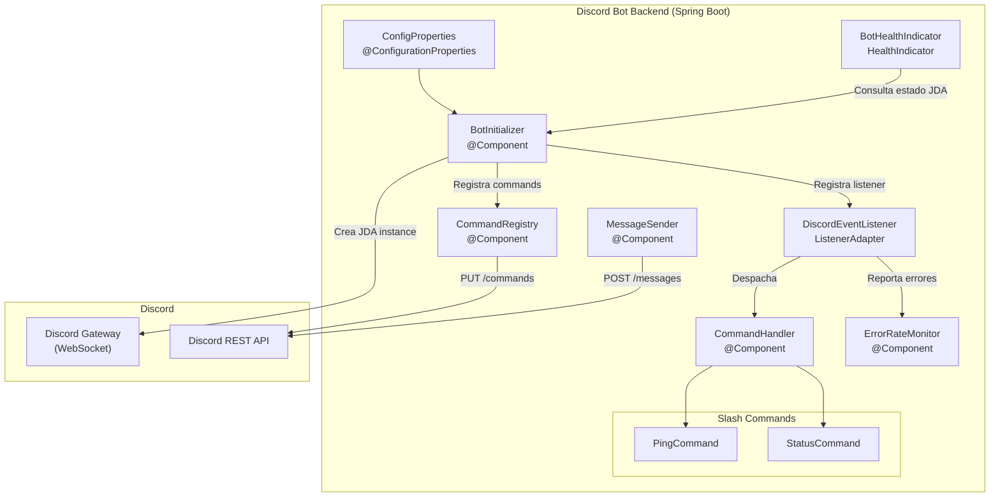
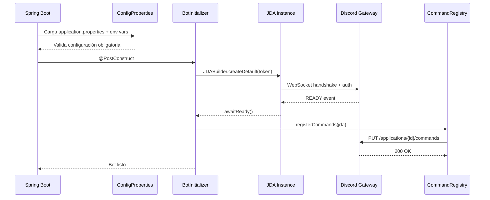
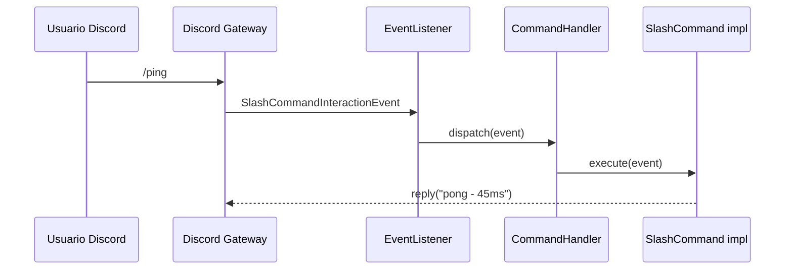

# Documento de Diseño: Discord Bot Backend

## Resumen (Overview)

Este documento describe el diseño técnico del backend de un bot de Discord implementado en Java con Spring Boot y JDA (Java Discord API). El sistema establece una conexión WebSocket persistente con el Gateway de Discord, escucha eventos en tiempo real, procesa slash commands (`/ping`, `/status`), envía mensajes programáticamente a canales específicos, y expone un endpoint de health check. La configuración se externaliza mediante `application.properties` y variables de entorno.

### Decisiones de Diseño Clave

- **Spring Boot 3.x** como framework base: proporciona inyección de dependencias, configuración externalizada nativa (`@ConfigurationProperties`), actuator para health checks, y un ecosistema maduro de logging (SLF4J + Logback).
- **JDA 5.x** como librería de integración con Discord: maneja internamente la conexión WebSocket, reconexión automática, y el ciclo de vida del Gateway. Esto simplifica significativamente la implementación de los requisitos 1, 2 y 3.
- **Patrón Command** para el procesamiento de slash commands: cada comando se implementa como un bean independiente que implementa una interfaz común, facilitando la extensibilidad.
- **Gradle** como sistema de build (convención estándar para proyectos Spring Boot modernos).

## Arquitectura

### Diagrama de Componentes



### Flujo de Inicio



### Flujo de Procesamiento de Comandos



## Componentes e Interfaces

### 1. BotConfigProperties

Clase de configuración que mapea las propiedades externalizadas. Durante la fase de pruebas, el token puede configurarse directamente en `application.properties` con su valor en texto plano (hardcoded) para facilitar el desarrollo. En producción, se recomienda usar variables de entorno.

```java
@ConfigurationProperties(prefix = "discord.bot")
public class BotConfigProperties {
    private String token;              // Bot token (obligatorio) - puede ser hardcoded en application.properties para pruebas
    private String defaultChannelId;   // Canal por defecto (opcional)
    private String logPrefix;          // Prefijo de log (opcional, default: "discord-bot")
    private int maxReconnectAttempts;  // Máx intentos reconexión (default: 5)
}
```

### 2. SlashCommand (Interfaz)

Contrato que deben implementar todos los slash commands.

```java
public interface SlashCommand {
    String getName();
    String getDescription();
    void execute(SlashCommandInteractionEvent event);
}
```

### 3. BotInitializer

Responsable de crear la instancia JDA, configurar listeners y disparar el registro de comandos.

```java
@Component
public class BotInitializer {
    // Crea JDA con el token, registra EventListener, llama a CommandRegistry
    // Expone getJda() para health checks
    // Expone getStartTime() para uptime
}
```

### 4. DiscordEventListener (extends ListenerAdapter)

Recibe eventos del Gateway y los despacha al CommandHandler.

```java
@Component
public class DiscordEventListener extends ListenerAdapter {
    @Override
    public void onSlashCommandInteraction(SlashCommandInteractionEvent event);
    
    @Override
    public void onMessageReceived(MessageReceivedEvent event);
    
    @Override
    public void onGenericEvent(GenericEvent event);
    // Eventos no reconocidos se loguean como WARN
}
```

### 5. CommandHandler

Mantiene un registro de comandos y despacha eventos al comando correcto.

```java
@Component
public class CommandHandler {
    private final Map<String, SlashCommand> commands;
    
    public CommandHandler(List<SlashCommand> commands); // Inyección automática
    public void dispatch(SlashCommandInteractionEvent event);
    public Collection<SlashCommand> getRegisteredCommands();
}
```

### 6. PingCommand / StatusCommand

Implementaciones concretas de SlashCommand.

```java
@Component
public class PingCommand implements SlashCommand {
    // Responde "pong" + latencia en ms (jda.getGatewayPing())
}

@Component
public class StatusCommand implements SlashCommand {
    // Responde con uptime + estado de conexión JDA
}
```

### 7. MessageSender

Envía mensajes a canales específicos, con soporte para división de mensajes largos.

```java
@Component
public class MessageSender {
    public void send(String channelId, String content);
    // Divide mensajes > 2000 chars en chunks
    // Loguea éxito con channelId + messageId
    // Loguea error si canal no existe o sin permisos
}
```

### 8. CommandRegistry

Registra los slash commands con la API REST de Discord al inicio.

```java
@Component
public class CommandRegistry {
    public void registerCommands(JDA jda, Collection<SlashCommand> commands);
    // Loguea cada comando registrado
    // Si falla uno, loguea error y continúa con los demás
}
```

### 9. ErrorRateMonitor

Monitorea la tasa de errores y emite alertas.

```java
@Component
public class ErrorRateMonitor {
    public void recordError();
    public int getErrorsInLastMinute();
    // Si > 10 errores/min, loguea alerta ERROR
}
```

### 10. BotHealthIndicator

Implementa `HealthIndicator` de Spring Boot Actuator.

```java
@Component
public class BotHealthIndicator implements HealthIndicator {
    @Override
    public Health health();
    // Retorna UP/DOWN según estado JDA + uptime
}
```

## Modelos de Datos

### Configuración (application.properties)

Para pruebas, el token se puede escribir directamente en el archivo. En producción, usar variables de entorno.

```properties
# Para pruebas: poner el token directamente aquí
discord.bot.token=TU_TOKEN_AQUI
# Para producción: usar variable de entorno
# discord.bot.token=${DISCORD_BOT_TOKEN}
discord.bot.default-channel-id=${DISCORD_DEFAULT_CHANNEL_ID:}
discord.bot.log-prefix=${DISCORD_LOG_PREFIX:discord-bot}
discord.bot.max-reconnect-attempts=${DISCORD_MAX_RECONNECT_ATTEMPTS:5}
```

### Modelo de Respuesta del Health Check

```json
{
  "status": "UP",
  "details": {
    "discordConnection": "CONNECTED",
    "gatewayPing": 45,
    "uptime": "2h 15m 30s",
    "registeredCommands": ["ping", "status"]
  }
}
```

### Modelo Interno: CommandDispatchResult

Usado internamente para tracking de ejecución de comandos.

```java
public record CommandDispatchResult(
    String commandName,
    String userId,
    String channelId,
    boolean success,
    long executionTimeMs,
    String errorMessage  // null si success=true
) {}
```

### Modelo Interno: MessageSendRequest

```java
public record MessageSendRequest(
    String channelId,
    String content
) {
    public List<String> splitContent(int maxLength) {
        // Divide content en chunks de maxLength caracteres
    }
}
```

### Estructura de Logs (formato estructurado)

```
timestamp=2024-01-15T10:30:00Z level=INFO component=CommandHandler command=ping user=user123 channel=general executionTimeMs=12
timestamp=2024-01-15T10:30:01Z level=ERROR component=MessageSender channelId=123456 error="Missing Access"
timestamp=2024-01-15T10:30:02Z level=ERROR component=ErrorRateMonitor errorRate=12 message="Tasa de errores elevada"
```


## Propiedades de Corrección (Correctness Properties)

*Una propiedad es una característica o comportamiento que debe cumplirse en todas las ejecuciones válidas de un sistema — esencialmente, una declaración formal sobre lo que el sistema debe hacer. Las propiedades sirven como puente entre especificaciones legibles por humanos y garantías de corrección verificables por máquina.*

### Property 1: Validación de configuración obligatoria

*Para cualquier* parámetro de configuración obligatorio (token, etc.), si dicho parámetro está ausente, es vacío, o contiene solo espacios en blanco, el sistema SHALL registrar un error descriptivo que incluya el nombre del parámetro y terminar la ejecución de forma controlada.

**Validates: Requirements 1.3, 8.3**

### Property 2: Cálculo de backoff exponencial

*Para cualquier* número de intento de reconexión `n` (donde n >= 1), el delay calculado por la estrategia de backoff exponencial SHALL seguir la fórmula `min(baseDelay * 2^(n-1), maxDelay)`, produciendo valores estrictamente crecientes hasta alcanzar el tope máximo.

**Validates: Requirements 2.2**

### Property 3: Despacho correcto de comandos registrados

*Para cualquier* slash command registrado en el sistema, cuando el CommandHandler recibe un evento con ese nombre de comando, SHALL enrutar la ejecución al handler correcto correspondiente y producir una respuesta.

**Validates: Requirements 3.3, 4.1**

### Property 4: Comandos no registrados son rechazados

*Para cualquier* nombre de comando que NO esté en el conjunto de comandos registrados, el CommandHandler SHALL responder con un mensaje indicando que el comando no fue reconocido.

**Validates: Requirements 4.4**

### Property 5: Errores en ejecución de comandos producen respuesta genérica

*Para cualquier* comando cuya ejecución lance una excepción, el CommandHandler SHALL responder al usuario con un mensaje de error genérico (sin detalles internos) y registrar el error detallado (incluyendo stack trace) en los logs.

**Validates: Requirements 4.5**

### Property 6: División de mensajes preserva contenido

*Para cualquier* cadena de texto, al dividirla en chunks para envío a Discord: (a) cada chunk SHALL tener longitud <= 2000 caracteres, (b) la concatenación de todos los chunks SHALL ser igual a la cadena original, y (c) el número de chunks SHALL ser `ceil(length / 2000)` para cadenas no vacías.

**Validates: Requirements 5.3**

### Property 7: Registro parcial de comandos es resiliente

*Para cualquier* lista de slash commands donde un subconjunto arbitrario falla durante el registro, todos los comandos que no fallaron SHALL registrarse exitosamente, y cada comando fallido SHALL generar un log de error con su nombre y motivo del fallo.

**Validates: Requirements 6.3**

### Property 8: Logs de comandos contienen campos requeridos

*Para cualquier* evento de slash command recibido, el log generado SHALL contener el nombre del comando, el identificador del usuario que lo invocó, y el identificador del canal de origen.

**Validates: Requirements 7.2**

### Property 9: Umbral de tasa de errores dispara alerta

*Para cualquier* secuencia de errores registrados, el ErrorRateMonitor SHALL emitir una alerta de nivel ERROR si y solo si la cantidad de errores en la ventana de un minuto supera 10. Si la cantidad es <= 10, no SHALL emitir alerta.

**Validates: Requirements 7.4**

### Property 10: Variables de entorno sobreescriben configuración de archivo

*Para cualquier* propiedad de configuración definida tanto en `application.properties` como en una variable de entorno, el valor cargado por el sistema SHALL ser el de la variable de entorno.

**Validates: Requirements 8.2**

## Manejo de Errores (Error Handling)

### Errores de Configuración
- **Token ausente/inválido**: Log ERROR con nombre del parámetro → `System.exit(1)` controlado via Spring Boot `ApplicationRunner` que valida antes de iniciar JDA.
- **Parámetro obligatorio faltante**: Validación en `@PostConstruct` de `BotConfigProperties`. Spring Boot falla el arranque con mensaje descriptivo.

### Errores de Conexión
- **Fallo de autenticación**: JDA lanza `LoginException` → capturada en `BotInitializer`, log ERROR, shutdown.
- **Pérdida de conexión**: JDA maneja reconexión automática internamente. Configuramos `setAutoReconnect(true)` y un `SessionController` con backoff exponencial.
- **Reconexión fallida (5 intentos)**: Listener en `onDisconnect` con contador. Al alcanzar 5, log ERROR crítico con conteo de intentos.

### Errores de Comandos
- **Comando no reconocido**: `CommandHandler.dispatch()` busca en el mapa, si no existe → respuesta efímera "Comando no reconocido".
- **Excepción durante ejecución**: Try-catch en `dispatch()` → respuesta genérica al usuario ("Ha ocurrido un error"), log ERROR con stack trace completo.
- **Timeout de respuesta**: JDA requiere respuesta en 3 segundos. Usamos `deferReply()` si la operación puede tardar, seguido de `editOriginal()`.

### Errores de Envío de Mensajes
- **Canal inexistente**: `jda.getTextChannelById()` retorna null → log ERROR con channelId.
- **Sin permisos**: `InsufficientPermissionException` capturada → log ERROR con channelId y permiso faltante.
- **Mensaje vacío**: Validación previa, log WARN, no se envía.

### Monitoreo de Tasa de Errores
- `ErrorRateMonitor` usa una cola circular con timestamps. Cada error registrado añade un timestamp. Al consultar, filtra los últimos 60 segundos. Si count > 10, emite log ERROR con la tasa actual.

## Estrategia de Testing

### Enfoque Dual

El proyecto utiliza un enfoque dual de testing:
- **Tests unitarios**: Verifican ejemplos específicos, edge cases y condiciones de error.
- **Tests de propiedades (PBT)**: Verifican propiedades universales con inputs generados aleatoriamente.

### Librería de Property-Based Testing

- **jqwik** (https://jqwik.net/) — librería PBT madura para Java, integrada con JUnit 5.
- Cada test de propiedad se configura con mínimo **100 iteraciones** (`@Property(tries = 100)`).
- Cada test referencia la propiedad del diseño con un tag: `// Feature: discord-bot-backend, Property N: <título>`.

### Tests de Propiedades (PBT)

| Propiedad | Qué se genera | Qué se verifica |
|-----------|---------------|-----------------|
| P1: Validación de config | Strings vacíos, whitespace, null para cada param obligatorio | Error descriptivo + shutdown controlado |
| P2: Backoff exponencial | Enteros n ∈ [1, 20] | Delay = min(base * 2^(n-1), max) |
| P3: Despacho de comandos | Nombres de comandos del set registrado | Handler correcto invocado + respuesta producida |
| P4: Comandos no registrados | Strings aleatorios ∉ set registrado | Respuesta "no reconocido" |
| P5: Error en ejecución | Excepciones aleatorias (RuntimeException, IOException, etc.) | Respuesta genérica + log detallado |
| P6: División de mensajes | Strings de 0 a 10000 chars | Chunks ≤ 2000, concat = original |
| P7: Registro resiliente | Listas de commands con subsets fallidos | No-fallidos registrados, fallidos logueados |
| P8: Logs de comandos | Eventos con nombres/users/channels aleatorios | Log contiene los 3 campos |
| P9: Umbral de errores | Secuencias de 0-50 errores en ventana de 1 min | Alerta iff count > 10 |
| P10: Override de env vars | Pares key-value aleatorios | Env var prevalece sobre archivo |

### Tests Unitarios (Ejemplos)

- `/ping` responde "pong" + latencia numérica (Req 4.2)
- `/status` responde con uptime y estado de conexión (Req 4.3)
- Health endpoint retorna estado de conexión y uptime (Req 7.3)
- Envío exitoso loguea channelId + messageId (Req 5.4)
- Registro exitoso de comando loguea nombre (Req 6.2)
- 5 reconexiones fallidas generan log crítico (Req 2.4)

### Tests de Integración

- Conexión con Discord Gateway usando token válido (Req 1.1, 1.2)
- Recepción de eventos de mensaje y slash command (Req 3.1, 3.2)
- Registro de comandos con API REST de Discord (Req 6.1)
- Envío de mensaje a canal válido (Req 5.1)
- Error al enviar a canal inexistente o sin permisos (Req 5.2)

### Tests Smoke

- Token se carga desde application.properties o variable de entorno (Req 1.4)
- Logging estructurado con niveles INFO/WARN/ERROR configurado (Req 7.1)
- Configuración se carga desde application.properties (Req 8.1)
