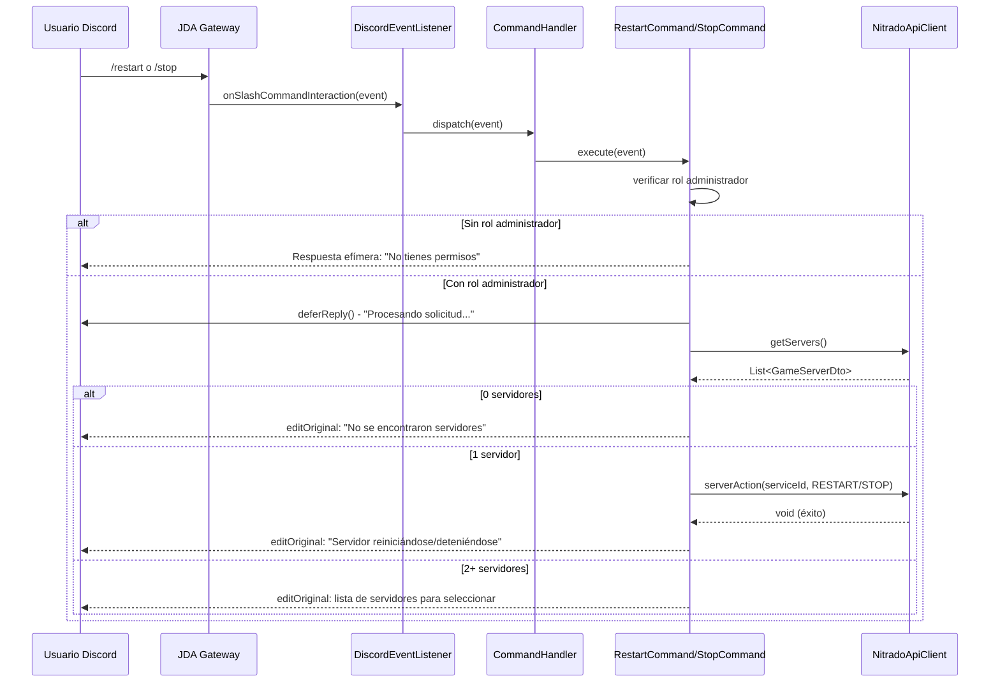
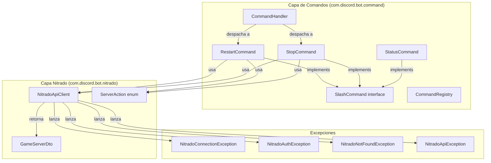
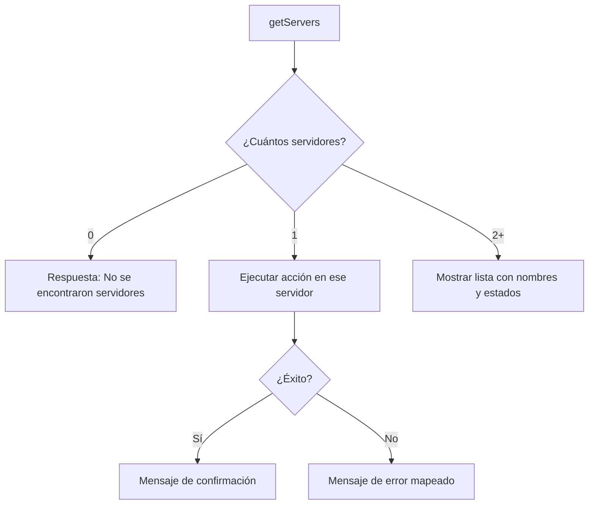

# Documento de Diseño: Comandos Discord-Nitrado

## Visión General

Esta funcionalidad añade dos comandos slash de Discord (`/restart` y `/stop`) que permiten a los administradores controlar servidores DayZ alojados en Nitrado directamente desde Discord. Los comandos se integran en la infraestructura existente de comandos slash (`SlashCommand`, `CommandHandler`, `CommandRegistry`) y utilizan el `NitradoApiClient` ya implementado para comunicarse con la API de Nitrado.

El diseño sigue el patrón establecido por `StatusCommand`: cada comando es un `@Component` de Spring que implementa `SlashCommand`, se auto-registra en el `CommandHandler` mediante inyección de dependencias, y se registra en Discord a través del `CommandRegistry` durante la inicialización del bot.

La principal diferencia con los comandos existentes es que estos nuevos comandos:
1. Requieren verificación de permisos (rol administrador).
2. Realizan llamadas asíncronas a la API de Nitrado, por lo que usan respuestas diferidas (deferred replies).
3. Implementan lógica de selección de servidor cuando hay múltiples servidores disponibles.

## Arquitectura

### Flujo de Ejecución



### Diagrama de Componentes



## Componentes e Interfaces

### 1. RestartCommand

**Paquete:** `com.discord.bot.command`
**Implementa:** `SlashCommand`
**Anotación:** `@Component`

```java
@Component
public class RestartCommand implements SlashCommand {
    private final NitradoApiClient nitradoApiClient;

    // Inyección por constructor
    public RestartCommand(NitradoApiClient nitradoApiClient) { ... }

    @Override
    public String getName() { return "restart"; }

    @Override
    public String getDescription() { return "Reinicia el servidor DayZ (solo administradores)"; }

    @Override
    public void execute(SlashCommandInteractionEvent event) { ... }
}
```

**Responsabilidades:**
- Verificar que el usuario tiene rol de administrador en el guild.
- Enviar respuesta diferida inmediatamente.
- Obtener la lista de servidores DayZ vía `NitradoApiClient.getServers()`.
- Si hay exactamente un servidor, ejecutar `serverAction(serviceId, ServerAction.RESTART)`.
- Si hay múltiples servidores, presentar la lista al usuario.
- Mapear excepciones de Nitrado a mensajes de error en Discord.

### 2. StopCommand

**Paquete:** `com.discord.bot.command`
**Implementa:** `SlashCommand`
**Anotación:** `@Component`

```java
@Component
public class StopCommand implements SlashCommand {
    private final NitradoApiClient nitradoApiClient;

    public StopCommand(NitradoApiClient nitradoApiClient) { ... }

    @Override
    public String getName() { return "stop"; }

    @Override
    public String getDescription() { return "Detiene el servidor DayZ (solo administradores)"; }

    @Override
    public void execute(SlashCommandInteractionEvent event) { ... }
}
```

**Responsabilidades:** Idénticas a `RestartCommand` pero usando `ServerAction.STOP`.

### 3. Decisión de Diseño: Clase Base vs. Duplicación

**Decisión:** Extraer la lógica compartida en una clase abstracta `AbstractServerCommand`.

**Justificación:** `RestartCommand` y `StopCommand` comparten el 90% de su lógica (verificación de permisos, respuesta diferida, selección de servidor, manejo de errores). La única diferencia es el nombre del comando, la descripción, la acción (`ServerAction`) y el mensaje de confirmación. Una clase abstracta elimina la duplicación sin añadir complejidad innecesaria.

```java
public abstract class AbstractServerCommand implements SlashCommand {
    private static final Logger log = LoggerFactory.getLogger(AbstractServerCommand.class);
    protected final NitradoApiClient nitradoApiClient;

    protected AbstractServerCommand(NitradoApiClient nitradoApiClient) {
        this.nitradoApiClient = nitradoApiClient;
    }

    /** La acción de servidor a ejecutar (RESTART o STOP). */
    protected abstract ServerAction getAction();

    /** Mensaje de confirmación cuando la acción se ejecuta con éxito. */
    protected abstract String getSuccessMessage(String serverName);

    @Override
    public void execute(SlashCommandInteractionEvent event) {
        // 1. Verificar permisos
        // 2. Deferred reply
        // 3. Obtener servidores
        // 4. Seleccionar/ejecutar acción
        // 5. Manejar errores
    }
}
```

Con esto, `RestartCommand` y `StopCommand` solo definen:
- `getName()`, `getDescription()`, `getAction()`, `getSuccessMessage()`

### 4. Verificación de Permisos

La verificación de permisos se realiza al inicio del método `execute()`:

```java
// Verificar que el comando se ejecuta dentro de un guild
Member member = event.getMember();
if (member == null) {
    event.reply("❌ Este comando solo está disponible en servidores de Discord.")
        .setEphemeral(true).queue();
    return;
}

// Verificar rol de administrador usando JDA Permission API
if (!member.hasPermission(Permission.ADMINISTRATOR)) {
    event.reply("❌ No tienes permisos para ejecutar este comando. Se requiere rol de administrador.")
        .setEphemeral(true).queue();
    return;
}
```

**Decisión:** Usar `Permission.ADMINISTRATOR` de JDA en lugar de buscar un rol por nombre.

**Justificación:** `Permission.ADMINISTRATOR` es la forma estándar de JDA para verificar permisos de administrador. Es independiente del idioma del servidor y del nombre específico del rol. Cualquier rol que tenga el permiso de administrador habilitado será reconocido.

### 5. Patrón de Respuesta Diferida

Discord requiere una respuesta dentro de 3 segundos. Como las llamadas a la API de Nitrado pueden tardar más, se usa el patrón de respuesta diferida:

```java
// Paso 1: Respuesta diferida inmediata (dentro de 3s)
event.deferReply().queue();

// Paso 2: Ejecutar lógica (puede tardar)
try {
    List<GameServerDto> servers = nitradoApiClient.getServers();
    // ... lógica de selección y ejecución ...

    // Paso 3: Actualizar la respuesta diferida con el resultado
    event.getHook().editOriginal("✅ " + getSuccessMessage(serverName)).queue();
} catch (Exception e) {
    // Actualizar con mensaje de error
    event.getHook().editOriginal("❌ " + errorMessage).queue();
}
```

### 6. Lógica de Selección de Servidor



Para el caso de múltiples servidores, el mensaje incluirá:
```
Hay varios servidores disponibles. Por favor, especifica cuál deseas controlar:
1. 🟢 Mi Servidor DayZ (ID: 12345) - started
2. 🔴 Servidor Test (ID: 67890) - stopped
```

**Nota:** En esta primera iteración, la selección de múltiples servidores se presenta como información. La implementación de selección interactiva (botones/menús de Discord) queda fuera del alcance actual.

### 7. Mapeo de Errores

| Excepción | Mensaje Discord |
|---|---|
| `NitradoConnectionException` | "❌ No se pudo contactar con el servicio de Nitrado. Intenta de nuevo más tarde." |
| `NitradoAuthException` | "❌ Error de autenticación con la API de Nitrado. Contacta al administrador del bot." |
| `NitradoNotFoundException` | "❌ El servidor especificado no fue encontrado en Nitrado." |
| `NitradoApiException` (otras) | "❌ Ocurrió un error inesperado. Intenta de nuevo más tarde." |
| `Exception` (genérica) | "❌ Ocurrió un error inesperado. Intenta de nuevo más tarde." |

Todas las respuestas de error se envían como respuestas efímeras (solo visibles para el usuario que ejecutó el comando) cuando es posible, o como edición de la respuesta diferida si ya se envió el `deferReply()`.

## Modelos de Datos

No se requieren nuevos modelos de datos. Los componentes existentes cubren todas las necesidades:

| Modelo | Uso |
|---|---|
| `GameServerDto` | Representa un servidor DayZ retornado por `getServers()`. Contiene `id`, `name`, `status`. |
| `ServerAction` | Enum con valores `START`, `STOP`, `RESTART`. Se usa para indicar la acción al `NitradoApiClient`. |
| `SlashCommand` | Interfaz que define `getName()`, `getDescription()`, `execute()`. |
| `CommandDispatchResult` | Record que captura el resultado del despacho de un comando. |

### Flujo de Datos

1. **Entrada:** `SlashCommandInteractionEvent` de JDA → contiene `Member` (con roles), nombre del comando.
2. **Procesamiento:** `AbstractServerCommand.execute()` → verifica permisos → obtiene servidores → ejecuta acción.
3. **Salida:** Respuesta en Discord vía `event.getHook().editOriginal()` o `event.reply()`.

## Propiedades de Correctitud

*Una propiedad es una característica o comportamiento que debe mantenerse verdadero en todas las ejecuciones válidas de un sistema — esencialmente, una declaración formal sobre lo que el sistema debe hacer. Las propiedades sirven como puente entre especificaciones legibles por humanos y garantías de correctitud verificables por máquinas.*

### Propiedad 1: Control de acceso por rol de administrador

*Para cualquier* usuario y *para cualquier* comando de control de servidor (restart, stop), el comando debe ejecutar la acción del servidor si y solo si el usuario posee el permiso de administrador. Si el usuario no tiene el permiso, debe recibir una respuesta efímera de denegación y la acción del servidor no debe invocarse.

**Valida: Requisitos 1.1, 1.4, 2.1, 2.4, 3.1**

### Propiedad 2: Auto-selección con servidor único

*Para cualquier* lista de servidores que contenga exactamente un `GameServerDto`, cuando un administrador ejecuta un comando de control, el sistema debe ejecutar la acción directamente sobre ese servidor (usando su `serviceId`) sin solicitar selección adicional al usuario.

**Valida: Requisitos 4.2**

### Propiedad 3: Presentación completa de múltiples servidores

*Para cualquier* lista de servidores que contenga dos o más `GameServerDto`, cuando un administrador ejecuta un comando de control, la respuesta debe contener el nombre y el estado de cada servidor de la lista.

**Valida: Requisitos 4.3**

## Manejo de Errores

### Estrategia General

El manejo de errores sigue dos fases según el momento en que ocurre el error:

**Fase 1 — Antes del `deferReply()`** (verificación de permisos):
- Se usa `event.reply(...).setEphemeral(true).queue()` directamente.
- Errores: usuario sin permisos, comando fuera de guild.

**Fase 2 — Después del `deferReply()`** (llamadas a Nitrado):
- Se usa `event.getHook().editOriginal(...)` para actualizar la respuesta diferida.
- Errores: excepciones de Nitrado, servidores no encontrados.

### Manejo Específico de Excepciones

```java
try {
    // Lógica de servidor...
} catch (NitradoConnectionException e) {
    log.error("Error de conexión con Nitrado: {}", e.getMessage(), e);
    hook.editOriginal("❌ No se pudo contactar con el servicio de Nitrado. Intenta de nuevo más tarde.").queue();
} catch (NitradoAuthException e) {
    log.error("Error de autenticación con Nitrado: {}", e.getMessage(), e);
    hook.editOriginal("❌ Error de autenticación con la API de Nitrado. Contacta al administrador del bot.").queue();
} catch (NitradoNotFoundException e) {
    log.error("Servidor no encontrado en Nitrado: {}", e.getMessage(), e);
    hook.editOriginal("❌ El servidor especificado no fue encontrado en Nitrado.").queue();
} catch (NitradoApiException e) {
    log.error("Error de API Nitrado (status={}): {}", e.getStatusCode(), e.getMessage(), e);
    hook.editOriginal("❌ Ocurrió un error inesperado. Intenta de nuevo más tarde.").queue();
} catch (Exception e) {
    log.error("Error inesperado ejecutando comando: {}", e.getMessage(), e);
    hook.editOriginal("❌ Ocurrió un error inesperado. Intenta de nuevo más tarde.").queue();
}
```

### Resiliencia del CommandHandler

El `CommandHandler` existente ya tiene un catch genérico que responde con un mensaje de error si `execute()` lanza una excepción no capturada. Sin embargo, dado que los nuevos comandos usan `deferReply()`, las excepciones deben capturarse dentro del propio comando para poder usar `editOriginal()` en lugar de `reply()`. El catch del `CommandHandler` actúa como red de seguridad final.

## Estrategia de Testing

### Tests Unitarios (JUnit 5)

Tests basados en ejemplos concretos para verificar comportamientos específicos:

| Test | Verifica | Requisito |
|---|---|---|
| `RestartCommand` invoca `serverAction` con `RESTART` | Acción correcta | 1.2 |
| `StopCommand` invoca `serverAction` con `STOP` | Acción correcta | 2.2 |
| Mensaje de confirmación tras restart exitoso | Texto de respuesta | 1.3 |
| Mensaje de confirmación tras stop exitoso | Texto de respuesta | 2.3 |
| Comando fuera de guild (member null) | Denegación efímera | 3.2 |
| Lista vacía de servidores | Mensaje "no se encontraron" | 4.4 |
| `NitradoConnectionException` → mensaje de conexión | Mapeo de error | 5.1 |
| `NitradoAuthException` → mensaje de autenticación | Mapeo de error | 5.2 |
| `NitradoNotFoundException` → mensaje de no encontrado | Mapeo de error | 5.3 |
| Excepción genérica → mensaje genérico + log | Mapeo de error | 5.4 |
| `deferReply()` se invoca antes de llamadas a Nitrado | Orden de operaciones | 6.1 |
| `editOriginal()` se invoca con resultado final | Actualización de respuesta | 6.2 |
| Comandos registrados en CommandHandler | Registro automático | 7.1 |
| Descripciones en español | Internacionalización | 7.2 |

### Tests de Propiedades (jqwik)

La librería de property-based testing es **jqwik** (ya configurada en `build.gradle` con `net.jqwik:jqwik:1.9.2`).

Cada test de propiedad debe ejecutar un mínimo de **100 iteraciones** y estar etiquetado con un comentario que referencia la propiedad del diseño.

| Propiedad | Tag | Iteraciones |
|---|---|---|
| Control de acceso por rol | `Feature: discord-nitrado-commands, Property 1: For any user and admin command, the command executes if and only if the user has admin permission` | 100+ |
| Auto-selección con servidor único | `Feature: discord-nitrado-commands, Property 2: For any single-server list, the action executes on that server without selection prompt` | 100+ |
| Presentación de múltiples servidores | `Feature: discord-nitrado-commands, Property 3: For any multi-server list, the response contains all server names and statuses` | 100+ |

### Enfoque de Mocking

- **JDA:** Mockear `SlashCommandInteractionEvent`, `Member`, `InteractionHook`, `ReplyCallbackAction`.
- **NitradoApiClient:** Mockear para controlar respuestas y excepciones.
- **Generadores jqwik:** Generar `GameServerDto` con datos aleatorios (nombres, IDs, estados), generar combinaciones de permisos de usuario.
