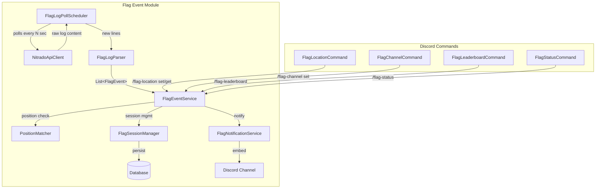
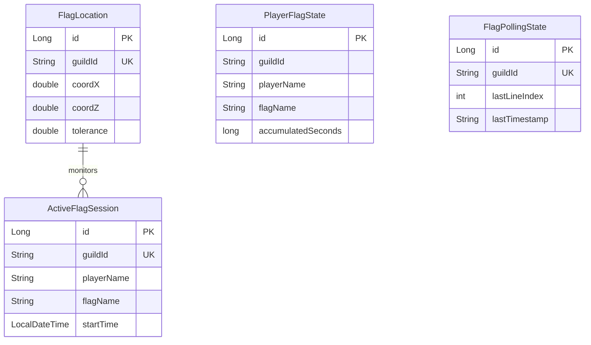

# Design Document: Flag Event System

## Overview

The Flag Event System is a new module (`com.discord.bot.flagevent`) for the existing DayZ Discord bot backend. It monitors DayZ server logs for flag raise/lower events at a configured location, tracks cumulative time per player, and delivers real-time Discord notifications and leaderboards.

The system follows the same architectural patterns already established in the project: Spring Boot services, JPA entities with H2/MySQL, scheduled polling with `@Scheduled`, JDA 5.x slash commands implementing `SlashCommand`, and the `NitradoApiClient` for log retrieval.

### Key Design Decisions

1. **2D Euclidean distance (X, Z only)**: DayZ terrain elevation varies wildly; comparing only horizontal coordinates ensures flags on elevated terrain or rooftops are not missed.
2. **Single active session model**: Only one flag can be "dominant" at the configured location at a time. A new raise implicitly ends the previous session.
3. **Incremental log polling**: Similar to the existing `LogCacheService`, we track the last processed line index to avoid reprocessing. However, unlike `LogCacheService` which caches locally, this module persists polling state in the database to survive restarts.
4. **jqwik property-based testing**: The log parser and position comparison are pure functions with well-defined input domains — ideal for PBT, which is already configured in `build.gradle`.

## Architecture



### Data Flow

1. **Poll Cycle**: `FlagLogPollScheduler` downloads the ADM log via `NitradoApiClient.getServerLogs()`, extracts only new lines since the last poll (tracked by line index in DB).
2. **Parsing**: `FlagLogParser` applies regex patterns to each new line, producing `FlagEvent` records.
3. **Position Matching**: `PositionMatcher` filters events by comparing the flag position (X, Z) against the configured `FlagLocation` using 2D Euclidean distance ≤ tolerance.
4. **Session Management**: `FlagSessionManager` updates `ActiveFlagSession` and accumulates `PlayerFlagState` time.
5. **Notification**: `FlagNotificationService` builds Discord embeds with the top 5 leaderboard and dominant flag, sending them to the configured channel.

## Components and Interfaces

### Package Structure

```
com.discord.bot.flagevent/
├── command/
│   ├── FlagLocationCommand.java      (implements SlashCommand)
│   ├── FlagChannelCommand.java       (implements SlashCommand)
│   ├── FlagLeaderboardCommand.java   (implements SlashCommand)
│   └── FlagStatusCommand.java        (implements SlashCommand)
├── model/
│   ├── FlagEvent.java                (value object / record)
│   ├── FlagLocation.java             (JPA entity)
│   ├── PlayerFlagState.java          (JPA entity)
│   ├── ActiveFlagSession.java        (JPA entity)
│   └── FlagPollingState.java         (JPA entity)
├── parser/
│   └── FlagLogParser.java            (stateless, pure function)
├── repository/
│   ├── FlagLocationRepository.java
│   ├── PlayerFlagStateRepository.java
│   ├── ActiveFlagSessionRepository.java
│   └── FlagPollingStateRepository.java
├── scheduler/
│   └── FlagLogPollScheduler.java
├── service/
│   ├── FlagEventService.java         (orchestrator)
│   ├── FlagSessionManager.java       (session lifecycle)
│   ├── FlagNotificationService.java  (Discord embeds)
│   └── PositionMatcher.java          (2D distance check)
└── config/
    └── FlagEventProperties.java      (@ConfigurationProperties)
```

### Key Interfaces

```java
// FlagLogParser — Stateless parser, pure function
public class FlagLogParser {
    /**
     * Parses a single log line into a FlagEvent, or empty if not a flag event.
     */
    public Optional<FlagEvent> parseLine(String line);

    /**
     * Parses multiple log lines, returning all valid FlagEvents in order.
     */
    public List<FlagEvent> parseLines(List<String> lines);

    /**
     * Formats a FlagEvent back to a log line string (for round-trip testing).
     */
    public String format(FlagEvent event);
}

// PositionMatcher — Pure function for 2D distance
public class PositionMatcher {
    /**
     * Returns the 2D Euclidean distance between two points using only X and Z.
     */
    public double distance2D(double x1, double z1, double x2, double z2);

    /**
     * Checks if the event flag position matches the configured location
     * within the given tolerance.
     */
    public boolean matches(FlagEvent event, FlagLocation location);
}

// FlagSessionManager — Session lifecycle
public class FlagSessionManager {
    /**
     * Handles a matched flag raise event. Ends existing session if any,
     * creates new session.
     */
    public void handleRaise(FlagEvent event);

    /**
     * Handles a matched flag lower event. Ends session and accumulates time.
     */
    public void handleLower(FlagEvent event);

    /**
     * Gets the currently active session, or empty if none.
     */
    public Optional<ActiveFlagSession> getActiveSession();
}
```

## Data Models

### FlagEvent (Value Object / Record)

```java
public record FlagEvent(
    String action,           // "raised" or "lowered"
    String playerName,       // max 128 chars
    String playerId,         // hex string up to 64 chars
    String flagName,         // e.g., "Flag_Chedaki"
    double playerX,          // player position X
    double playerY,          // player position Y (ignored for matching)
    double playerZ,          // player position Z
    double flagX,            // flag position X
    double flagY,            // flag position Y (ignored for matching)
    double flagZ,            // flag position Z
    LocalTime timestamp      // HH:mm:ss from log line
) {}
```

### FlagLocation (JPA Entity)

```java
@Entity
@Table(name = "flag_location")
public class FlagLocation {
    @Id @GeneratedValue(strategy = GenerationType.IDENTITY)
    private Long id;

    @Column(unique = true, nullable = false)
    private String guildId;

    @Column(nullable = false)
    private double coordX;       // 0..15360

    @Column(nullable = false)
    private double coordZ;       // 0..15360

    @Column(nullable = false)
    private double tolerance;    // 1..1000, default 10.0
}
```

### PlayerFlagState (JPA Entity)

```java
@Entity
@Table(name = "player_flag_state")
public class PlayerFlagState {
    @Id @GeneratedValue(strategy = GenerationType.IDENTITY)
    private Long id;

    @Column(nullable = false)
    private String guildId;

    @Column(nullable = false)
    private String playerName;

    @Column(nullable = false)
    private String flagName;

    @Column(nullable = false)
    private long accumulatedSeconds;  // total time in whole seconds
}
```

### ActiveFlagSession (JPA Entity)

```java
@Entity
@Table(name = "active_flag_session")
public class ActiveFlagSession {
    @Id @GeneratedValue(strategy = GenerationType.IDENTITY)
    private Long id;

    @Column(unique = true, nullable = false)
    private String guildId;

    @Column(nullable = false)
    private String playerName;

    @Column(nullable = false)
    private String flagName;

    @Column(nullable = false)
    private LocalDateTime startTime;
}
```

### FlagPollingState (JPA Entity)

```java
@Entity
@Table(name = "flag_polling_state")
public class FlagPollingState {
    @Id @GeneratedValue(strategy = GenerationType.IDENTITY)
    private Long id;

    @Column(unique = true, nullable = false)
    private String guildId;

    @Column(nullable = false)
    private int lastLineIndex;       // index of last processed line

    @Column(nullable = false)
    private String lastTimestamp;     // timestamp from last processed line (for restart detection)
}
```

### FlagEventProperties (Configuration)

```java
@ConfigurationProperties(prefix = "flagevent")
public class FlagEventProperties {
    private int pollIntervalSeconds = 30;     // 10..300
    private int nitradoServiceId = 0;
    private String guildId = "";
    private double defaultTolerance = 10.0;
}
```

### Entity Relationship Diagram




## Correctness Properties

*A property is a characteristic or behavior that should hold true across all valid executions of a system — essentially, a formal statement about what the system should do. Properties serve as the bridge between human-readable specifications and machine-verifiable correctness guarantees.*

### Property 1: Parse round-trip

*For any* valid `FlagEvent` with action in {"raised", "lowered"}, player name (1-128 chars), player ID (hex string up to 64 chars), flag name (non-empty), and coordinates in range -100000.0 to 100000.0, formatting the event to a log line string and then parsing it back SHALL produce a `FlagEvent` where all string fields are identical and all coordinate values match within a tolerance of 0.001.

**Validates: Requirements 1.7, 1.5**

### Property 2: Valid log line parsing extracts correct fields

*For any* randomly generated valid flag event log line (either "raised" or "lowered" pattern) with valid player name, hex player ID, flag name, and decimal coordinates, parsing that line SHALL produce a `FlagEvent` whose action, player name, player ID, flag name, and coordinates match the values embedded in the original line (coordinates within 0.001 tolerance).

**Validates: Requirements 1.1, 1.2**

### Property 3: Non-matching lines produce no events

*For any* string that does not match the flag event log line patterns (i.e., does not contain "has raised" or "has lowered" followed by "on TerritoryFlag at"), parsing that string SHALL return an empty result without throwing any exception.

**Validates: Requirements 1.3**

### Property 4: Sequential parsing preserves order

*For any* list of valid flag event log lines, parsing them as a batch SHALL produce `FlagEvent` entries in the same order as their corresponding source lines.

**Validates: Requirements 1.6**

### Property 5: 2D Euclidean distance and position matching

*For any* two points (x1, z1) and (x2, z2) and any positive tolerance value, the `matches()` function SHALL return true if and only if `sqrt((x1 - x2)² + (z1 - z2)²) <= tolerance`. Additionally, the computed distance SHALL be non-negative and satisfy the triangle inequality.

**Validates: Requirements 3.1, 3.2, 3.4**

### Property 6: Y coordinate does not affect position matching

*For any* `FlagEvent` and `FlagLocation` pair where `matches()` returns a result R, changing the Y coordinate of either the flag position or the player position to any other valid value SHALL not change the result of `matches()` (the result remains R).

**Validates: Requirements 3.3**

### Property 7: Session transitions preserve time accumulation invariant

*For any* sequence of raise and lower events at the configured location, the sum of all accumulated seconds across all `PlayerFlagState` entries plus the elapsed time of the current `ActiveFlagSession` (if any) SHALL equal the total wall-clock time between the first raise event and the last processed event's timestamp (with no gaps or overlaps in tracked time).

**Validates: Requirements 4.1, 4.2, 4.3**

### Property 8: Total time includes active session elapsed

*For any* player with an `ActiveFlagSession` that started at time T and a stored `accumulatedSeconds` of S, when queried at time Q (where Q > T), the reported total time SHALL equal `S + (Q - T)` in seconds.

**Validates: Requirements 4.5, 6.3, 7.2**

### Property 9: Top-N leaderboard ranking

*For any* set of `PlayerFlagState` entries and a limit N, the leaderboard SHALL return at most N entries sorted in descending order by total accumulated time, with ties broken by player name in ascending alphabetical order. No entry with a lower rank (higher time) shall appear after an entry with a higher rank (lower time).

**Validates: Requirements 5.4, 5.7, 6.1, 6.5**

### Property 10: Dominant flag identification

*For any* set of `PlayerFlagState` entries, the dominant flag SHALL be the flag name whose sum of accumulated seconds across all players is the highest. If two or more flags are tied for the highest total, the flag whose name comes first alphabetically SHALL be selected.

**Validates: Requirements 5.5, 5.8**

### Property 11: Leaderboard entry contains all required fields

*For any* `PlayerFlagState` entry with rank position, when formatted for display, the resulting string SHALL contain the rank position, the player name, the flag name, and the accumulated time in HH:MM:SS format.

**Validates: Requirements 6.2**

### Property 12: Incremental log processing

*For any* log content that grows between poll cycles (new lines appended), the system SHALL process exactly the lines from index `lastLineIndex + 1` to the end of the current content. Lines at indices `0` through `lastLineIndex` SHALL NOT be re-processed.

**Validates: Requirements 8.2**

### Property 13: Server restart detection

*For any* polling state where the stored `lastLineIndex` exceeds the current log file line count, or the stored `lastTimestamp` is later than the first line's timestamp, the system SHALL reset the polling state and process the entire log from the beginning.

**Validates: Requirements 8.6**

## Error Handling

### Parser Errors

| Error Condition | Handling | Logging |
|----------------|----------|---------|
| Non-matching log line | Skip silently | None |
| Malformed coordinates | Skip line, return empty | WARN with line content reference |
| Empty player name | Skip line | WARN with line content |
| Missing player ID | Skip line | WARN with line content |

### Position Matching Errors

| Error Condition | Handling | Logging |
|----------------|----------|---------|
| No FlagLocation configured | Discard all events | WARN "No flag location is set" |
| Event outside tolerance | Discard event | None (silent discard) |

### Session Management Errors

| Error Condition | Handling | Logging |
|----------------|----------|---------|
| Lower event mismatches active session | Ignore event | WARN with details |
| Session open > 24 hours | Continue, don't auto-close | WARN "potentially orphaned session" |
| Database error on persist | Propagate exception | ERROR with stack trace |

### Notification Errors

| Error Condition | Handling | Logging |
|----------------|----------|---------|
| No channel configured | Skip notification | WARN "no notification channel set" |
| Channel unavailable / bot lacks permissions | Discard notification, continue | WARN with channel ID and reason |
| Embed building failure | Skip notification | ERROR with details |

### Polling Errors

| Error Condition | Handling | Logging |
|----------------|----------|---------|
| Log file unavailable/empty | Retry next cycle | WARN, state unchanged |
| Connection error | Retry next cycle | WARN, state unchanged |
| Server restart detected | Reset polling state, reprocess | INFO "Server restart detected" |

### Command Errors

| Error Condition | Handling | Logging |
|----------------|----------|---------|
| Invalid coordinates (out of range) | Reply with error message | None (user-facing) |
| Invalid tolerance (out of range) | Reply with error message | None (user-facing) |
| Invalid channel ID format | Reply with error message | None (user-facing) |
| No player linked to Discord user | Reply with info message | None |
| Database error on leaderboard | Reply "temporarily unavailable" | ERROR |

## Testing Strategy

### Property-Based Testing (jqwik)

The project already includes `net.jqwik:jqwik:1.9.2` and the JUnit platform is configured to include the `jqwik` engine. Property-based tests are the primary verification tool for the pure logic components.

**Configuration**: Each property test runs a minimum of 100 iterations.

**Tag format**: `Feature: flag-event-system, Property {number}: {property_text}`

**Target components for PBT**:
- `FlagLogParser` — Properties 1, 2, 3, 4 (round-trip, extraction, non-match, ordering)
- `PositionMatcher` — Properties 5, 6 (distance correctness, Y independence)
- `FlagSessionManager` — Properties 7, 8 (time invariant, elapsed calculation)
- Ranking/leaderboard logic — Properties 9, 10, 11 (sorting, dominant flag, formatting)
- Polling logic — Properties 12, 13 (incremental processing, restart detection)

**Generators needed**:
- Valid flag event log lines (with random names, IDs, coordinates)
- Random `FlagEvent` records
- Random coordinate pairs within map bounds
- Random `PlayerFlagState` collections
- Random log content sequences (growing between polls)

### Unit Tests (JUnit 5)

Example-based tests for specific scenarios:
- Command handling (set/get with valid and invalid input)
- Edge cases: empty leaderboard, no channel configured, no player linked
- Discord embed content verification (mocked JDA)
- Orphaned session detection threshold (24h)

### Integration Tests

- Full poll-parse-match-session-notify pipeline with mocked `NitradoApiClient`
- Database persistence verification (H2 in-memory)
- Command execution through `SlashCommandInteractionEvent` mocks

### Test Coverage Approach

| Component | PBT | Unit | Integration |
|-----------|-----|------|-------------|
| FlagLogParser | ✅ Properties 1-4 | Edge cases (malformed) | — |
| PositionMatcher | ✅ Properties 5-6 | — | — |
| FlagSessionManager | ✅ Properties 7-8 | Orphaned session, mismatch | DB persistence |
| Leaderboard logic | ✅ Properties 9-11 | Empty state | — |
| Polling logic | ✅ Properties 12-13 | First run, errors | Full pipeline |
| Commands | — | Valid/invalid inputs | JDA interaction |
| Notifications | — | Embed content | Channel mocking |
