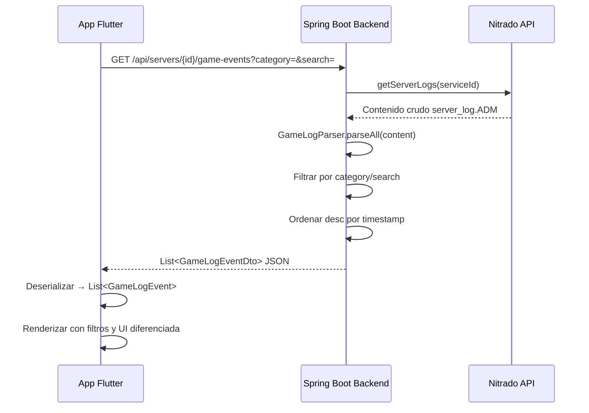
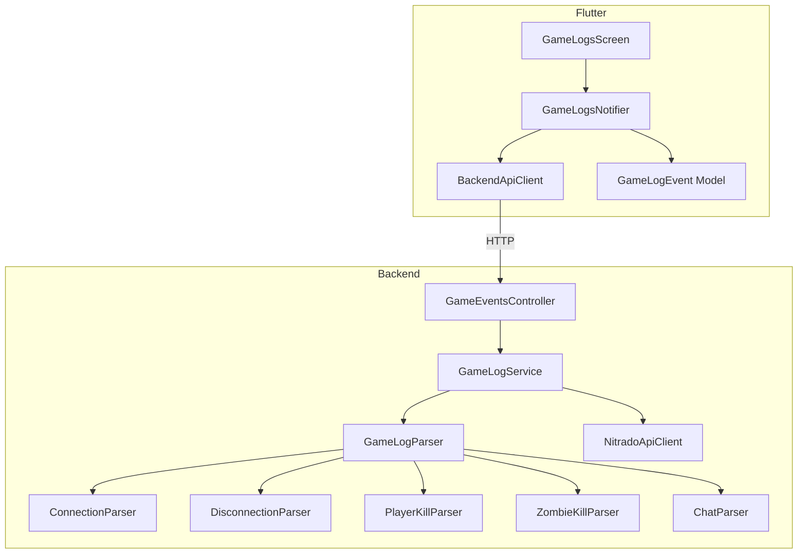

# Documento de Diseño: Game Logs Viewer

## Resumen

Este documento describe el diseño técnico para el módulo **Game Logs Viewer**, que extiende tanto el backend Spring Boot (`discord-bot-backend`) como la app Flutter (`nitrado_server_manager`) para parsear, categorizar y visualizar todos los eventos del servidor DayZ extraídos del archivo `server_log.ADM`.

El sistema actual muestra los logs como texto crudo. Este módulo introduce un **parser unificado** en el backend que clasifica cada línea del log en categorías (conexión, desconexión, kill PvP, kill zombie, chat, hit, unknown), expone los eventos estructurados vía un nuevo endpoint REST, y la app Flutter los presenta con filtros por categoría, búsqueda y diferenciación visual.

---

## Arquitectura

### Diagrama de Flujo General



### Capas del Sistema



---

## Componentes e Interfaces

### Backend (Spring Boot)

#### 1. `GameLogEvent` (Record)

Modelo unificado para todos los tipos de eventos del log.

```java
package com.discord.bot.gamelogs.model;

public record GameLogEvent(
    String timestamp,           // "HH:mm:ss"
    GameLogCategory category,   // enum
    String playerName,          // nombre del jugador principal
    String message,             // representación legible del evento
    Map<String, Object> details, // datos específicos del tipo
    int lineIndex               // posición en el log original
) {}
```

#### 2. `GameLogCategory` (Enum)

```java
public enum GameLogCategory {
    CONNECTION,
    DISCONNECTION,
    PLAYER_KILL,
    ZOMBIE_KILL,
    CHAT,
    HIT,
    UNKNOWN
}
```

#### 3. `GameLogParser` (Componente principal)

Orquesta los sub-parsers existentes y nuevos. Itera cada línea del log y delega al primer sub-parser que haga match.

```java
@Component
public class GameLogParser {
    private final List<EventLineParser> parsers;

    public List<GameLogEvent> parseAll(String logContent) { ... }
    public String formatEvent(GameLogEvent event) { ... }
}
```

#### 4. `EventLineParser` (Interfaz)

```java
public interface EventLineParser {
    Optional<GameLogEvent> parseLine(String line, int lineIndex);
    String formatEvent(GameLogEvent event);
    boolean canFormat(GameLogEvent event);
}
```

Implementaciones:
- `ConnectionLineParser` — patrón: `HH:mm:ss | Player "NAME" is connected (id=ID)`
- `DisconnectionLineParser` — patrón: `HH:mm:ss | Player "NAME" has been disconnected`
- `PlayerKillLineParser` — reutiliza lógica del `LogParser` existente
- `ZombieKillLineParser` — reutiliza lógica del `ZombieKillParser` existente
- `ChatLineParser` — patrón: `HH:mm:ss | Player "NAME" (id=...) placed Chat: MESSAGE`
- `UnknownLineParser` — fallback que siempre hace match

#### 5. `GameLogService` (Servicio)

```java
@Service
public class GameLogService {
    private final NitradoApiClient nitradoApiClient;
    private final GameLogParser gameLogParser;

    public List<GameLogEvent> getGameEvents(int serviceId, String category, String search) {
        String logContent = nitradoApiClient.getServerLogs(serviceId);
        List<GameLogEvent> events = gameLogParser.parseAll(logContent);
        // Aplicar filtros
        if (category != null) events = filterByCategory(events, category);
        if (search != null) events = filterBySearch(events, search);
        // Ordenar desc por timestamp (más reciente primero)
        events.sort(comparing(GameLogEvent::timestamp).reversed()
                    .thenComparing(comparing(GameLogEvent::lineIndex).reversed()));
        return events;
    }
}
```

#### 6. `GameEventsController` (REST Controller)

```java
@RestController
@RequestMapping("/api/servers")
public class GameEventsController {

    @GetMapping("/{serviceId}/game-events")
    public List<GameLogEventDto> getGameEvents(
            @PathVariable int serviceId,
            @RequestParam(required = false) String category,
            @RequestParam(required = false) String search) { ... }
}
```

#### 7. `GameLogEventDto` (DTO de respuesta)

```java
public record GameLogEventDto(
    String timestamp,
    String category,        // lowercase: "connection", "player_kill", etc.
    String playerName,
    String message,
    Map<String, Object> details
) {}
```

### Flutter (App)

#### 1. `GameLogEvent` (Modelo)

```dart
enum GameLogCategory {
  connection,
  disconnection,
  playerKill,
  zombieKill,
  chat,
  hit,
  unknown;

  static GameLogCategory fromString(String value) {
    return GameLogCategory.values.firstWhere(
      (e) => e.name == value || e.toApiString() == value,
      orElse: () => GameLogCategory.unknown,
    );
  }

  String toApiString() => switch (this) {
    playerKill => 'player_kill',
    zombieKill => 'zombie_kill',
    _ => name,
  };
}

class GameLogEvent {
  final String timestamp;
  final GameLogCategory category;
  final String playerName;
  final String message;
  final Map<String, dynamic> details;

  GameLogEvent({...});

  factory GameLogEvent.fromJson(Map<String, dynamic> json) => ...;
  Map<String, dynamic> toJson() => ...;
}
```

#### 2. `GameLogsNotifier` (StateNotifier con Riverpod)

```dart
class GameLogsState {
  final List<GameLogEvent> events;
  final GameLogCategory? selectedCategory;
  final String searchQuery;
  final bool isLoading;
  final String? error;
}

class GameLogsNotifier extends StateNotifier<GameLogsState> {
  Future<void> loadEvents() { ... }
  void selectCategory(GameLogCategory? category) { ... }
  void updateSearch(String query) { ... }
  Future<void> refresh() { ... }
  List<GameLogEvent> get filteredEvents { ... }
}
```

#### 3. `GameLogsScreen` (Widget)

Nueva pantalla que reemplaza/complementa la pantalla de logs existente:
- AppBar con título y botón de refresh
- Fila de `FilterChip` para categorías
- `TextField` de búsqueda
- `ListView.builder` con tiles diferenciados por categoría

#### 4. Extensión de `BackendApiClient`

```dart
Future<List<GameLogEvent>> getGameEvents(
  int serverId, {
  String? category,
  String? search,
}) async { ... }
```

---

## Modelos de Datos

### Formato de Respuesta JSON del Endpoint

```json
[
  {
    "timestamp": "14:32:05",
    "category": "connection",
    "playerName": "SurvivorJoe",
    "message": "Player \"SurvivorJoe\" is connected (id=abc123)",
    "details": {
      "playerId": "abc123"
    }
  },
  {
    "timestamp": "14:35:12",
    "category": "player_kill",
    "playerName": "Killer99",
    "message": "Player \"Victim01\" killed by Player \"Killer99\" with M4A1 from 150.3 meters",
    "details": {
      "victimName": "Victim01",
      "killerName": "Killer99",
      "weapon": "M4A1",
      "distance": 150.3,
      "killerPos": {"x": 100.0, "y": 200.0, "z": 50.0},
      "victimPos": {"x": 250.0, "y": 200.0, "z": 50.0}
    }
  },
  {
    "timestamp": "14:36:00",
    "category": "zombie_kill",
    "playerName": "Hunter42",
    "message": "Player \"Hunter42\" killed ZmbM_CitizenASkinny with IJ70",
    "details": {
      "zombieType": "ZmbM_CitizenASkinny",
      "weapon": "IJ70",
      "playerPos": {"x": 300.0, "y": 100.0, "z": 25.0}
    }
  },
  {
    "timestamp": "14:40:00",
    "category": "chat",
    "playerName": "Talker",
    "message": "Hola a todos!",
    "details": {
      "chatMessage": "Hola a todos!",
      "playerId": "xyz789"
    }
  },
  {
    "timestamp": "14:41:00",
    "category": "unknown",
    "playerName": "",
    "message": "Some unrecognized log line content",
    "details": {
      "rawLine": "14:41:00 | Some unrecognized log line content"
    }
  }
]
```

### Patrones Regex del ADM Log

| Categoría | Patrón |
|-----------|--------|
| Connection | `^(\d{2}:\d{2}:\d{2}) \| Player "(.+?)" is connected \(id=(.+?)\)$` |
| Disconnection | `^(\d{2}:\d{2}:\d{2}) \| Player "(.+?)" has been disconnected$` |
| Player Kill | `^(\d{2}:\d{2}:\d{2}) \| Player "(.+?)" \(id=.+? pos=<...>\) killed by Player "(.+?)" \(id=.+? pos=<...>\) with (.+?) from ([\d.]+) meters$` |
| Zombie Kill | `^(\d{2}:\d{2}:\d{2}) \| Player "(.+?)" \(id=.+? pos=<...>\) killed (Zmb\w+)( with (.+))?$` |
| Chat | `^(\d{2}:\d{2}:\d{2}) \| Player "(.+?)" \(id=(.+?)\) placed Chat: (.+)$` |
| Unknown | Cualquier línea que no matchee los anteriores |

---

## Propiedades de Correctitud

*Una propiedad es una característica o comportamiento que debe cumplirse en todas las ejecuciones válidas de un sistema — esencialmente, una declaración formal sobre lo que el sistema debe hacer. Las propiedades sirven como puente entre especificaciones legibles por humanos y garantías de correctitud verificables por máquinas.*

### Propiedad 1: Round-trip del parser ADM

*Para cualquier* línea ADM válida de cualquier categoría (conexión, desconexión, kill PvP, kill zombie, chat), parsear la línea en un `GameLogEvent`, formatearlo de vuelta a texto ADM, y re-parsearlo SHALL producir un evento con los mismos campos semánticos (timestamp, categoría, playerName, datos específicos).

**Valida: Requisitos 6.2, 1.1, 1.2, 1.3, 1.4, 1.5**

### Propiedad 2: Líneas no reconocidas se clasifican como unknown

*Para cualquier* string que no coincida con ningún patrón ADM conocido (conexión, desconexión, kill, zombie kill, chat), el parser SHALL clasificar el evento como categoría `UNKNOWN` y el campo `details.rawLine` SHALL contener el texto original de la línea.

**Valida: Requisitos 1.6**

### Propiedad 3: Invariante estructural de eventos parseados

*Para cualquier* línea de un ADM_Log (válida o inválida), el evento resultante del parseo SHALL tener un `timestamp` no nulo, una `category` válida del enum, un `playerName` no nulo (puede ser vacío para unknown), y un `message` no nulo.

**Valida: Requisitos 1.7, 2.2**

### Propiedad 4: Filtrado por categoría

*Para cualquier* lista de eventos y cualquier categoría seleccionada, filtrar por esa categoría SHALL producir una lista donde TODOS los eventos tienen exactamente esa categoría, y la cantidad de eventos filtrados es igual al número de eventos originales con esa categoría.

**Valida: Requisitos 2.3, 4.3, 5.3**

### Propiedad 5: Búsqueda case-insensitive

*Para cualquier* lista de eventos y cualquier término de búsqueda no vacío, filtrar por búsqueda SHALL producir una lista donde TODOS los eventos contienen el término de búsqueda (ignorando mayúsculas/minúsculas) en su campo `message` o `playerName`.

**Valida: Requisitos 2.4, 4.4**

### Propiedad 6: Composición de filtros (categoría + búsqueda)

*Para cualquier* lista de eventos, cualquier categoría y cualquier término de búsqueda, aplicar ambos filtros simultáneamente SHALL producir una lista donde TODOS los eventos cumplen AMBOS criterios: pertenecen a la categoría seleccionada Y contienen el término de búsqueda.

**Valida: Requisitos 5.5**

### Propiedad 7: Ordenamiento cronológico descendente

*Para cualquier* lista de eventos devuelta por el endpoint, cada evento en posición `i` SHALL tener un timestamp mayor o igual al evento en posición `i+1` (orden descendente).

**Valida: Requisitos 2.5**

### Propiedad 8: Round-trip de serialización Flutter (GameLogEvent)

*Para cualquier* instancia válida de `GameLogEvent`, serializar a JSON con `toJson()` y deserializar con `fromJson()` SHALL producir un objeto equivalente al original (mismos valores en todos los campos).

**Valida: Requisitos 3.3, 3.2**

### Propiedad 9: Categoría no reconocida en deserialización Flutter

*Para cualquier* string que no corresponda a una categoría válida del enum `GameLogCategory`, la deserialización SHALL asignar `GameLogCategory.unknown` sin lanzar excepciones.

**Valida: Requisitos 3.4**

### Propiedad 10: Resiliencia del parser ante contenido mixto

*Para cualquier* contenido de ADM_Log que contenga una mezcla de líneas válidas e inválidas, el parser SHALL extraer exactamente las líneas válidas como eventos categorizados y las inválidas como `UNKNOWN`, sin lanzar excepciones en ningún caso.

**Valida: Requisitos 6.3**

### Propiedad 11: Metamórfica — eventos ≤ líneas

*Para cualquier* contenido de ADM_Log, el número de eventos parseados SHALL ser menor o igual al número total de líneas no vacías del log.

**Valida: Requisitos 6.4**

---

## Manejo de Errores

### Backend

| Escenario | Comportamiento | Código HTTP |
|-----------|---------------|-------------|
| Nitrado API no disponible | Responder con error descriptivo | 502 |
| Nitrado API timeout | Responder con error de timeout | 504 |
| Log file no encontrado | Responder con error descriptivo | 502 |
| Categoría inválida en query param | Ignorar filtro, devolver todos | 200 |
| Línea de log malformada | Clasificar como UNKNOWN, no lanzar excepción | N/A |
| Token de Nitrado expirado | Propagar error de autenticación | 401 |

### Flutter

| Escenario | Comportamiento |
|-----------|---------------|
| Error de red | Mostrar mensaje de error con botón "Reintentar" |
| Respuesta 502 del backend | Mostrar "Servicio no disponible temporalmente" |
| JSON con categoría desconocida | Asignar `GameLogCategory.unknown` |
| Lista vacía de eventos | Mostrar mensaje "No hay eventos disponibles" |
| Timeout de la petición | Mostrar error con opción de reintentar |

---

## Estrategia de Testing

### Backend (Java - JUnit 5 + jqwik)

**Tests de Propiedad (jqwik):**
- Mínimo 100 iteraciones por propiedad
- Cada test referencia su propiedad del documento de diseño
- Tag format: `Feature: game-logs-viewer, Property {N}: {título}`

| Propiedad | Test |
|-----------|------|
| P1: Round-trip parser | Generar líneas ADM válidas → parse → format → re-parse → assertEquals |
| P2: Unknown classification | Generar strings aleatorios no-ADM → parse → assertCategory(UNKNOWN) |
| P3: Invariante estructural | Generar líneas mixtas → parse → assertNotNull en campos requeridos |
| P4: Filtrado por categoría | Generar lista de eventos → filtrar → assertAll(category == selected) |
| P5: Búsqueda case-insensitive | Generar eventos + término → filtrar → assertAll(contains term) |
| P6: Composición de filtros | Generar eventos + categoría + término → filtrar → assertAll(ambos) |
| P7: Ordenamiento descendente | Generar eventos → ordenar → assertOrdered(desc) |
| P10: Resiliencia | Generar contenido mixto → parse → assertNoException + assertCount |
| P11: Metamórfica | Generar contenido → parse → assertCount <= lineCount |

**Tests Unitarios (JUnit 5):**
- Ejemplos concretos de cada tipo de evento
- Caso de error: Nitrado no disponible → 502
- Caso de endpoint con parámetros vacíos

**Tests de Integración (MockMvc):**
- Endpoint responde 200 con JSON válido
- Endpoint responde 502 cuando Nitrado falla
- Filtros de query params funcionan correctamente

### Flutter (Dart - flutter_test + test)

**Tests de Propiedad (dart test con loops):**
- Mínimo 100 iteraciones por propiedad

| Propiedad | Test |
|-----------|------|
| P8: Round-trip serialización | Generar GameLogEvent → toJson → fromJson → assertEquals |
| P9: Categoría unknown | Generar strings aleatorios → fromString → assertEquals(unknown) |

**Tests Unitarios:**
- Deserialización de cada tipo de evento desde JSON
- BackendApiClient.getGameEvents parsea respuesta correctamente
- Filtrado local por categoría y búsqueda

**Widget Tests:**
- GameLogsScreen muestra lista de eventos
- Chips de filtro renderizan todas las categorías
- Búsqueda filtra eventos visualmente
- Estado de carga muestra indicador de progreso
- Estado de error muestra mensaje con botón reintentar

### Librería de Property-Based Testing

- **Backend**: [jqwik](https://jqwik.net/) — librería PBT para JUnit 5
- **Flutter**: Loops con generadores aleatorios en `dart:math` + `Random` (no hay librería PBT estándar en Dart, se implementa con iteraciones manuales de 100+ casos)

### Configuración de Tests de Propiedad

```java
// Backend - jqwik
@Property(tries = 100)
@Tag("Feature: game-logs-viewer, Property 1: Round-trip del parser ADM")
void roundTripParserAdm(@ForAll("validAdmLines") String admLine) { ... }
```

```dart
// Flutter - loop manual
test('Feature: game-logs-viewer, Property 8: Round-trip serialización', () {
  final random = Random(42);
  for (var i = 0; i < 100; i++) {
    final event = generateRandomGameLogEvent(random);
    final json = event.toJson();
    final restored = GameLogEvent.fromJson(json);
    expect(restored, equals(event));
  }
});
```
