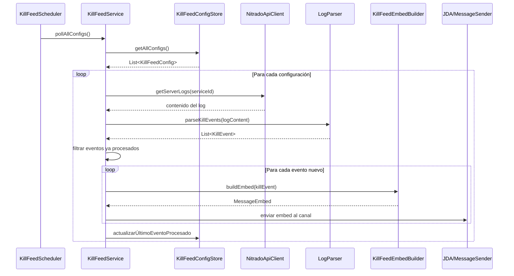

# Documento de Diseño — Kill Feed Discord

## Visión General

Este documento describe el diseño técnico del sistema de Kill Feed para DayZ integrado con Discord. El sistema sondea periódicamente los logs del servidor DayZ alojado en Nitrado, parsea los eventos de muerte del archivo `server_log.ADM`, y publica embeds enriquecidos en un canal de Discord configurado por los administradores.

El diseño se integra con la infraestructura existente del bot de Discord basado en Spring Boot + JDA 5.x, reutilizando `NitradoApiClient`, `SlashCommand`, `CommandHandler`, `MessageSender` y el patrón `AbstractServerCommand`.

## Arquitectura

### Diagrama de Componentes

```mermaid
graph TD
    subgraph Discord
        A[Usuario Admin] -->|/killfeed setup/remove/test| B[KillFeedCommand]
        G[Canal de Kill Feed] 
    end

    subgraph Spring Boot Application
        B --> C[KillFeedConfigStore]
        D[KillFeedScheduler] -->|@Scheduled 5 min| E[KillFeedService]
        E --> F[LogParser]
        E --> C
        E --> H[KillFeedEmbedBuilder]
        E --> I[NitradoApiClient]
        E --> J[MessageSender / JDA]
        H --> J
        J --> G
    end

    subgraph Nitrado API
        I -->|getServerLogs| K[server_log.ADM]
    end
```

### Flujo Principal



### Decisiones de Diseño

1. **Almacenamiento en memoria (ConcurrentHashMap)**: Las configuraciones de kill feed se almacenan en memoria en lugar de una base de datos. Esto simplifica la implementación y es adecuado dado que el bot se ejecuta como una sola instancia. Al reiniciar, los administradores deben reconfigurar el canal, lo cual es aceptable para este caso de uso.

2. **Patrón de último offset procesado**: Para evitar duplicados, se almacena la marca de tiempo + índice de línea del último evento procesado por cada configuración. Al reiniciar, se comienza desde el momento actual (Req 5.3).

3. **LogParser como componente puro**: El parser de logs es una función pura sin estado ni dependencias externas, lo que facilita el testing exhaustivo con property-based testing.

4. **Comando slash con subcomandos**: Se implementa un solo comando `/killfeed` con subcomandos `setup`, `remove` y `test` usando la API de subcomandos de JDA, en lugar de tres comandos separados.

5. **Aislamiento de errores por servidor**: Cada configuración se procesa de forma independiente. Un fallo en un servidor no afecta a los demás (Req 8.1).

## Componentes e Interfaces

### 1. KillEvent (Record)

Record inmutable que representa un evento de muerte extraído del log.

```java
public record KillEvent(
    String killerName,
    String victimName,
    String weapon,
    double distance,
    double killerX, double killerY, double killerZ,
    double victimX, double victimY, double victimZ,
    String timestamp,
    int lineIndex
) {}
```

### 2. LogParser (Service)

Componente sin estado que parsea el contenido del archivo `server_log.ADM` y extrae eventos de muerte.

```java
@Component
public class LogParser {
    /**
     * Parsea el contenido completo del log y retorna los eventos de muerte.
     * Las líneas con formato inesperado se omiten con un log de advertencia.
     */
    public List<KillEvent> parseKillEvents(String logContent);
    
    /**
     * Intenta parsear una sola línea de log como un KillEvent.
     * Retorna Optional.empty() si la línea no es un evento de muerte.
     */
    public Optional<KillEvent> parseLine(String line, int lineIndex);
    
    /**
     * Formatea un KillEvent de vuelta a una representación textual.
     * Usado para validar la propiedad de ida y vuelta.
     */
    public String formatKillEvent(KillEvent event);
}
```

**Estrategia de parseo**: Se utiliza una expresión regular para capturar las variaciones del formato ADM de DayZ:

```
^(\d{2}:\d{2}:\d{2}) \| Player "(.+?)" \(id=.+? pos=<([\d.]+), ([\d.]+), ([\d.]+)>\) killed by Player "(.+?)" \(id=.+? pos=<([\d.]+), ([\d.]+), ([\d.]+)>\) with (.+?) from ([\d.]+) meters$
```

La regex es flexible para manejar variaciones en espaciado y campos opcionales. Las líneas que no coincidan se ignoran silenciosamente (Req 3.5).

### 3. KillFeedConfig (Record)

Configuración que asocia un guild de Discord con un canal y un servicio de Nitrado.

```java
public record KillFeedConfig(
    String guildId,
    String channelId,
    int serviceId
) {}
```

### 4. KillFeedConfigStore (Service)

Almacén en memoria de las configuraciones de kill feed, thread-safe.

```java
@Component
public class KillFeedConfigStore {
    // guildId -> KillFeedConfig
    private final ConcurrentHashMap<String, KillFeedConfig> configs;
    
    // guildId -> LastProcessedState (timestamp + lineIndex)
    private final ConcurrentHashMap<String, LastProcessedState> lastProcessed;
    
    public void saveConfig(KillFeedConfig config);
    public Optional<KillFeedConfig> getConfig(String guildId);
    public void removeConfig(String guildId);
    public Collection<KillFeedConfig> getAllConfigs();
    
    public Optional<LastProcessedState> getLastProcessed(String guildId);
    public void updateLastProcessed(String guildId, LastProcessedState state);
}
```

### 5. LastProcessedState (Record)

Estado del último evento procesado para control de duplicados.

```java
public record LastProcessedState(
    String timestamp,
    int lineIndex
) {}
```

### 6. KillFeedEmbedBuilder (Component)

Construye embeds de Discord a partir de un `KillEvent`.

```java
@Component
public class KillFeedEmbedBuilder {
    /**
     * Construye un MessageEmbed de Discord con la información del kill.
     * Incluye icono de calavera, color rojo, y todos los campos del evento.
     */
    public MessageEmbed buildEmbed(KillEvent event);
    
    /**
     * Genera un KillEvent dummy para pruebas.
     */
    public KillEvent createDummyEvent();
}
```

**Formato del embed**:
- **Color**: Rojo (`#CC0000`)
- **Título**: `☠️ Kill Feed`
- **Campos**:
  - Asesino: nombre del killer
  - Víctima: nombre de la víctima
  - Arma: nombre del arma
  - Distancia: `X.X metros`
  - Ubicación: coordenadas formateadas
- **Footer**: marca de tiempo del evento

### 7. KillFeedService (Service)

Servicio principal que orquesta el ciclo de sondeo.

```java
@Service
public class KillFeedService {
    /**
     * Procesa todas las configuraciones activas: descarga logs,
     * parsea eventos, filtra duplicados y publica embeds.
     */
    public PollResult pollAllConfigs();
    
    /**
     * Procesa una configuración individual.
     * Aislado para que un fallo no afecte a las demás.
     */
    public int processConfig(KillFeedConfig config);
}
```

### 8. KillFeedScheduler (Component)

Tarea programada de Spring que ejecuta el sondeo periódico.

```java
@Component
public class KillFeedScheduler {
    @Scheduled(fixedRate = 300000) // 5 minutos
    public void scheduledPoll();
}
```

### 9. KillFeedCommand (SlashCommand)

Comando slash `/killfeed` con subcomandos `setup`, `remove` y `test`.

```java
@Component
public class KillFeedCommand implements SlashCommand {
    // Implementa subcomandos: setup, remove, test
    // Verifica permisos de administrador
    // Valida serviceId contra Nitrado API
}
```

## Modelos de Datos

### KillEvent

| Campo      | Tipo     | Descripción                                    |
|------------|----------|------------------------------------------------|
| killerName | String   | Nombre del jugador que realizó la kill          |
| victimName | String   | Nombre del jugador que murió                    |
| weapon     | String   | Arma o causa de muerte                          |
| distance   | double   | Distancia del disparo en metros                 |
| killerX    | double   | Coordenada X de la posición del asesino         |
| killerY    | double   | Coordenada Y de la posición del asesino         |
| killerZ    | double   | Coordenada Z de la posición del asesino         |
| victimX    | double   | Coordenada X de la posición de la víctima       |
| victimY    | double   | Coordenada Y de la posición de la víctima       |
| victimZ    | double   | Coordenada Z de la posición de la víctima       |
| timestamp  | String   | Marca de tiempo del evento (HH:mm:ss del log)  |
| lineIndex  | int      | Índice de la línea en el archivo de log         |

### KillFeedConfig

| Campo     | Tipo   | Descripción                                      |
|-----------|--------|--------------------------------------------------|
| guildId   | String | ID del servidor de Discord                        |
| channelId | String | ID del canal de Discord para publicar el kill feed|
| serviceId | int    | ID del servicio de Nitrado                        |

### LastProcessedState

| Campo     | Tipo   | Descripción                                      |
|-----------|--------|--------------------------------------------------|
| timestamp | String | Marca de tiempo del último evento procesado       |
| lineIndex | int    | Índice de línea del último evento procesado       |

### PollResult

| Campo              | Tipo | Descripción                                    |
|--------------------|------|------------------------------------------------|
| configsProcessed   | int  | Cantidad de configuraciones procesadas          |
| newEventsFound     | int  | Cantidad de eventos nuevos encontrados          |
| embedsPublished    | int  | Cantidad de embeds publicados exitosamente      |
| errors             | int  | Cantidad de errores durante el procesamiento    |


## Propiedades de Corrección

*Una propiedad es una característica o comportamiento que debe mantenerse verdadero en todas las ejecuciones válidas de un sistema — esencialmente, una declaración formal sobre lo que el sistema debe hacer. Las propiedades sirven como puente entre especificaciones legibles por humanos y garantías de corrección verificables por máquinas.*

### Propiedad 1: Ida y vuelta del parseo de Kill Events

*Para cualquier* `KillEvent` válido con nombres de jugador, arma, distancia, coordenadas y marca de tiempo arbitrarios, formatear el evento como texto de log y luego parsearlo de vuelta SHALL producir un `KillEvent` equivalente al original.

**Valida: Requisitos 3.2, 3.3, 3.6**

### Propiedad 2: El parser extrae únicamente eventos de muerte

*Para cualquier* contenido de log que contenga una mezcla de líneas de kill válidas y líneas que no son kills (conexiones, desconexiones, etc.), el `LogParser` SHALL retornar exactamente las líneas de kill y ninguna de las líneas que no son kills.

**Valida: Requisitos 3.1, 3.5**

### Propiedad 3: Resiliencia del parser ante líneas malformadas

*Para cualquier* contenido de log que contenga líneas de kill válidas mezcladas con líneas malformadas (campos faltantes, formato incorrecto), el `LogParser` SHALL extraer correctamente todas las líneas válidas y omitir las malformadas sin lanzar excepciones.

**Valida: Requisitos 3.4**

### Propiedad 4: Almacenamiento y sobreescritura de configuración

*Para cualquier* secuencia de dos configuraciones con el mismo `guildId` pero diferente `channelId` y `serviceId`, al guardar ambas secuencialmente en el `KillFeedConfigStore`, la configuración almacenada SHALL ser igual a la segunda configuración guardada.

**Valida: Requisitos 1.2, 1.4**

### Propiedad 5: Eliminación de configuración

*Para cualquier* configuración almacenada en el `KillFeedConfigStore`, al eliminarla por `guildId`, la consulta posterior por ese `guildId` SHALL retornar vacío.

**Valida: Requisitos 1.5**

### Propiedad 6: Filtrado de duplicados por marca de tiempo e índice de línea

*Para cualquier* lista de `KillEvent` ordenada por timestamp y lineIndex, y cualquier `LastProcessedState` válido, el filtrado SHALL retornar únicamente los eventos cuyo timestamp sea posterior al del estado, o cuyo timestamp sea igual pero con lineIndex mayor.

**Valida: Requisitos 2.3, 2.4, 5.1, 5.2, 5.4**

### Propiedad 7: El embed contiene todos los campos requeridos

*Para cualquier* `KillEvent` con datos arbitrarios, el `MessageEmbed` construido por `KillFeedEmbedBuilder` SHALL contener el nombre del asesino, nombre de la víctima, arma, distancia formateada en metros y coordenadas de ubicación.

**Valida: Requisitos 4.1, 4.6**

## Manejo de Errores

### Errores de Nitrado API

| Error                        | Acción                                                                 |
|------------------------------|------------------------------------------------------------------------|
| `NitradoConnectionException` | Log WARN, omitir configuración, reintentar en siguiente ciclo (Req 2.5)|
| `NitradoAuthException`       | Log ERROR, omitir configuración hasta siguiente ciclo (Req 2.6)        |
| `NitradoNotFoundException`   | Log WARN, omitir configuración (log no encontrado)                     |
| `NitradoServerException`     | Log ERROR, omitir configuración, reintentar en siguiente ciclo (Req 8.2)|
| `NitradoApiException`        | Log ERROR, omitir configuración                                        |

### Errores de Discord

| Error                              | Acción                                                          |
|------------------------------------|-----------------------------------------------------------------|
| Canal no encontrado (null)         | Log ERROR, omitir publicación del evento (Req 4.5)              |
| `InsufficientPermissionException`  | Log ERROR, omitir publicación del evento (Req 4.5)              |
| Error genérico al enviar           | Log ERROR, omitir publicación del evento                        |

### Errores de Parseo

| Error                              | Acción                                                          |
|------------------------------------|-----------------------------------------------------------------|
| Línea con formato inesperado       | Log WARN, omitir línea, continuar procesamiento (Req 3.4)       |
| Log vacío                          | Omitir procesamiento sin error (Req 8.3)                        |
| Excepción inesperada en parseo     | Log ERROR, omitir configuración completa                        |

### Aislamiento de Errores

Cada configuración se procesa de forma independiente dentro de un bloque try-catch. Un fallo en una configuración no afecta el procesamiento de las demás (Req 8.1). El `PollResult` registra la cantidad de errores para métricas (Req 8.4).

## Estrategia de Testing

### Enfoque Dual

El proyecto utiliza un enfoque dual de testing:

1. **Tests unitarios (JUnit 5)**: Verifican ejemplos específicos, casos borde y condiciones de error.
2. **Tests de propiedades (jqwik)**: Verifican propiedades universales con entradas generadas aleatoriamente.

### Librería de Property-Based Testing

Se utiliza **jqwik 1.9.2**, ya configurado en el proyecto (`build.gradle`), con el motor de jqwik habilitado en la plataforma JUnit.

### Configuración de Tests de Propiedades

- Mínimo **100 iteraciones** por test de propiedad (`@Property(tries = 100)`)
- Cada test de propiedad referencia su propiedad del documento de diseño
- Formato de etiqueta: `Feature: kill-feed-discord, Property {número}: {texto de la propiedad}`

### Tests de Propiedades Planificados

| Propiedad | Clase de Test                          | Descripción                                           |
|-----------|----------------------------------------|-------------------------------------------------------|
| 1         | `LogParserRoundTripPropertyTest`       | Ida y vuelta: format → parse produce evento equivalente|
| 2         | `LogParserKillExtractionPropertyTest`  | Solo extrae líneas de kill de logs mixtos              |
| 3         | `LogParserResiliencePropertyTest`      | Resiliente ante líneas malformadas                     |
| 4         | `KillFeedConfigStorePropertyTest`      | Save sobreescribe config anterior para mismo guild     |
| 5         | `KillFeedConfigStorePropertyTest`      | Remove elimina config correctamente                    |
| 6         | `DuplicateFilterPropertyTest`          | Solo eventos nuevos pasan el filtro                    |
| 7         | `KillFeedEmbedBuilderPropertyTest`     | Embed contiene todos los campos requeridos             |

### Tests Unitarios Planificados

| Componente            | Clase de Test                  | Escenarios                                              |
|-----------------------|--------------------------------|---------------------------------------------------------|
| `KillFeedCommand`     | `KillFeedCommandTest`          | Setup, remove, test; permisos; validación de serviceId  |
| `KillFeedService`     | `KillFeedServiceTest`          | Ciclo de sondeo; aislamiento de errores; log vacío      |
| `KillFeedScheduler`   | `KillFeedSchedulerTest`        | Verificar @Scheduled con fixedRate correcto             |
| `LogParser`           | `LogParserTest`                | Líneas específicas de ejemplo; formatos variantes        |
| `KillFeedEmbedBuilder`| `KillFeedEmbedBuilderTest`     | Color rojo; icono de calavera; evento dummy              |
| `KillFeedConfigStore` | `KillFeedConfigStoreTest`      | Remove sin config; getAllConfigs vacío                   |

### Tests de Integración

| Escenario                                    | Descripción                                                |
|----------------------------------------------|------------------------------------------------------------|
| Error de conexión Nitrado durante sondeo     | Verificar log WARN y continuación del procesamiento        |
| Error de autenticación Nitrado               | Verificar log ERROR y omisión de configuración             |
| Canal de Discord no encontrado               | Verificar log ERROR y omisión de publicación               |
| Permisos insuficientes en canal              | Verificar log ERROR y omisión de publicación               |
