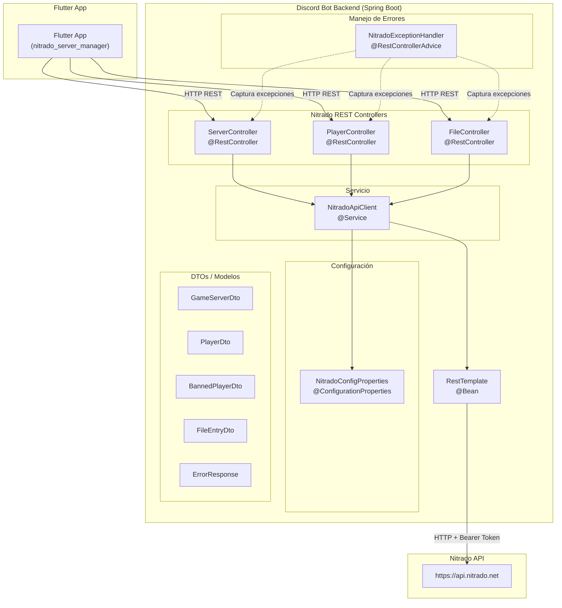
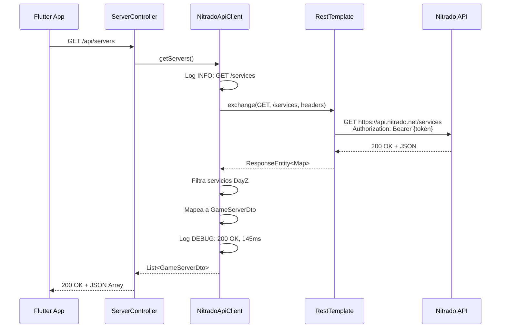
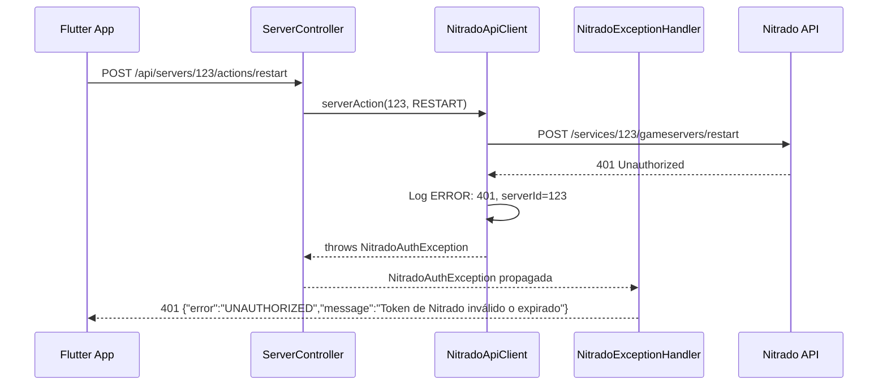

# Documento de Diseño: Integración Nitrado Server

## Resumen (Overview)

Este documento describe el diseño técnico para migrar la integración con la API de Nitrado desde la aplicación Flutter/Dart (`nitrado_server_manager`) al backend Java Spring Boot (`discord-bot-backend`). El backend actuará como proxy/gateway entre la app Flutter y la API de Nitrado (`https://api.nitrado.net`), centralizando la autenticación, el manejo de errores y el logging.

### Decisiones de Diseño Clave

- **Spring Boot Web (`spring-boot-starter-web`)**: Se añade al proyecto existente para exponer endpoints REST. El backend ya usa Spring Boot 3.x con Actuator, por lo que añadir Web es una extensión natural.
- **`RestTemplate`** como cliente HTTP para comunicarse con la API de Nitrado: Es síncrono, simple y suficiente para las operaciones de proxy. Se prefiere sobre `WebClient` porque el proyecto no requiere programación reactiva y `RestTemplate` es más fácil de testear con `MockRestServiceServer`.
- **`NitradoConfigProperties`** como clase de configuración separada (prefijo `nitrado`): Mantiene la separación de responsabilidades respecto a `BotConfigProperties` (prefijo `discord.bot`). Permite configurar el token y la URL base de forma independiente.
- **Paquete `nitrado`** dentro de la estructura existente (`com.discord.bot.nitrado`): Agrupa todos los componentes de la integración (client, controller, DTOs, excepciones) en un subpaquete dedicado, manteniendo la organización del proyecto.
- **DTOs con Java Records**: Se usan records para los modelos de respuesta (inmutables, concisos), siguiendo el patrón de `CommandDispatchResult` ya existente en el proyecto.
- **`@RestControllerAdvice`** para manejo centralizado de errores: Traduce las excepciones del `NitradoApiClient` a respuestas HTTP apropiadas con formato JSON consistente.
- **jqwik** para property-based testing: Ya está configurado en el proyecto (`build.gradle`), se reutiliza para validar las propiedades de corrección de la integración.

## Arquitectura

### Diagrama de Componentes



### Flujo de una Solicitud Típica



### Flujo de Error



## Componentes e Interfaces

### 1. NitradoConfigProperties

Clase de configuración para las propiedades de la integración con Nitrado. Separada de `BotConfigProperties` para mantener independencia.

```java
@ConfigurationProperties(prefix = "nitrado")
@Validated
public class NitradoConfigProperties {
    @NotBlank(message = "nitrado.api-token must not be blank")
    private String apiToken;

    private String baseUrl = "https://api.nitrado.net";

    private int connectTimeoutMs = 10_000;

    private int readTimeoutMs = 10_000;

    // getters y setters
}
```

### 2. NitradoApiClient

Servicio central que encapsula toda la comunicación con la API de Nitrado. Equivalente Java de `NitradoApiClientImpl` en Dart.

```java
@Service
public class NitradoApiClient {

    private final RestTemplate restTemplate;
    private final NitradoConfigProperties config;
    private static final Logger log = LoggerFactory.getLogger(NitradoApiClient.class);

    // ── Servidores ──
    public List<GameServerDto> getServers();
    public GameServerDto getServerStatus(int serviceId);
    public void serverAction(int serviceId, ServerAction action);

    // ── Jugadores ──
    public List<PlayerDto> getPlayers(int serviceId);
    public void kickPlayer(int serviceId, String playerId);
    public void banPlayer(int serviceId, String playerId, String reason);
    public List<BannedPlayerDto> getBanList(int serviceId);
    public void unbanPlayer(int serviceId, String playerId);

    // ── Archivos ──
    public List<FileEntryDto> listFiles(int serviceId, String path);
    public String downloadFile(int serviceId, String filePath);
    public void uploadFile(int serviceId, String filePath, String content);

    // ── Logs ──
    public String getServerLogs(int serviceId);
}
```

Internamente, cada método:
1. Construye la URL completa (`baseUrl + endpoint`).
2. Crea `HttpHeaders` con `Authorization: Bearer {apiToken}`.
3. Ejecuta la solicitud con `RestTemplate.exchange()`.
4. Parsea la respuesta JSON y mapea a DTOs.
5. Registra logs con prefijo `[NitradoClient]` (método, URL, serviceId, tiempo de respuesta).
6. Traduce errores HTTP a excepciones tipadas (`NitradoAuthException`, `NitradoApiException`, `NitradoServerException`, `NitradoConnectionException`).

### 3. ServerController

Controlador REST para operaciones de servidor.

```java
@RestController
@RequestMapping("/api/servers")
public class ServerController {

    private final NitradoApiClient nitradoClient;

    @GetMapping
    public List<GameServerDto> getServers();

    @GetMapping("/{serviceId}/status")
    public GameServerDto getServerStatus(@PathVariable int serviceId);

    @PostMapping("/{serviceId}/actions/{action}")
    public ActionResponse serverAction(
        @PathVariable int serviceId,
        @PathVariable String action);

    @GetMapping("/{serviceId}/logs")
    public LogResponse getServerLogs(@PathVariable int serviceId);
}
```

### 4. PlayerController

Controlador REST para operaciones de jugadores.

```java
@RestController
@RequestMapping("/api/servers/{serviceId}/players")
public class PlayerController {

    private final NitradoApiClient nitradoClient;

    @GetMapping
    public List<PlayerDto> getPlayers(@PathVariable int serviceId);

    @PostMapping("/{playerId}/kick")
    public ActionResponse kickPlayer(
        @PathVariable int serviceId,
        @PathVariable String playerId);

    @PostMapping("/{playerId}/ban")
    public ActionResponse banPlayer(
        @PathVariable int serviceId,
        @PathVariable String playerId,
        @RequestBody(required = false) BanRequest request);

    @GetMapping("/banlist")
    public List<BannedPlayerDto> getBanList(@PathVariable int serviceId);

    @DeleteMapping("/banlist/{playerId}")
    public ActionResponse unbanPlayer(
        @PathVariable int serviceId,
        @PathVariable String playerId);
}
```

Nota: El endpoint de banlist se mapea bajo `/api/servers/{serviceId}/players/banlist` en lugar de `/api/servers/{serviceId}/banlist` para mantener consistencia con el controlador. Sin embargo, para respetar los requisitos (Req 8.1 y 9.1), se añade un mapeo alternativo en `ServerController`:

```java
// En ServerController, para cumplir con Req 8.1 y 9.1
@GetMapping("/{serviceId}/banlist")
public List<BannedPlayerDto> getBanList(@PathVariable int serviceId);

@DeleteMapping("/{serviceId}/banlist/{playerId}")
public ActionResponse unbanPlayer(
    @PathVariable int serviceId,
    @PathVariable String playerId);
```

### 5. FileController

Controlador REST para operaciones de archivos.

```java
@RestController
@RequestMapping("/api/servers/{serviceId}/files")
public class FileController {

    private final NitradoApiClient nitradoClient;

    @GetMapping
    public List<FileEntryDto> listFiles(
        @PathVariable int serviceId,
        @RequestParam(defaultValue = "/") String path);

    @GetMapping("/download")
    public FileContentResponse downloadFile(
        @PathVariable int serviceId,
        @RequestParam String path);

    @PostMapping("/upload")
    public ActionResponse uploadFile(
        @PathVariable int serviceId,
        @RequestParam String path,
        @RequestBody String content);
}
```

### 6. NitradoExceptionHandler

Manejo centralizado de errores para todos los controladores de Nitrado.

```java
@RestControllerAdvice(basePackages = "com.discord.bot.nitrado")
public class NitradoExceptionHandler {

    @ExceptionHandler(NitradoAuthException.class)
    @ResponseStatus(HttpStatus.UNAUTHORIZED)
    public ErrorResponse handleAuth(NitradoAuthException ex);

    @ExceptionHandler(NitradoApiException.class)
    @ResponseStatus(HttpStatus.BAD_REQUEST)
    public ErrorResponse handleApiError(NitradoApiException ex);

    @ExceptionHandler(NitradoServerException.class)
    @ResponseStatus(HttpStatus.BAD_GATEWAY)
    public ErrorResponse handleServerError(NitradoServerException ex);

    @ExceptionHandler(NitradoConnectionException.class)
    @ResponseStatus(HttpStatus.GATEWAY_TIMEOUT)
    public ErrorResponse handleConnectionError(NitradoConnectionException ex);

    @ExceptionHandler(NitradoNotFoundException.class)
    @ResponseStatus(HttpStatus.NOT_FOUND)
    public ErrorResponse handleNotFound(NitradoNotFoundException ex);

    @ExceptionHandler(IllegalArgumentException.class)
    @ResponseStatus(HttpStatus.BAD_REQUEST)
    public ErrorResponse handleBadRequest(IllegalArgumentException ex);
}
```

### 7. Jerarquía de Excepciones

```java
// Excepción base
public class NitradoApiException extends RuntimeException {
    private final int statusCode;
    public NitradoApiException(String message, int statusCode);
}

// 401/403 de Nitrado
public class NitradoAuthException extends NitradoApiException {
    public NitradoAuthException(String message);
}

// 5xx de Nitrado
public class NitradoServerException extends NitradoApiException {
    public NitradoServerException(String message, int statusCode);
}

// Timeout / error de red
public class NitradoConnectionException extends RuntimeException {
    public NitradoConnectionException(String message, Throwable cause);
}

// Recurso no encontrado (404 de Nitrado o recurso lógico)
public class NitradoNotFoundException extends NitradoApiException {
    public NitradoNotFoundException(String message);
}
```

### 8. RestTemplate Configuration

```java
@Configuration
public class NitradoRestTemplateConfig {

    @Bean("nitradoRestTemplate")
    public RestTemplate nitradoRestTemplate(NitradoConfigProperties config) {
        var factory = new SimpleClientHttpRequestFactory();
        factory.setConnectTimeout(config.getConnectTimeoutMs());
        factory.setReadTimeout(config.getReadTimeoutMs());

        var restTemplate = new RestTemplate(factory);
        restTemplate.setUriTemplateHandler(
            new DefaultUriBuilderFactory(config.getBaseUrl()));
        return restTemplate;
    }
}
```

## Modelos de Datos

### DTOs de Respuesta (Java Records)

```java
public record GameServerDto(
    int id,
    String name,
    String ip,
    int port,
    String status,
    int currentPlayers,
    int maxPlayers,
    String map,
    String gameVersion
) {}

public record PlayerDto(
    String id,
    String name,
    boolean online
) {}

public record BannedPlayerDto(
    String id,
    String name,
    String reason,
    Instant bannedAt
) {}

public record FileEntryDto(
    String name,
    String path,
    String type,
    Long size
) {}

public record ErrorResponse(
    String error,
    String message
) {}

public record ActionResponse(
    String status,
    String message
) {}

public record BanRequest(
    String reason
) {}

public record FileContentResponse(
    String content
) {}

public record LogResponse(
    String content
) {}
```

### Enumeración ServerAction

```java
public enum ServerAction {
    START, STOP, RESTART;

    public static ServerAction fromString(String value) {
        try {
            return ServerAction.valueOf(value.toUpperCase());
        } catch (IllegalArgumentException e) {
            throw new IllegalArgumentException(
                "Acción no válida: '" + value + "'. Acciones permitidas: start, stop, restart");
        }
    }
}
```

### Mapeo de Respuestas de la API de Nitrado

La API de Nitrado devuelve respuestas con la estructura:

```json
{
  "status": "success",
  "data": {
    "services": [ ... ]
  }
}
```

El `NitradoApiClient` extrae el campo `data` y mapea los objetos internos a los DTOs correspondientes. El mapeo sigue la misma lógica que la implementación Dart existente:

| Endpoint Nitrado | Campo de respuesta | DTO destino |
|---|---|---|
| `GET /services` | `data.services[]` | `GameServerDto` (filtrado por `details.game` contiene "dayz") |
| `GET /services/{id}/gameservers` | `data.gameserver` | `GameServerDto` |
| `GET /services/{id}/gameservers/games/players` | `data.players[]` | `PlayerDto` |
| `GET /services/{id}/gameservers/games/banlist` | `data.banlist[]` | `BannedPlayerDto` |
| `GET /services/{id}/gameservers/file_server/list` | `data.entries[]` | `FileEntryDto` |
| `GET /services/{id}/gameservers/file_server/download` | `data.token.url` | URL temporal → contenido String |

### Configuración (application.properties)

```properties
# Nitrado API Configuration
nitrado.api-token=${NITRADO_API_TOKEN:}
nitrado.base-url=${NITRADO_BASE_URL:https://api.nitrado.net}
nitrado.connect-timeout-ms=${NITRADO_CONNECT_TIMEOUT_MS:10000}
nitrado.read-timeout-ms=${NITRADO_READ_TIMEOUT_MS:10000}
```

### Especificación de Endpoints REST

| Método | Endpoint | Descripción | Req |
|--------|----------|-------------|-----|
| GET | `/api/servers` | Lista servidores DayZ | 2 |
| GET | `/api/servers/{serviceId}/status` | Estado detallado del servidor | 3 |
| POST | `/api/servers/{serviceId}/actions/{action}` | Control del servidor (start/stop/restart) | 4 |
| GET | `/api/servers/{serviceId}/players` | Lista jugadores conectados | 5 |
| POST | `/api/servers/{serviceId}/players/{playerId}/kick` | Expulsar jugador | 6 |
| POST | `/api/servers/{serviceId}/players/{playerId}/ban` | Banear jugador | 7 |
| GET | `/api/servers/{serviceId}/banlist` | Lista jugadores baneados | 8 |
| DELETE | `/api/servers/{serviceId}/banlist/{playerId}` | Desbanear jugador | 9 |
| GET | `/api/servers/{serviceId}/files?path={path}` | Listar archivos | 10 |
| GET | `/api/servers/{serviceId}/files/download?path={path}` | Descargar archivo | 11 |
| POST | `/api/servers/{serviceId}/files/upload?path={path}` | Subir archivo | 12 |
| GET | `/api/servers/{serviceId}/logs` | Descargar logs del servidor | 13 |


## Propiedades de Corrección (Correctness Properties)

*Una propiedad es una característica o comportamiento que debe cumplirse en todas las ejecuciones válidas de un sistema — esencialmente, una declaración formal sobre lo que el sistema debe hacer. Las propiedades sirven como puente entre especificaciones legibles por humanos y garantías de corrección verificables por máquina.*

### Property 1: Cabecera de autenticación siempre presente

*Para cualquier* valor de token configurado (no vacío), toda solicitud HTTP enviada por el `NitradoApiClient` a la API de Nitrado SHALL incluir la cabecera `Authorization` con el valor exacto `Bearer {token}`.

**Validates: Requirements 1.2**

### Property 2: Tokens vacíos o en blanco son rechazados

*Para cualquier* cadena compuesta únicamente de espacios en blanco (incluyendo la cadena vacía y null), el sistema SHALL rechazar el valor como token inválido y registrar un error descriptivo que incluya el nombre del parámetro.

**Validates: Requirements 1.3**

### Property 3: Filtrado de servidores DayZ (case-insensitive)

*Para cualquier* lista de servicios devuelta por la API de Nitrado, el `NitradoApiClient` SHALL incluir en el resultado únicamente aquellos servicios cuyo campo `game` contenga la subcadena "dayz" sin distinción de mayúsculas/minúsculas, y SHALL excluir todos los demás.

**Validates: Requirements 2.2**

### Property 4: Mapeo JSON-a-DTO preserva todos los campos

*Para cualquier* respuesta JSON válida de la API de Nitrado que represente un servidor, jugador, jugador baneado o entrada de archivo, el mapeo a su DTO correspondiente (`GameServerDto`, `PlayerDto`, `BannedPlayerDto`, `FileEntryDto`) SHALL preservar todos los campos sin pérdida ni alteración de datos.

**Validates: Requirements 2.3, 3.2, 5.2, 8.2, 10.2**

### Property 5: Mapeo de acciones a endpoints de Nitrado

*Para cualquier* `serviceId` válido: las acciones `start` y `restart` SHALL mapearse al endpoint POST `/services/{serviceId}/gameservers/restart`, y la acción `stop` SHALL mapearse al endpoint POST `/services/{serviceId}/gameservers/stop`.

**Validates: Requirements 4.2, 4.3**

### Property 6: Acciones inválidas son rechazadas

*Para cualquier* cadena que no sea "start", "stop" o "restart" (sin distinción de mayúsculas/minúsculas), el método `ServerAction.fromString()` SHALL lanzar una `IllegalArgumentException` con un mensaje que incluya las acciones permitidas.

**Validates: Requirements 4.4**

### Property 7: Construcción correcta del cuerpo de solicitudes de jugadores

*Para cualquier* `serviceId` y `playerId`, las solicitudes de kick, ban y unban enviadas por el `NitradoApiClient` SHALL incluir el campo `player_id` con el valor del `playerId` en el cuerpo de la solicitud. Adicionalmente, la solicitud de ban SHALL incluir el campo `reason` cuando se proporcione un valor no nulo.

**Validates: Requirements 6.2, 7.2, 9.2**

### Property 8: Subida de archivos usa content-type correcto

*Para cualquier* contenido de archivo y ruta, la solicitud de subida enviada por el `NitradoApiClient` SHALL usar el content-type `application/octet-stream` y SHALL incluir el parámetro `path` en la query string.

**Validates: Requirements 12.2**

### Property 9: Errores de autenticación de Nitrado se clasifican correctamente

*Para cualquier* respuesta HTTP con código 401 o 403 de la API de Nitrado, el `NitradoApiClient` SHALL lanzar una `NitradoAuthException`, y el `NitradoExceptionHandler` SHALL traducirla a una respuesta HTTP 401 con un mensaje indicando que el token es inválido o ha expirado.

**Validates: Requirements 1.4, 14.1**

### Property 10: Errores de cliente de Nitrado se clasifican correctamente

*Para cualquier* respuesta HTTP con código 4xx (excluyendo 401 y 403) de la API de Nitrado, el `NitradoApiClient` SHALL lanzar una `NitradoApiException`, y el `NitradoExceptionHandler` SHALL traducirla a una respuesta HTTP 400 con el mensaje de error original de la API de Nitrado.

**Validates: Requirements 14.2**

### Property 11: Errores de servidor de Nitrado se clasifican correctamente

*Para cualquier* respuesta HTTP con código 5xx de la API de Nitrado, el `NitradoApiClient` SHALL lanzar una `NitradoServerException`, y el `NitradoExceptionHandler` SHALL traducirla a una respuesta HTTP 502 con un mensaje indicando que el servicio de Nitrado no está disponible temporalmente.

**Validates: Requirements 14.3**

### Property 12: Formato consistente de respuestas de error

*Para cualquier* excepción manejada por el `NitradoExceptionHandler` (`NitradoAuthException`, `NitradoApiException`, `NitradoServerException`, `NitradoConnectionException`, `NitradoNotFoundException`, `IllegalArgumentException`), la respuesta JSON SHALL contener exactamente los campos `error` (código de error como cadena) y `message` (descripción legible).

**Validates: Requirements 14.5**

## Manejo de Errores (Error Handling)

### Errores de Configuración

- **Token ausente/vacío**: La anotación `@NotBlank` en `NitradoConfigProperties.apiToken` hace que Spring Boot falle el arranque con un mensaje descriptivo. Esto impide que los endpoints de Nitrado estén disponibles sin un token válido.
- **URL base inválida**: Valor por defecto `https://api.nitrado.net` asegura que siempre hay una URL válida. Si se sobreescribe con un valor inválido, `RestTemplate` lanzará una excepción al primer uso.

### Errores de Comunicación con Nitrado

| Código Nitrado | Excepción Java | Código HTTP Gateway | Mensaje |
|---|---|---|---|
| 401, 403 | `NitradoAuthException` | 401 | "Token de Nitrado inválido o expirado" |
| 400, 404, 405, 409, 422 | `NitradoApiException` | 400 | Mensaje original de la API de Nitrado |
| 404 (recurso lógico) | `NitradoNotFoundException` | 404 | "Servidor/archivo/recurso no encontrado" |
| 500, 502, 503 | `NitradoServerException` | 502 | "Servicio de Nitrado no disponible temporalmente" |
| Timeout / error de red | `NitradoConnectionException` | 504 | "No se pudo contactar con el servicio de Nitrado" |

### Flujo de Manejo de Errores en NitradoApiClient

```java
try {
    ResponseEntity<Map> response = restTemplate.exchange(...);
    // procesar respuesta exitosa
} catch (HttpClientErrorException e) {
    int status = e.getStatusCode().value();
    String message = extractMessage(e.getResponseBodyAsString());
    if (status == 401 || status == 403) {
        throw new NitradoAuthException(message != null ? message : "Token inválido o expirado");
    }
    if (status == 404) {
        throw new NitradoNotFoundException(message != null ? message : "Recurso no encontrado");
    }
    throw new NitradoApiException(message != null ? message : "Error en la solicitud", status);
} catch (HttpServerErrorException e) {
    throw new NitradoServerException(
        "Servicio de Nitrado no disponible temporalmente", e.getStatusCode().value());
} catch (ResourceAccessException e) {
    throw new NitradoConnectionException(
        "No se pudo contactar con el servicio de Nitrado", e);
}
```

### Extracción de Mensajes de Error

La API de Nitrado devuelve errores con la estructura `{"message": "..."}`. El método `extractMessage()` intenta parsear el cuerpo de la respuesta como JSON y extraer el campo `message`. Si no es posible, retorna `null` y se usa un mensaje por defecto.

### Validación de Parámetros de Entrada

- **`serviceId`**: Validado implícitamente por Spring (debe ser `int`). Valores negativos o cero se aceptan y se delegan a la API de Nitrado (que retornará 404).
- **`action`**: Validado por `ServerAction.fromString()`. Valores inválidos lanzan `IllegalArgumentException`, capturada por `NitradoExceptionHandler` → 400.
- **`path` en archivos**: Valor por defecto `"/"` si no se proporciona. Rutas inválidas se delegan a la API de Nitrado.
- **`playerId`**: Se pasa directamente a la API de Nitrado. Valores inválidos generarán un error 4xx de Nitrado.

## Estrategia de Testing

### Enfoque Dual

El proyecto utiliza un enfoque dual de testing:
- **Tests unitarios**: Verifican ejemplos específicos, edge cases y condiciones de error con mocks.
- **Tests de propiedades (PBT)**: Verifican propiedades universales con inputs generados aleatoriamente.

### Librería de Property-Based Testing

- **jqwik** (https://jqwik.net/) — ya configurada en `build.gradle` del proyecto.
- Cada test de propiedad se configura con mínimo **100 iteraciones** (`@Property(tries = 100)`).
- Cada test referencia la propiedad del diseño con un tag: `// Feature: nitrado-server-integration, Property N: <título>`.

### Tests de Propiedades (PBT)

| Propiedad | Qué se genera | Qué se verifica |
|-----------|---------------|-----------------|
| P1: Cabecera de autenticación | Strings aleatorios no vacíos como tokens | Header `Authorization: Bearer {token}` presente en cada request |
| P2: Tokens vacíos rechazados | Strings de whitespace, vacíos, null | Validación falla con mensaje descriptivo |
| P3: Filtrado DayZ | Listas de servicios con game names aleatorios (algunos con "dayz" en distintas casings) | Solo servicios DayZ incluidos en resultado |
| P4: Mapeo JSON-a-DTO | Objetos JSON con campos aleatorios (strings, ints, fechas) | Todos los campos preservados en el DTO |
| P5: Mapeo acciones-endpoints | ServiceIds aleatorios + las 3 acciones válidas | URL correcta para cada acción |
| P6: Acciones inválidas | Strings aleatorios ∉ {start, stop, restart} | IllegalArgumentException con mensaje descriptivo |
| P7: Cuerpo de solicitudes | ServiceIds y playerIds aleatorios, reasons opcionales | Campo `player_id` siempre presente, `reason` presente cuando no es null |
| P8: Content-type de upload | Contenidos de archivo aleatorios | Content-type = `application/octet-stream` |
| P9: Errores auth | Respuestas con códigos 401 y 403 | NitradoAuthException → HTTP 401 |
| P10: Errores cliente | Respuestas con códigos 4xx (excl. 401/403) | NitradoApiException → HTTP 400 con mensaje original |
| P11: Errores servidor | Respuestas con códigos 5xx | NitradoServerException → HTTP 502 |
| P12: Formato de errores | Todas las excepciones tipadas del sistema | Respuesta JSON con campos `error` y `message` |

### Tests Unitarios (Ejemplos)

- `GET /api/servers` devuelve lista de GameServerDto (Req 2.1)
- `GET /api/servers/{id}/status` devuelve GameServerDto detallado (Req 3.1)
- `GET /api/servers/{id}/status` con id inexistente devuelve 404 (Req 3.3)
- `POST /api/servers/{id}/actions/start` devuelve 200 (Req 4.1)
- `GET /api/servers/{id}/players` devuelve lista vacía con 200 (Req 5.3)
- `POST /api/servers/{id}/players/{pid}/kick` devuelve 200 (Req 6.1)
- `POST /api/servers/{id}/players/{pid}/ban` con y sin reason devuelve 200 (Req 7.1)
- `GET /api/servers/{id}/banlist` devuelve lista vacía con 200 (Req 8.3)
- `DELETE /api/servers/{id}/banlist/{pid}` devuelve 200 (Req 9.1)
- `GET /api/servers/{id}/files` sin parámetro path usa "/" por defecto (Req 10.4)
- `GET /api/servers/{id}/files/download` devuelve contenido de archivo (Req 11.1)
- `POST /api/servers/{id}/files/upload` devuelve 200 (Req 12.1)
- `GET /api/servers/{id}/logs` devuelve contenido de log (Req 13.1)
- Fallback de ruta de logs cuando no se encuentra carpeta DayZ (Req 13.3)
- Timeout de conexión devuelve 504 (Req 14.4)

### Tests de Integración

- Descarga de archivo en dos pasos (obtener URL temporal + descargar contenido) (Req 11.2)
- Descubrimiento de carpeta DayZ en `/games` para logs (Req 13.2)

### Tests Smoke

- Token se carga desde `application.properties` o variable de entorno (Req 1.1)
- Logger del `NitradoApiClient` usa el nombre de clase como prefijo (Req 15.4)
- Logs INFO contienen método HTTP, URL y serviceId (Req 15.1)
- Logs ERROR contienen código de respuesta, mensaje y serviceId (Req 15.2)
- Logs DEBUG contienen tiempo de respuesta en ms (Req 15.3)
