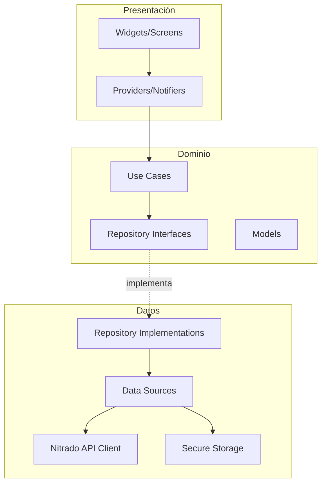

# Documento de Diseño - Nitrado Server Manager

## Visión General

Nitrado Server Manager es una aplicación Flutter multiplataforma (móvil, tablet, escritorio) que permite a administradores de servidores DayZ gestionar sus servidores a través de la API REST de Nitrado. La aplicación sigue una arquitectura limpia con separación clara entre capas de datos, dominio y presentación, utilizando Riverpod como solución de gestión de estado.

La aplicación se comunica exclusivamente con la API de Nitrado (`https://api.nitrado.net`) mediante HTTPS, almacena credenciales de forma segura usando `flutter_secure_storage`, y proporciona interfaces visuales especializadas para editar archivos de configuración XML/JSON del servidor DayZ.

## Arquitectura

### Patrón Arquitectónico

Se adopta una arquitectura por capas basada en Clean Architecture adaptada a Flutter:



### Gestión de Estado

Se utiliza Riverpod con `AsyncNotifier` para manejar estados asíncronos de la API. Cada pantalla principal tiene su propio provider que encapsula la lógica de negocio y el estado de la UI.

### Estructura de Carpetas

El proyecto Flutter se crea como un proyecto independiente en la carpeta `nitrado_server_manager/` en la raíz del workspace. No se coloca dentro de `dayzOffline.chernarusplus/`, ya que esa carpeta contiene archivos de configuración del servidor DayZ y no es un proyecto Flutter.

```
nitrado_server_manager/          # Proyecto Flutter independiente
├── pubspec.yaml
├── lib/
│   ├── main.dart
│   ├── app.dart
│   ├── core/
│   │   ├── api/              # Cliente HTTP, interceptores, manejo de errores API
│   │   ├── storage/           # Abstracción de almacenamiento seguro
│   │   ├── xml/               # Parser/serializer XML genérico
│   │   └── router/            # Configuración de GoRouter
│   ├── features/
│   │   ├── auth/              # Autenticación OAuth
│   │   ├── server_selection/  # Selección de servidor
│   │   ├── dashboard/         # Panel de estado del servidor
│   │   ├── server_control/    # Iniciar, detener, reiniciar
│   │   ├── players/           # Gestión de jugadores
│   │   ├── config_editor/     # Editor de archivos de configuración
│   │   ├── types_manager/     # Gestión visual de types.xml
│   │   ├── globals_manager/   # Gestión de globals.xml
│   │   ├── events_manager/    # Gestión de events.xml
│   │   └── logs/              # Visualización de logs
│   └── shared/
│       ├── widgets/           # Widgets reutilizables
│       └── models/            # Modelos compartidos
└── test/                      # Tests unitarios y de propiedades
```

## Componentes e Interfaces

### 1. NitradoApiClient

Cliente HTTP centralizado que gestiona todas las comunicaciones con la API de Nitrado.

```dart
abstract class NitradoApiClient {
  /// Obtiene la lista de servidores DayZ de la cuenta
  Future<List<GameServer>> getServers();
  
  /// Obtiene el estado detallado de un servidor
  Future<ServerStatus> getServerStatus(int serverId);
  
  /// Ejecuta una acción de control (restart, stop, start)
  Future<void> serverAction(int serverId, ServerAction action);
  
  /// Obtiene la lista de jugadores conectados
  Future<List<Player>> getPlayers(int serverId);
  
  /// Expulsa a un jugador
  Future<void> kickPlayer(int serverId, String playerId);
  
  /// Banea a un jugador
  Future<void> banPlayer(int serverId, String playerId, {String? reason});
  
  /// Obtiene la lista de jugadores baneados
  Future<List<BannedPlayer>> getBanList(int serverId);
  
  /// Desbanea a un jugador
  Future<void> unbanPlayer(int serverId, String playerId);
  
  /// Lista archivos del servidor
  Future<List<FileEntry>> listFiles(int serverId, String path);
  
  /// Descarga el contenido de un archivo
  Future<String> downloadFile(int serverId, String filePath);
  
  /// Sube un archivo al servidor
  Future<void> uploadFile(int serverId, String filePath, String content);
  
  /// Obtiene los logs del servidor
  Future<String> getServerLogs(int serverId);
}
```

### 2. AuthService

Gestiona la autenticación y el almacenamiento seguro del token OAuth.

```dart
abstract class AuthService {
  /// Almacena el token OAuth de forma segura
  Future<void> saveToken(String token);
  
  /// Recupera el token almacenado
  Future<String?> getToken();
  
  /// Valida el token contra la API de Nitrado
  Future<bool> validateToken(String token);
  
  /// Elimina el token almacenado (cerrar sesión)
  Future<void> deleteToken();
  
  /// Indica si hay una sesión activa
  Future<bool> isAuthenticated();
}
```

### 3. XmlParserService

Servicio genérico de parseo y serialización XML para los archivos de configuración DayZ.

```dart
abstract class XmlParserService {
  /// Parsea types.xml a una lista de objetos DayzType
  List<DayzType> parseTypes(String xmlContent);
  
  /// Serializa una lista de DayzType a XML válido
  String serializeTypes(List<DayzType> types);
  
  /// Parsea globals.xml a una lista de GlobalVariable
  List<GlobalVariable> parseGlobals(String xmlContent);
  
  /// Serializa una lista de GlobalVariable a XML válido
  String serializeGlobals(List<GlobalVariable> globals);
  
  /// Parsea events.xml a una lista de SpawnEvent
  List<SpawnEvent> parseEvents(String xmlContent);
  
  /// Serializa una lista de SpawnEvent a XML válido
  String serializeEvents(List<SpawnEvent> events);
  
  /// Valida que un string sea XML bien formado
  bool isValidXml(String content);
  
  /// Valida que un string sea JSON válido
  bool isValidJson(String content);
}
```

### 4. Navegación

Se utiliza GoRouter con navegación basada en shell para el menú principal:

```dart
// Rutas principales
// /auth              → Pantalla de autenticación
// /servers           → Selección de servidor
// /dashboard         → Panel de estado
// /control           → Control del servidor
// /players           → Gestión de jugadores
// /config            → Editor de configuración
// /types             → Gestión de items (types.xml)
// /globals           → Variables globales (globals.xml)
// /events            → Eventos de spawn (events.xml)
// /logs              → Logs del servidor
```

## Modelos de Datos

### GameServer
```dart
class GameServer {
  final int id;
  final String name;
  final String ip;
  final int port;
  final String status; // "started", "stopped", "restarting", "installing"
  final int currentPlayers;
  final int maxPlayers;
  final String map;
  final String gameVersion;
}
```

### DayzType (types.xml)
Basado en la estructura real del archivo `types.xml`:

```dart
class DayzType {
  final String name;
  final int nominal;
  final int lifetime;
  final int restock;
  final int min;
  final int quantmin;
  final int quantmax;
  final int cost;
  final DayzTypeFlags flags;
  final String? category;       // "weapons", "tools", "containers", "clothes", "food", etc.
  final List<String> usages;    // ["Military", "Police", "Hunting", ...]
  final List<String> values;    // ["Tier1", "Tier2", "Tier3", "Tier4"]
  final List<String> tags;      // ["shelves", ...]
}

class DayzTypeFlags {
  final int countInCargo;
  final int countInHoarder;
  final int countInMap;
  final int countInPlayer;
  final int crafted;
  final int deloot;
}
```

Ejemplo XML real:
```xml
<type name="AK101">
    <nominal>20</nominal>
    <lifetime>14400</lifetime>
    <restock>3600</restock>
    <min>12</min>
    <quantmin>30</quantmin>
    <quantmax>80</quantmax>
    <cost>100</cost>
    <flags count_in_cargo="0" count_in_hoarder="0" count_in_map="1" count_in_player="0" crafted="0" deloot="0"/>
    <category name="weapons"/>
    <usage name="Military"/>
    <value name="Tier4"/>
</type>
```

### GlobalVariable (globals.xml)
Basado en la estructura real del archivo `globals.xml`:

```dart
class GlobalVariable {
  final String name;
  final int type;     // 0 = entero, 1 = decimal
  final String value;
}
```

Ejemplo XML real:
```xml
<var name="ZombieMaxCount" type="0" value="1000"/>
<var name="LootDamageMax" type="1" value="0.82"/>
```

### SpawnEvent (events.xml)
Basado en la estructura real del archivo `events.xml`:

```dart
class SpawnEvent {
  final String name;
  final int nominal;
  final int min;
  final int max;
  final int lifetime;
  final int restock;
  final int saferadius;
  final int distanceradius;
  final int cleanupradius;
  final SpawnEventFlags flags;
  final String position;   // "fixed", "player"
  final String limit;      // "child", "custom", "mixed"
  final int active;        // 0 o 1
  final List<EventChild> children;
}

class SpawnEventFlags {
  final int deletable;
  final int initRandom;
  final int removeDamaged;
}

class EventChild {
  final String type;
  final int min;
  final int max;
  final int lootmin;
  final int lootmax;
}
```

Ejemplo XML real:
```xml
<event name="AnimalBear">
    <nominal>10</nominal>
    <min>2</min>
    <max>2</max>
    <lifetime>180</lifetime>
    <restock>0</restock>
    <saferadius>200</saferadius>
    <distanceradius>0</distanceradius>
    <cleanupradius>0</cleanupradius>
    <flags deletable="0" init_random="0" remove_damaged="1"/>
    <position>fixed</position>
    <limit>custom</limit>
    <active>1</active>
    <children>
      <child lootmax="0" lootmin="0" max="1" min="1" type="Animal_UrsusArctos"/>
    </children>
</event>
```

### Player
```dart
class Player {
  final String id;
  final String name;
  final bool online;
}

class BannedPlayer {
  final String id;
  final String name;
  final String? reason;
  final DateTime? bannedAt;
}
```

### ServerAction
```dart
enum ServerAction { start, stop, restart }
```


## Propiedades de Corrección

*Una propiedad es una característica o comportamiento que debe mantenerse verdadero en todas las ejecuciones válidas de un sistema — esencialmente, una declaración formal sobre lo que el sistema debe hacer. Las propiedades sirven como puente entre especificaciones legibles por humanos y garantías de corrección verificables por máquinas.*

### Propiedad 1: Round trip de almacenamiento de token

*Para cualquier* token OAuth válido (string no vacío), almacenarlo con `saveToken` y luego recuperarlo con `getToken` debe devolver el mismo token. Además, después de llamar a `deleteToken`, `getToken` debe devolver null.

**Valida: Requisitos 1.1, 1.4**

### Propiedad 2: Información completa del servidor en dashboard

*Para cualquier* objeto GameServer generado aleatoriamente, la función de renderizado del Panel_Estado debe producir una representación que contenga: nombre del servidor, dirección IP, puerto, número de jugadores conectados, máximo de jugadores, mapa activo y versión del juego.

**Valida: Requisito 2.3**

### Propiedad 3: Mapeo estado-color del servidor

*Para cualquier* estado de servidor válido ("started", "stopped", "restarting", "installing"), la función de mapeo de estado a color debe devolver: verde para "started", rojo para "stopped", y amarillo para "restarting" o "installing". La función debe ser total (cubrir todos los estados posibles).

**Valida: Requisito 2.5**

### Propiedad 4: Propagación de errores de API en control del servidor

*Para cualquier* mensaje de error devuelto por la API de Nitrado (string no vacío), el estado de error presentado al usuario debe contener dicho mensaje.

**Valida: Requisito 3.4**

### Propiedad 5: Deshabilitación de controles durante operaciones en curso

*Para cualquier* estado de servidor que sea "restarting" o "installing", la función que determina si los botones de control están habilitados debe devolver `false`.

**Valida: Requisito 3.5**

### Propiedad 6: Validación de sintaxis XML y JSON

*Para cualquier* string generado aleatoriamente, la función `isValidXml` debe devolver `true` si y solo si el string es XML bien formado, y la función `isValidJson` debe devolver `true` si y solo si el string es JSON válido. Strings que no sean XML/JSON válido deben ser rechazados.

**Valida: Requisitos 5.4, 5.5, 5.6**

### Propiedad 7: Round trip de types.xml

*Para cualquier* lista de objetos DayzType válidos generados aleatoriamente, serializar la lista a XML con `serializeTypes` y luego parsear el XML resultante con `parseTypes` debe producir una lista de objetos equivalente a la original.

**Valida: Requisito 6.4**

### Propiedad 8: Filtrado de items por categoría

*Para cualquier* lista de DayzType y cualquier categoría seleccionada del conjunto válido (weapons, tools, containers, clothes, food, explosives, books), filtrar la lista por esa categoría debe devolver únicamente items cuya categoría coincida con la seleccionada, y todos los items con esa categoría deben estar presentes en el resultado.

**Valida: Requisitos 6.1, 6.6**

### Propiedad 9: Validación nominal >= min en types

*Para cualquier* DayzType donde el valor de `nominal` sea menor que el valor de `min`, la función de validación debe detectar y reportar esta inconsistencia.

**Valida: Requisito 6.5**

### Propiedad 10: Round trip de globals.xml

*Para cualquier* lista de objetos GlobalVariable válidos generados aleatoriamente, serializar la lista a XML con `serializeGlobals` y luego parsear el XML resultante con `parseGlobals` debe producir una lista de objetos equivalente a la original.

**Valida: Requisito 7.4**

### Propiedad 11: Validación numérica de variables globales

*Para cualquier* string que no represente un número válido (ni entero ni decimal) y cualquier GlobalVariable de tipo numérico, la función de validación debe rechazar el valor.

**Valida: Requisito 7.3**

### Propiedad 12: Round trip de events.xml

*Para cualquier* lista de objetos SpawnEvent válidos generados aleatoriamente, serializar la lista a XML con `serializeEvents` y luego parsear el XML resultante con `parseEvents` debe producir una lista de objetos equivalente a la original.

**Valida: Requisito 8.5**

### Propiedad 13: Mapeo estado activo/inactivo de eventos

*Para cualquier* SpawnEvent, si el campo `active` es 0, la función de presentación debe marcarlo como desactivado; si es 1, debe marcarlo como activado.

**Valida: Requisito 8.4**

### Propiedad 14: Clasificación de niveles de log

*Para cualquier* entrada de log que contenga indicadores de nivel (como "ERROR", "WARNING", "INFO"), la función de clasificación debe asignar el nivel correcto correspondiente.

**Valida: Requisito 9.2**

### Propiedad 15: Filtrado de logs por texto de búsqueda

*Para cualquier* lista de entradas de log y cualquier string de búsqueda, el resultado del filtrado debe contener únicamente entradas que incluyan el texto buscado (case-insensitive), y todas las entradas que contengan el texto deben estar presentes en el resultado.

**Valida: Requisito 9.3**

## Manejo de Errores

### Errores de Red y API

| Escenario | Comportamiento |
|---|---|
| Sin conexión a internet | Mostrar mensaje de error con opción de reintentar |
| Timeout de API (>10s) | Mostrar indicador de error de conexión con botón de reintento |
| Token OAuth inválido/expirado | Redirigir a pantalla de autenticación con mensaje descriptivo |
| Error 4xx de API | Mostrar mensaje de error devuelto por la API |
| Error 5xx de API | Mostrar mensaje genérico de error del servidor con opción de reintentar |

### Errores de Validación

| Escenario | Comportamiento |
|---|---|
| XML mal formado | Señalar error de sintaxis, impedir subida del archivo |
| JSON inválido | Señalar error de sintaxis, impedir subida del archivo |
| nominal < min en types.xml | Mostrar advertencia, permitir guardar con confirmación |
| Valor no numérico en globals.xml | Rechazar valor, mostrar mensaje de validación |

### Estrategia de Reintentos

- Las operaciones de lectura (GET) se reintentan automáticamente hasta 3 veces con backoff exponencial (1s, 2s, 4s)
- Las operaciones de escritura (POST/PUT) no se reintentan automáticamente para evitar duplicación
- El usuario puede reintentar manualmente cualquier operación fallida

## Estrategia de Testing

### Testing Unitario

Los tests unitarios cubren casos específicos, edge cases y condiciones de error:

- Parseo de archivos XML reales del servidor DayZ (types.xml, globals.xml, events.xml)
- Validación de formularios con valores límite
- Manejo de respuestas de error de la API (con mocks)
- Flujos de autenticación (token válido, inválido, expirado)
- Navegación entre pantallas
- Casos edge: listas vacías, archivos vacíos, caracteres especiales en nombres de items

### Testing Basado en Propiedades

Se utiliza la librería `dart_check` (o `glados`) para Dart/Flutter.

Cada propiedad del documento de diseño se implementa como un test basado en propiedades con mínimo 100 iteraciones.

Cada test debe estar etiquetado con un comentario referenciando la propiedad del diseño:

```dart
// Feature: nitrado-server-manager, Property 7: Round trip de types.xml
test('serializeTypes then parseTypes produces equivalent objects', () {
  // property-based test implementation
});
```

Propiedades a implementar como tests basados en propiedades:
1. Round trip de almacenamiento de token
2. Información completa del servidor en dashboard
3. Mapeo estado-color del servidor
4. Propagación de errores de API
5. Deshabilitación de controles durante operaciones
6. Validación de sintaxis XML/JSON
7. Round trip de types.xml
8. Filtrado de items por categoría
9. Validación nominal >= min en types
10. Round trip de globals.xml
11. Validación numérica de variables globales
12. Round trip de events.xml
13. Mapeo estado activo/inactivo de eventos
14. Clasificación de niveles de log
15. Filtrado de logs por texto de búsqueda

### Configuración de Tests

- Mínimo 100 iteraciones por test de propiedad
- Mocks para la API de Nitrado usando `mocktail`
- Tests de widgets con `flutter_test` para verificar renderizado de UI
- Cada propiedad de corrección se implementa con un ÚNICO test basado en propiedades
- Formato de etiqueta: **Feature: nitrado-server-manager, Property {número}: {título}**
