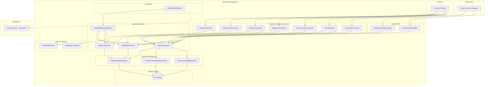
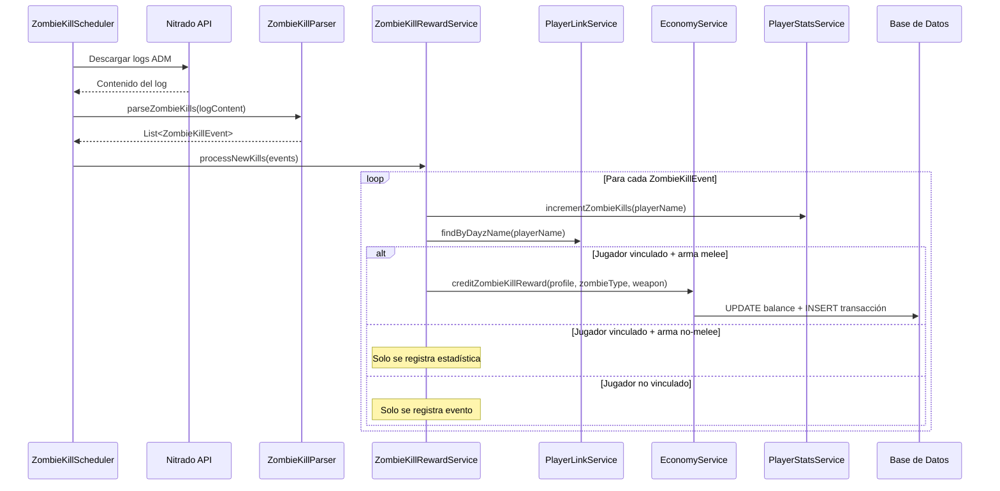
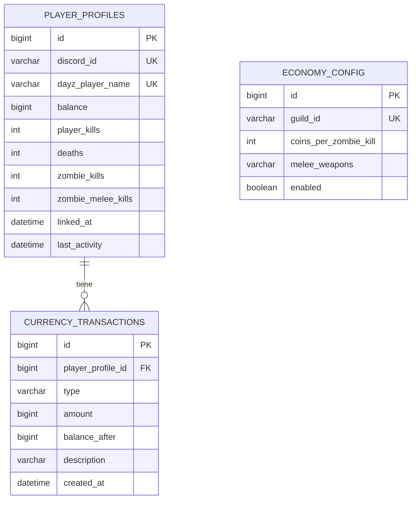

# Documento de Diseño — Sistema de Economía y Estadísticas de Jugadores

## Resumen General

Este documento describe el diseño técnico del sistema de economía y estadísticas de jugadores para el bot de Discord de DayZ. El sistema introduce persistencia con base de datos (Spring Data JPA + H2/MySQL), un parser de kills de zombies, un sistema de moneda virtual (TNT Coins), seguimiento de estadísticas, comandos de Discord para interacción de jugadores, endpoints REST para la app Flutter, y pantallas de configuración en Flutter.

### Decisiones de Diseño Clave

1. **Base de datos**: Spring Data JPA con H2 embebido (desarrollo) y MySQL (producción). Se eligió MySQL por requisito explícito del usuario para producción.
2. **Parser de zombies**: Nuevo componente `ZombieKillParser` separado del `LogParser` existente, ya que el formato de log de kills de zombies difiere significativamente del formato de kills entre jugadores.
3. **Clasificación de armas melee**: Lista configurable almacenada en `EconomyConfig` en base de datos, con valores por defecto hardcodeados como fallback.
4. **Atomicidad de transacciones**: `@Transactional` de Spring para garantizar que balance + registro de transacción se actualicen juntos.
5. **Vinculación de cuentas**: Relación 1:1 entre Discord ID y nombre DayZ, con unicidad en ambos campos.

---

## Arquitectura

### Diagrama de Componentes de Alto Nivel



### Diagrama de Flujo: Procesamiento de Kill de Zombie



---

## Componentes e Interfaces

### 1. Capa de Persistencia (JPA Entities + Repositories)

#### PlayerProfile (Entidad JPA)

```java
@Entity
@Table(name = "player_profiles")
public class PlayerProfile {
    @Id
    @GeneratedValue(strategy = GenerationType.IDENTITY)
    private Long id;

    @Column(unique = true, nullable = false)
    private String discordId;

    @Column(unique = true, nullable = false)
    private String dayzPlayerName;

    @Column(nullable = false)
    private long balance; // TNT Coins

    // Estadísticas
    private int playerKills;
    private int deaths;
    private int zombieKills;
    private int zombieMeleeKills;

    @Column(nullable = false)
    private LocalDateTime linkedAt;

    private LocalDateTime lastActivity;
}
```

#### CurrencyTransaction (Entidad JPA)

```java
@Entity
@Table(name = "currency_transactions")
public class CurrencyTransaction {
    @Id
    @GeneratedValue(strategy = GenerationType.IDENTITY)
    private Long id;

    @ManyToOne(fetch = FetchType.LAZY)
    @JoinColumn(name = "player_profile_id", nullable = false)
    private PlayerProfile playerProfile;

    @Enumerated(EnumType.STRING)
    @Column(nullable = false)
    private TransactionType type;

    @Column(nullable = false)
    private long amount;

    @Column(nullable = false)
    private long balanceAfter;

    private String description;

    @Column(nullable = false)
    private LocalDateTime createdAt;
}
```

#### EconomyConfig (Entidad JPA)

```java
@Entity
@Table(name = "economy_config")
public class EconomyConfig {
    @Id
    @GeneratedValue(strategy = GenerationType.IDENTITY)
    private Long id;

    @Column(nullable = false)
    private String guildId;

    @Column(nullable = false)
    private int coinsPerZombieKill; // default: 10

    @Column(length = 2000)
    private String meleeWeapons; // CSV: "SledgeHammer,FirefighterAxe,..."

    @Column(nullable = false)
    private boolean enabled; // default: true
}
```

#### Enumeración TransactionType

```java
public enum TransactionType {
    ZOMBIE_KILL_REWARD,
    ADMIN_CREDIT,
    ADMIN_DEBIT
}
```

### 2. Repositories (Spring Data JPA)

```java
public interface PlayerProfileRepository extends JpaRepository<PlayerProfile, Long> {
    Optional<PlayerProfile> findByDiscordId(String discordId);
    Optional<PlayerProfile> findByDayzPlayerName(String dayzPlayerName);
    Optional<PlayerProfile> findByDayzPlayerNameIgnoreCase(String dayzPlayerName);
    List<PlayerProfile> findTop10ByOrderByPlayerKillsDesc();
    List<PlayerProfile> findTop10ByOrderByZombieKillsDesc();
    List<PlayerProfile> findTop10ByOrderByBalanceDesc();

    @Query("SELECT p FROM PlayerProfile p WHERE p.deaths >= 5 ORDER BY (p.playerKills * 1.0 / p.deaths) DESC")
    List<PlayerProfile> findTop10ByKdRatio(Pageable pageable);
}

public interface CurrencyTransactionRepository extends JpaRepository<CurrencyTransaction, Long> {
    List<CurrencyTransaction> findTop10ByPlayerProfileOrderByCreatedAtDesc(PlayerProfile profile);
    Page<CurrencyTransaction> findAllByOrderByCreatedAtDesc(Pageable pageable);
}

public interface EconomyConfigRepository extends JpaRepository<EconomyConfig, Long> {
    Optional<EconomyConfig> findByGuildId(String guildId);
}
```

### 3. Capa de Servicios

#### PlayerLinkService

```java
@Service
public class PlayerLinkService {
    PlayerProfile linkPlayer(String discordId, String dayzName);
    void unlinkPlayer(String discordId);
    Optional<PlayerProfile> findByDiscordId(String discordId);
    Optional<PlayerProfile> findByDayzName(String dayzName);
    boolean isDayzNameTaken(String dayzName);
}
```

#### EconomyService

```java
@Service
public class EconomyService {
    @Transactional
    CurrencyTransaction creditCoins(PlayerProfile profile, long amount, 
                                     TransactionType type, String description);
    @Transactional
    CurrencyTransaction debitCoins(PlayerProfile profile, long amount, 
                                    TransactionType type, String description);
    long getBalance(String discordId);
    List<CurrencyTransaction> getRecentTransactions(PlayerProfile profile);
    Page<CurrencyTransaction> getAllTransactions(Pageable pageable);
    
    EconomyConfig getConfig(String guildId);
    EconomyConfig updateConfig(String guildId, EconomyConfigUpdateDto dto);
    boolean isMeleeWeapon(String weapon, String guildId);
}
```

#### PlayerStatsService

```java
@Service
public class PlayerStatsService {
    void incrementPlayerKills(String killerName);
    void incrementDeaths(String victimName);
    void incrementZombieKills(String playerName);
    void incrementZombieMeleeKills(String playerName);
    
    Optional<PlayerProfile> getStats(String discordId);
    List<PlayerProfile> getTopKills();
    List<PlayerProfile> getTopZombieKills();
    List<PlayerProfile> getTopBalance();
    List<PlayerProfile> getTopKd();
    List<PlayerProfile> getAllLinkedPlayers();
}
```

#### ZombieKillRewardService

```java
@Service
public class ZombieKillRewardService {
    void processZombieKills(List<ZombieKillEvent> events, String guildId);
}
```

### 4. Parser de Kills de Zombies

#### ZombieKillEvent (Record)

```java
public record ZombieKillEvent(
    String playerName,
    String zombieType,
    String weapon,
    double playerX,
    double playerY,
    double playerZ,
    String timestamp,
    int lineIndex
) {}
```

#### ZombieKillParser

```java
@Component
public class ZombieKillParser {
    // Formato: HH:mm:ss | Player "PLAYER" (id=... pos=<X, Y, Z>) killed ZmbM_Type
    private static final Pattern ZOMBIE_KILL_PATTERN = Pattern.compile(
        "^(\\d{2}:\\d{2}:\\d{2}) \\| Player \"(.+?)\" " +
        "\\(id=.+? pos=<([\\d.]+), ([\\d.]+), ([\\d.]+)>\\) " +
        "killed (Zmb\\w+)"
    );

    List<ZombieKillEvent> parseZombieKills(String logContent);
    Optional<ZombieKillEvent> parseLine(String line, int lineIndex);
    String formatZombieKillEvent(ZombieKillEvent event);
}
```

**Nota sobre el formato de log**: Las líneas de kill de zombie en DayZ ADM NO incluyen "by Player" ni "from X meters". El formato es simplemente:
```
HH:mm:ss | Player "PLAYER" (id=... pos=<X, Y, Z>) killed ZmbM_CitizenASkinny
```

La detección de arma se realiza buscando una línea adicional o infiriendo del contexto. Dado que el formato ADM para zombie kills no siempre incluye el arma explícitamente, se utilizará un patrón extendido que capture el arma cuando esté presente:
```
HH:mm:ss | Player "PLAYER" (id=... pos=<X, Y, Z>) killed ZmbM_Type with WEAPON
```

### 5. Comandos de Discord

Todos implementan la interfaz `SlashCommand` existente:

| Comando | Clase | Descripción |
|---------|-------|-------------|
| `/vincular <nombre>` | `VincularCommand` | Vincula cuenta Discord ↔ DayZ |
| `/desvincular` | `DesvincularCommand` | Elimina vinculación |
| `/estatus [@usuario]` | `EstatusCommand` | Muestra estadísticas |
| `/balance` | `BalanceCommand` | Muestra balance TNT Coins |
| `/transacciones` | `TransaccionesCommand` | Últimas 10 transacciones |
| `/top <tipo>` | `TopCommand` | Leaderboards (kills/zombies/ricos/kd) |
| `/economia <dar\|quitar>` | `EconomiaCommand` | Admin: gestión de monedas |

### 6. Controladores REST

#### EconomyConfigController

```java
@RestController
@RequestMapping("/api/economy")
public class EconomyConfigController {
    @GetMapping("/config")
    EconomyConfigDto getConfig(@RequestParam String guildId);

    @PutMapping("/config")
    EconomyConfigDto updateConfig(@RequestParam String guildId, 
                                   @RequestBody @Valid EconomyConfigUpdateDto dto);

    @GetMapping("/transactions")
    Page<TransactionDto> getTransactions(@RequestParam(defaultValue = "0") int page,
                                         @RequestParam(defaultValue = "20") int size);
}
```

#### PlayerStatsController

```java
@RestController
@RequestMapping("/api/players")
public class PlayerStatsController {
    @GetMapping("/stats")
    List<PlayerStatsDto> getAllPlayerStats();

    @GetMapping("/{discordId}/stats")
    PlayerStatsDto getPlayerStats(@PathVariable String discordId);
}
```

### 7. Flutter — Nuevas Pantallas

#### Pantalla de Configuración de Economía (`features/economy_config/`)

```
economy_config/
├── presentation/
│   ├── economy_config_screen.dart
│   └── widgets/
│       ├── melee_weapons_editor.dart
│       └── economy_toggle_card.dart
├── providers/
│   └── economy_config_provider.dart
└── models/
    └── economy_config_model.dart
```

#### Pantalla de Estadísticas de Jugadores (`features/player_stats/`)

```
player_stats/
├── presentation/
│   ├── player_stats_screen.dart
│   └── widgets/
│       ├── player_stats_card.dart
│       └── stats_table.dart
├── providers/
│   └── player_stats_provider.dart
└── models/
    └── player_stats_model.dart
```

---

## Modelos de Datos

### Diagrama Entidad-Relación



### DTOs para API REST

```java
// Response DTO para estadísticas de jugador
public record PlayerStatsDto(
    String discordId,
    String dayzPlayerName,
    int playerKills,
    int deaths,
    String kdRatio,
    int zombieKills,
    int zombieMeleeKills,
    long balance,
    LocalDateTime lastActivity
) {}

// Response DTO para transacciones
public record TransactionDto(
    Long id,
    String type,
    long amount,
    long balanceAfter,
    String description,
    LocalDateTime createdAt
) {}

// Request DTO para actualizar configuración
public record EconomyConfigUpdateDto(
    @Positive Integer coinsPerZombieKill,
    List<String> meleeWeapons,
    Boolean enabled
) {}

// Response DTO para configuración
public record EconomyConfigDto(
    int coinsPerZombieKill,
    List<String> meleeWeapons,
    boolean enabled
) {}
```

### Configuración de Base de Datos

**application.properties (perfil dev/local)**:
```properties
spring.datasource.url=jdbc:h2:file:./data/economy-dev
spring.datasource.driver-class-name=org.h2.Driver
spring.jpa.hibernate.ddl-auto=update
spring.h2.console.enabled=true
```

**application-prod.properties**:
```properties
spring.datasource.url=jdbc:mysql://${MYSQL_HOST:localhost}:${MYSQL_PORT:3306}/${MYSQL_DB:dayz_economy}
spring.datasource.username=${MYSQL_USER}
spring.datasource.password=${MYSQL_PASSWORD}
spring.datasource.driver-class-name=com.mysql.cj.jdbc.Driver
spring.jpa.hibernate.ddl-auto=update
spring.jpa.properties.hibernate.dialect=org.hibernate.dialect.MySQLDialect
```

---


## Propiedades de Correctitud

*Una propiedad es una característica o comportamiento que debe mantenerse verdadero en todas las ejecuciones válidas de un sistema — esencialmente, una declaración formal sobre lo que el sistema debe hacer. Las propiedades sirven como puente entre especificaciones legibles por humanos y garantías de correctitud verificables por máquinas.*

### Propiedad 1: Round-trip del ZombieKillParser

*Para cualquier* `ZombieKillEvent` válido, formatear el evento a texto de log ADM y luego parsearlo de vuelta debe producir un evento equivalente al original.

**Valida: Requisitos 4.2, 4.3**

### Propiedad 2: El ZombieKillParser no confunde kills de jugadores con kills de zombies

*Para cualquier* línea de log de kill entre jugadores (Player vs Player), el `ZombieKillParser` no debe producir un `ZombieKillEvent`. Inversamente, *para cualquier* línea de log de kill de zombie, el `LogParser` existente no debe producir un `KillEvent`.

**Valida: Requisitos 4.5**

### Propiedad 3: Líneas malformadas no interrumpen el parsing

*Para cualquier* cadena de texto que no coincida con el patrón de kill de zombie (incluyendo líneas vacías, campos numéricos malformados, y texto aleatorio), el `ZombieKillParser` debe retornar `Optional.empty()` sin lanzar excepciones.

**Valida: Requisitos 4.4**

### Propiedad 4: Unicidad de vinculación de nombre DayZ

*Para cualquier* par de Discord IDs distintos y un mismo nombre de jugador DayZ, si el primer usuario vincula ese nombre exitosamente, el segundo intento de vinculación con el mismo nombre debe ser rechazado.

**Valida: Requisitos 2.2**

### Propiedad 5: Vincular y desvincular es un round-trip

*Para cualquier* Discord ID y nombre DayZ válidos, vincular y luego desvincular debe resultar en que no exista ninguna asociación para ese Discord ID.

**Valida: Requisitos 2.1, 2.3**

### Propiedad 6: Re-vinculación reemplaza la anterior

*Para cualquier* Discord ID y dos nombres DayZ distintos, vincular el primero y luego vincular el segundo debe resultar en que solo el segundo nombre esté asociado al Discord ID.

**Valida: Requisitos 2.4**

### Propiedad 7: Cálculo correcto de K/D ratio

*Para cualquier* par de valores (kills, deaths) donde kills ≥ 0 y deaths ≥ 0: si deaths > 0, el ratio K/D debe ser igual a kills/deaths (con precisión de 2 decimales); si deaths = 0, el resultado debe ser "N/A".

**Valida: Requisitos 3.4**

### Propiedad 8: Clasificación correcta de armas melee

*Para cualquier* nombre de arma, `isMeleeWeapon` debe retornar `true` si y solo si el arma está en la lista configurada de armas cuerpo a cuerpo.

**Valida: Requisitos 5.4**

### Propiedad 9: Recompensa de zombie kill con melee acredita monedas y crea transacción

*Para cualquier* jugador vinculado que mata un zombie con un arma cuerpo a cuerpo, el balance del jugador debe incrementarse exactamente en la cantidad configurada (`coinsPerZombieKill`) Y debe crearse una transacción de tipo `ZOMBIE_KILL_REWARD` con esa misma cantidad.

**Valida: Requisitos 5.1, 5.5**

### Propiedad 10: Kill de zombie con arma no-melee no otorga monedas

*Para cualquier* jugador vinculado que mata un zombie con un arma que NO está en la lista de armas cuerpo a cuerpo, el balance del jugador debe permanecer sin cambios, pero el contador de zombie kills debe incrementarse en 1.

**Valida: Requisitos 5.2**

### Propiedad 11: Crédito de monedas incrementa balance correctamente

*Para cualquier* jugador vinculado con balance inicial `B` y cantidad positiva `A`, después de ejecutar `creditCoins(profile, A, ADMIN_CREDIT, ...)`, el nuevo balance debe ser exactamente `B + A`.

**Valida: Requisitos 7.1**

### Propiedad 12: Débito de monedas decrementa balance correctamente

*Para cualquier* jugador vinculado con balance inicial `B` y cantidad positiva `A` donde `A ≤ B`, después de ejecutar `debitCoins(profile, A, ADMIN_DEBIT, ...)`, el nuevo balance debe ser exactamente `B - A`.

**Valida: Requisitos 7.2**

### Propiedad 13: Débito rechazado cuando excede balance

*Para cualquier* jugador vinculado con balance `B` y cantidad `A` donde `A > B`, la operación de débito debe ser rechazada y el balance debe permanecer en `B`.

**Valida: Requisitos 7.4**

### Propiedad 14: Cantidades no positivas son rechazadas

*Para cualquier* cantidad ≤ 0, tanto las operaciones de crédito como de débito deben ser rechazadas sin modificar el balance del jugador.

**Valida: Requisitos 7.5, 11.5**

### Propiedad 15: No se procesan duplicados entre ciclos de polling

*Para cualquier* contenido de log procesado en un ciclo, si el mismo contenido (o un superconjunto) se procesa en el siguiente ciclo, ningún evento previamente procesado debe generar una nueva recompensa o incremento de estadísticas.

**Valida: Requisitos 6.2**

### Propiedad 16: Leaderboards retornan top 10 correctamente ordenados

*Para cualquier* conjunto de jugadores vinculados con estadísticas variadas, las consultas de leaderboard (kills, zombies, balance) deben retornar como máximo 10 jugadores ordenados de mayor a menor por la métrica correspondiente.

**Valida: Requisitos 10.1, 10.2, 10.3**

### Propiedad 17: Leaderboard K/D filtra por mínimo de muertes

*Para cualquier* conjunto de jugadores, el leaderboard de K/D debe incluir solo jugadores con al menos 5 muertes, ordenados por ratio K/D descendente, limitado a 10 resultados.

**Valida: Requisitos 10.4**

### Propiedad 18: Transacciones retornadas en orden cronológico descendente

*Para cualquier* jugador con N transacciones (N ≥ 0), la consulta de transacciones recientes debe retornar como máximo 10 transacciones ordenadas de más reciente a más antigua, y cada transacción debe contener tipo, cantidad, fecha/hora y descripción.

**Valida: Requisitos 9.1, 9.2**

### Propiedad 19: Atomicidad de operaciones de crédito/débito

*Para cualquier* operación de crédito o débito exitosa, el cambio en el balance del jugador debe ser exactamente igual al campo `amount` de la transacción creada, y el campo `balanceAfter` de la transacción debe coincidir con el balance actual del jugador.

**Valida: Requisitos 14.4**

### Propiedad 20: Incremento correcto de estadísticas por kill de jugador

*Para cualquier* evento de kill entre jugadores, el contador de `playerKills` del atacante debe incrementarse en exactamente 1 y el contador de `deaths` de la víctima debe incrementarse en exactamente 1.

**Valida: Requisitos 13.1**

### Propiedad 21: Configuración actualizada se aplica inmediatamente

*Para cualquier* actualización de `coinsPerZombieKill` a un nuevo valor `N`, el siguiente zombie kill procesado con arma melee debe otorgar exactamente `N` monedas (no el valor anterior).

**Valida: Requisitos 11.4**

---

## Manejo de Errores

### Estrategia General

| Capa | Estrategia | Ejemplo |
|------|-----------|---------|
| Comandos Discord | Try-catch global, respuesta ephemeral genérica | "❌ Ocurrió un error interno. Intenta de nuevo." |
| Servicios | Excepciones específicas del dominio | `InsufficientBalanceException`, `PlayerNotLinkedException` |
| Scheduler | Log + continuar en siguiente ciclo | Error de Nitrado no detiene el scheduler |
| REST Controllers | `@ControllerAdvice` con respuestas HTTP apropiadas | 400 para validación, 404 para no encontrado |
| Base de datos | Rollback automático via `@Transactional` | Fallo parcial revierte toda la operación |

### Excepciones del Dominio

```java
public class PlayerNotLinkedException extends RuntimeException { }
public class InsufficientBalanceException extends RuntimeException {
    private final long currentBalance;
    private final long requestedAmount;
}
public class InvalidAmountException extends RuntimeException { }
public class DayzNameAlreadyLinkedException extends RuntimeException {
    private final String dayzName;
}
```

### Resiliencia del Scheduler

```java
@Scheduled(fixedRate = 300000)
public void scheduledZombieKillPoll() {
    try {
        zombieKillRewardService.processNewKills(guildId);
    } catch (NitradoApiException | NitradoConnectionException e) {
        log.warn("Error descargando logs para zombie kills: {}", e.getMessage());
        // No re-throw: el siguiente ciclo reintentará
    } catch (Exception e) {
        log.error("Error inesperado en zombie kill scheduler: {}", e.getMessage(), e);
        // No re-throw: el scheduler debe continuar
    }
}
```

---

## Estrategia de Testing

### Enfoque Dual: Tests Unitarios + Tests de Propiedades

Este feature utiliza un enfoque dual de testing:

- **Tests unitarios (JUnit 5)**: Para ejemplos específicos, edge cases, integración entre componentes, y escenarios de error.
- **Tests de propiedades (jqwik)**: Para verificar propiedades universales que deben cumplirse para todas las entradas válidas.

### Librería de Property-Based Testing

Se utiliza **jqwik** (ya configurado en `build.gradle` con el engine `jqwik`). Cada test de propiedad debe ejecutar un mínimo de **100 iteraciones**.

### Configuración de Tests de Propiedades

Cada test de propiedad debe:
- Ejecutar mínimo 100 iteraciones (configuración por defecto de jqwik)
- Incluir un comentario referenciando la propiedad del documento de diseño
- Formato del tag: **Feature: player-economy-system, Property {número}: {texto de la propiedad}**

### Tests de Propiedades Planificados

| Propiedad | Clase de Test | Generadores Necesarios |
|-----------|--------------|----------------------|
| 1: Round-trip ZombieKillParser | `ZombieKillParserPropertyTest` | `ZombieKillEvent` arbitrario (nombres, timestamps, coordenadas) |
| 2: Separación parser zombie/player | `ParserSeparationPropertyTest` | Líneas de log de player kill y zombie kill |
| 3: Líneas malformadas | `ZombieKillParserPropertyTest` | Strings aleatorios, líneas parcialmente válidas |
| 4: Unicidad vinculación | `PlayerLinkServicePropertyTest` | Discord IDs y DayZ names aleatorios |
| 5: Round-trip vincular/desvincular | `PlayerLinkServicePropertyTest` | Discord IDs y DayZ names aleatorios |
| 6: Re-vinculación | `PlayerLinkServicePropertyTest` | Discord ID + dos DayZ names |
| 7: K/D ratio | `PlayerStatsPropertyTest` | Pares (kills, deaths) con kills ≥ 0, deaths ≥ 0 |
| 8: Clasificación melee | `EconomyServicePropertyTest` | Nombres de armas aleatorios + lista melee configurada |
| 9: Recompensa zombie melee | `ZombieKillRewardPropertyTest` | Jugadores vinculados + armas melee + config |
| 10: No recompensa sin melee | `ZombieKillRewardPropertyTest` | Jugadores vinculados + armas no-melee |
| 11: Crédito correcto | `EconomyServicePropertyTest` | Balances iniciales + cantidades positivas |
| 12: Débito correcto | `EconomyServicePropertyTest` | Balances + cantidades ≤ balance |
| 13: Débito rechazado | `EconomyServicePropertyTest` | Balances + cantidades > balance |
| 14: Cantidades no positivas | `EconomyServicePropertyTest` | Números ≤ 0 |
| 15: No duplicados | `ZombieKillSchedulerPropertyTest` | Contenido de log con overlap |
| 16: Leaderboards top 10 | `PlayerStatsPropertyTest` | Listas de jugadores con stats variadas |
| 17: K/D con filtro muertes | `PlayerStatsPropertyTest` | Jugadores con deaths variados |
| 18: Transacciones ordenadas | `EconomyServicePropertyTest` | Transacciones con timestamps variados |
| 19: Atomicidad | `EconomyServicePropertyTest` | Operaciones de crédito/débito |
| 20: Stats por kill | `PlayerStatsPropertyTest` | Eventos de kill aleatorios |
| 21: Config inmediata | `ZombieKillRewardPropertyTest` | Valores de config + zombie kills |

### Tests Unitarios Planificados

- **Comandos Discord**: Mocking de JDA events, verificar respuestas correctas para cada escenario (vinculado, no vinculado, permisos, etc.)
- **REST Controllers**: `@WebMvcTest` con MockMvc para verificar endpoints, validación, y respuestas HTTP
- **Servicios**: Tests con `@DataJpaTest` para verificar queries JPA y lógica de negocio
- **Edge cases**: Log vacío, jugador sin transacciones, leaderboard con menos de 10 jugadores

### Tests de Integración

- Startup de la aplicación con H2 (verificar que el esquema se crea)
- Flujo completo: parsear log → detectar kill → acreditar monedas → verificar balance
- REST endpoints con datos reales en H2

### Dependencias de Testing Adicionales (build.gradle)

```groovy
// Ya existentes:
testImplementation 'net.jqwik:jqwik:1.9.2'
testImplementation 'org.springframework.boot:spring-boot-starter-test'

// Nuevas necesarias:
implementation 'org.springframework.boot:spring-boot-starter-data-jpa'
runtimeOnly 'com.h2database:h2'
runtimeOnly 'com.mysql:mysql-connector-j'
```
