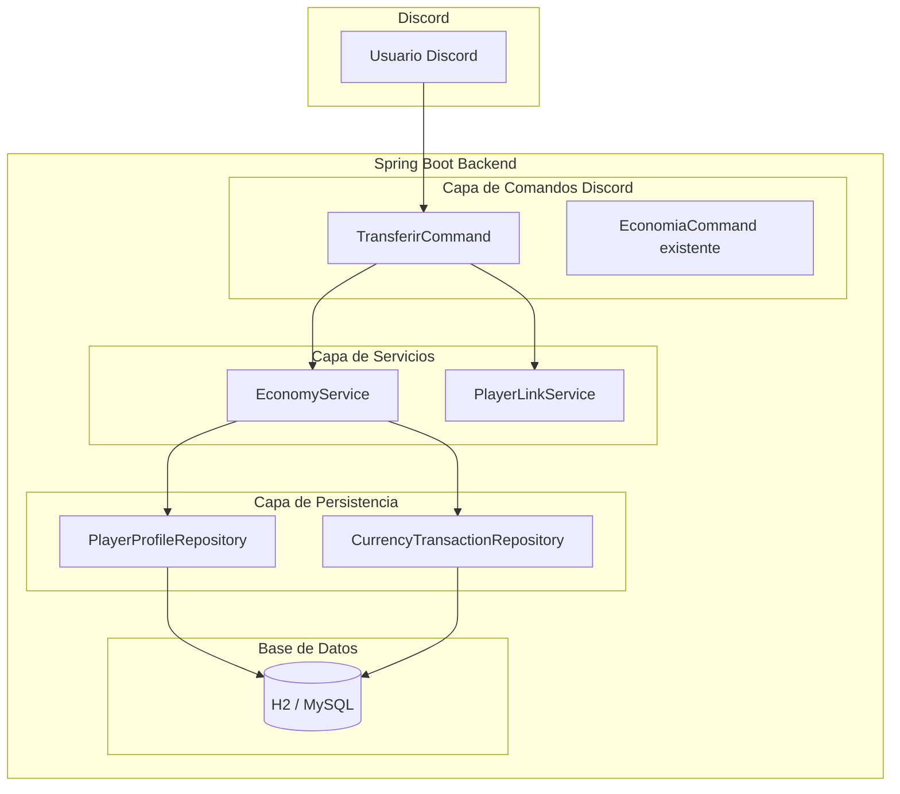
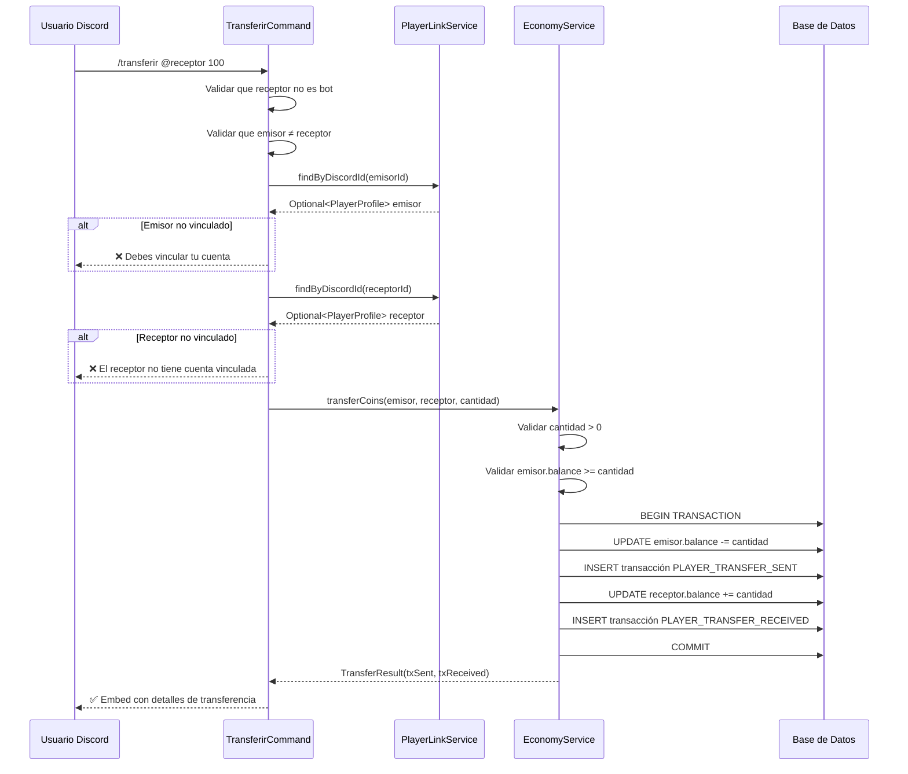
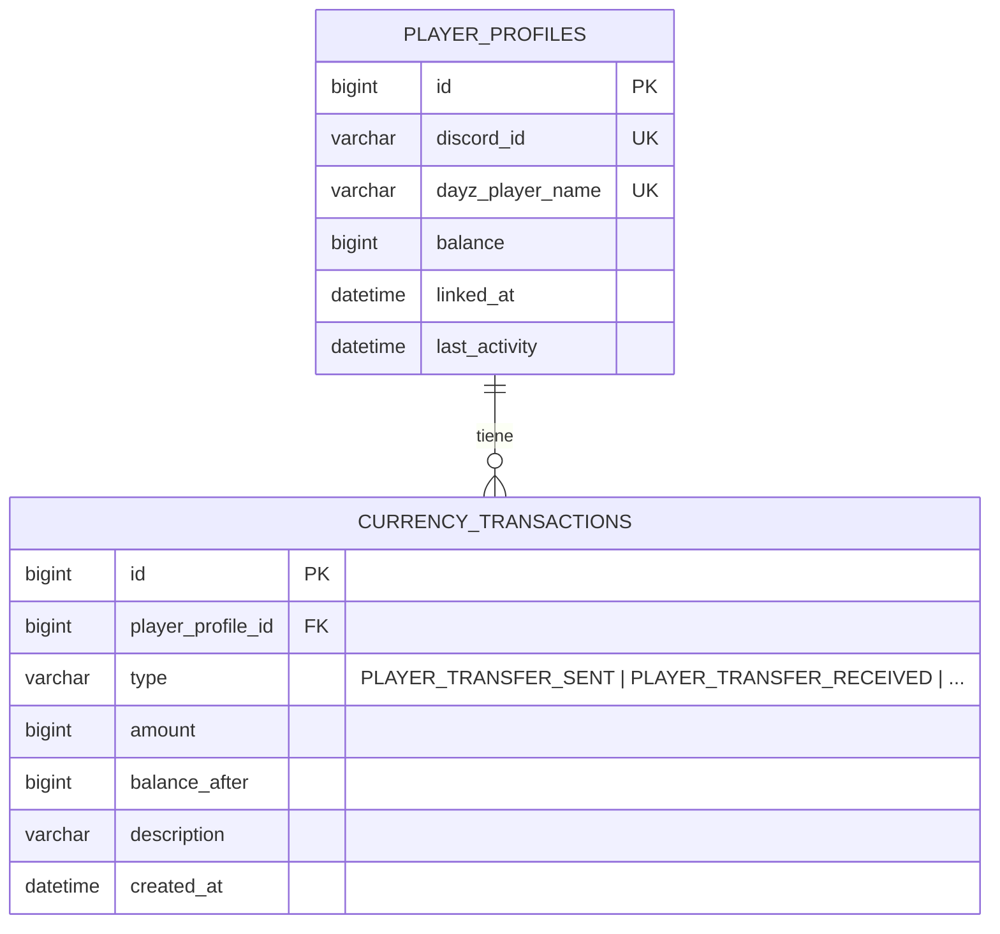

# Documento de Diseño — Transferencia de TNT Coins entre Jugadores

## Resumen General

Este documento describe el diseño técnico de la funcionalidad de transferencia de TNT Coins entre jugadores. El feature extiende el sistema de economía existente (`player-economy-system`) añadiendo la capacidad de que un jugador vinculado envíe monedas a otro jugador vinculado mediante el comando slash `/transferir`. La operación es atómica: el débito del emisor y el crédito del receptor ocurren en una única transacción de base de datos, garantizando la conservación de monedas en el sistema.

### Decisiones de Diseño Clave

1. **Método `transferCoins` en `EconomyService`**: Se añade un nuevo método transaccional que encapsula débito + crédito + creación de ambos registros de transacción en una sola operación `@Transactional`. Esto reutiliza la lógica de validación existente sin duplicar código.
2. **Nuevos valores en `TransactionType`**: Se agregan `PLAYER_TRANSFER_SENT` y `PLAYER_TRANSFER_RECEIVED` al enum existente para distinguir transferencias entre jugadores de otros tipos de transacciones.
3. **Comando `TransferirCommand`**: Nuevo comando slash que sigue el patrón `SlashCommand` existente con `@Component`, similar a `EconomiaCommand`.
4. **Validación en capas**: El comando valida permisos y formato de entrada; el servicio valida reglas de negocio (balance suficiente, cuentas vinculadas, no auto-transferencia).
5. **Sin cambios en el esquema de base de datos**: Los nuevos tipos de transacción se almacenan como `EnumType.STRING` en la columna existente `type` de `currency_transactions`, por lo que no se requiere migración.

---

## Arquitectura

### Diagrama de Componentes Afectados



### Diagrama de Secuencia: Flujo de Transferencia Exitosa



---

## Componentes e Interfaces

### 1. Nuevos Valores en `TransactionType`

```java
public enum TransactionType {
    ZOMBIE_KILL_REWARD,
    ADMIN_CREDIT,
    ADMIN_DEBIT,
    /** Coins sent to another player via /transferir. */
    PLAYER_TRANSFER_SENT,
    /** Coins received from another player via /transferir. */
    PLAYER_TRANSFER_RECEIVED
}
```

### 2. Nuevo Método en `EconomyService`

```java
@Service
public class EconomyService {

    // ... métodos existentes (creditCoins, debitCoins, getBalance, etc.) ...

    /**
     * Transfers coins from one player to another atomically.
     * Debits the sender, credits the receiver, and creates transaction
     * records for both parties within a single database transaction.
     *
     * @param sender   the player profile sending coins
     * @param receiver the player profile receiving coins
     * @param amount   the number of coins to transfer (must be > 0)
     * @return a TransferResult containing both transaction records
     * @throws InvalidAmountException       if amount <= 0
     * @throws InsufficientBalanceException  if sender's balance < amount
     * @throws SelfTransferException         if sender and receiver are the same
     */
    @Transactional
    public TransferResult transferCoins(PlayerProfile sender, PlayerProfile receiver, long amount);
}
```

### 3. Record `TransferResult`

```java
/**
 * Holds the result of a successful transfer operation,
 * containing the transaction records for both sender and receiver.
 */
public record TransferResult(
    CurrencyTransaction senderTransaction,
    CurrencyTransaction receiverTransaction
) {}
```

### 4. Nueva Excepción `SelfTransferException`

```java
/**
 * Thrown when a player attempts to transfer coins to themselves.
 */
public class SelfTransferException extends RuntimeException {
    public SelfTransferException(String message) {
        super(message);
    }
}
```

### 5. Comando `TransferirCommand`

```java
@Component
public class TransferirCommand implements SlashCommand {

    private final EconomyService economyService;
    private final PlayerLinkService playerLinkService;

    @Override
    public String getName() {
        return "transferir";
    }

    @Override
    public String getDescription() {
        return "Transfiere TNT Coins a otro jugador";
    }

    @Override
    public CommandData getCommandData() {
        return Commands.slash(getName(), getDescription())
                .addOption(OptionType.USER, "usuario", "Jugador al que transferir monedas", true)
                .addOption(OptionType.INTEGER, "cantidad", "Cantidad de TNT Coins a transferir", true);
    }

    @Override
    public void execute(SlashCommandInteractionEvent event);
}
```

#### Lógica de `execute`:

1. Obtener usuario objetivo y cantidad de las opciones del comando.
2. Validar que el usuario objetivo no sea un bot.
3. Validar que el emisor no sea el mismo que el receptor.
4. Buscar perfil del emisor via `PlayerLinkService.findByDiscordId(event.getUser().getId())`.
5. Si no existe → responder con error ephemeral.
6. Buscar perfil del receptor via `PlayerLinkService.findByDiscordId(targetUser.getId())`.
7. Si no existe → responder con error ephemeral.
8. Llamar a `economyService.transferCoins(senderProfile, receiverProfile, cantidad)`.
9. Si éxito → responder con embed mostrando detalles.
10. Capturar excepciones específicas (`InvalidAmountException`, `InsufficientBalanceException`, `SelfTransferException`) y responder con mensajes de error apropiados.
11. Capturar `Exception` genérica → log + mensaje genérico de error.

---

## Modelos de Datos

### Cambios en el Modelo de Datos

No se requieren cambios en el esquema de base de datos. Los nuevos tipos de transacción (`PLAYER_TRANSFER_SENT`, `PLAYER_TRANSFER_RECEIVED`) se almacenan como strings en la columna `type` existente de la tabla `currency_transactions` gracias a `@Enumerated(EnumType.STRING)`.

### Diagrama de Entidades Involucradas



### Ejemplo de Registros de Transacción para una Transferencia

Para una transferencia de 50 TNT Coins de "PlayerA" a "PlayerB":

| id | player_profile_id | type | amount | balance_after | description | created_at |
|----|-------------------|------|--------|---------------|-------------|------------|
| 101 | 1 (PlayerA) | PLAYER_TRANSFER_SENT | 50 | 150 | Transferencia enviada a PlayerB | 2025-01-15T10:30:00 |
| 102 | 2 (PlayerB) | PLAYER_TRANSFER_RECEIVED | 50 | 250 | Transferencia recibida de PlayerA | 2025-01-15T10:30:00 |

---

## Propiedades de Correctitud

*Una propiedad es una característica o comportamiento que debe mantenerse verdadero en todas las ejecuciones válidas de un sistema — esencialmente, una declaración formal sobre lo que el sistema debe hacer. Las propiedades sirven como puente entre especificaciones legibles por humanos y garantías de correctitud verificables por máquinas.*

### Propiedad 1: Conservación de monedas en transferencia

*Para cualquier* par de jugadores vinculados (emisor con balance `Bs`, receptor con balance `Br`) y cualquier cantidad válida `A` donde `0 < A ≤ Bs`, después de ejecutar `transferCoins(emisor, receptor, A)`, la suma `emisor.balance + receptor.balance` debe ser igual a `Bs + Br` (la suma total de monedas se conserva).

**Valida: Requisitos 4.3, 1.1**

### Propiedad 2: Débito y crédito exactos en transferencia

*Para cualquier* par de jugadores vinculados (emisor con balance `Bs`, receptor con balance `Br`) y cualquier cantidad válida `A` donde `0 < A ≤ Bs`, después de ejecutar `transferCoins(emisor, receptor, A)`, el balance del emisor debe ser exactamente `Bs - A` y el balance del receptor debe ser exactamente `Br + A`.

**Valida: Requisitos 1.1**

### Propiedad 3: Registros de transacción correctos en transferencia

*Para cualquier* transferencia exitosa de cantidad `A` entre emisor y receptor, el sistema debe crear exactamente dos transacciones: una de tipo `PLAYER_TRANSFER_SENT` asociada al emisor con cantidad `A` y descripción que contenga el nombre DayZ del receptor, y una de tipo `PLAYER_TRANSFER_RECEIVED` asociada al receptor con cantidad `A` y descripción que contenga el nombre DayZ del emisor.

**Valida: Requisitos 1.3, 1.4, 5.1, 5.2**

### Propiedad 4: Rechazo de transferencia con balance insuficiente

*Para cualquier* jugador vinculado con balance `B` y cualquier cantidad `A` donde `A > B`, la operación `transferCoins` debe ser rechazada con `InsufficientBalanceException`, y el balance del emisor debe permanecer en `B` sin modificaciones.

**Valida: Requisitos 2.2**

### Propiedad 5: Rechazo de cantidades no positivas

*Para cualquier* cantidad `A` donde `A ≤ 0`, la operación `transferCoins` debe ser rechazada con `InvalidAmountException`, sin modificar el balance de ningún jugador.

**Valida: Requisitos 2.3**

### Propiedad 6: Rechazo de auto-transferencia

*Para cualquier* jugador vinculado, intentar ejecutar `transferCoins` donde el emisor y el receptor son el mismo perfil debe ser rechazado con `SelfTransferException`, sin modificar el balance del jugador.

**Valida: Requisitos 3.2**

### Propiedad 7: Atomicidad — rollback completo en caso de fallo

*Para cualquier* transferencia que falla después de debitar al emisor pero antes de completar el crédito al receptor, todos los cambios deben ser revertidos: el balance del emisor debe permanecer en su valor original, el balance del receptor debe permanecer sin cambios, y no deben existir registros de transacción parciales.

**Valida: Requisitos 4.1, 4.2**

---

## Manejo de Errores

### Excepciones del Dominio

| Excepción | Cuándo se lanza | Mensaje al usuario |
|-----------|----------------|-------------------|
| `PlayerNotLinkedException` | Emisor o receptor sin cuenta vinculada | "❌ Debes vincular tu cuenta primero con `/vincular`." / "❌ El usuario no tiene una cuenta vinculada." |
| `InsufficientBalanceException` | Balance del emisor < cantidad | "❌ Balance insuficiente. Tu balance actual es: X TNT Coins." |
| `InvalidAmountException` | Cantidad ≤ 0 | "❌ La cantidad debe ser un número positivo." |
| `SelfTransferException` | Emisor = Receptor | "❌ No puedes transferirte monedas a ti mismo." |

### Validaciones en el Comando (antes de llamar al servicio)

| Validación | Condición | Mensaje |
|-----------|-----------|---------|
| Usuario objetivo es bot | `targetUser.isBot()` | "❌ No puedes transferir monedas a un bot." |
| Emisor = Receptor (Discord ID) | `event.getUser().getId().equals(targetUser.getId())` | "❌ No puedes transferirte monedas a ti mismo." |

### Estrategia de Manejo de Errores

```java
@Override
public void execute(SlashCommandInteractionEvent event) {
    try {
        // ... lógica de validación y transferencia ...
    } catch (PlayerNotLinkedException e) {
        event.reply("❌ " + e.getMessage()).setEphemeral(true).queue();
    } catch (InvalidAmountException e) {
        event.reply("❌ La cantidad debe ser un número positivo.").setEphemeral(true).queue();
    } catch (InsufficientBalanceException e) {
        event.reply("❌ Balance insuficiente. Tu balance actual es: "
                + formatBalance(e.getCurrentBalance()) + " TNT Coins.")
                .setEphemeral(true).queue();
    } catch (SelfTransferException e) {
        event.reply("❌ No puedes transferirte monedas a ti mismo.")
                .setEphemeral(true).queue();
    } catch (Exception e) {
        log.error("Error al ejecutar /transferir: {}", e.getMessage(), e);
        event.reply("❌ Ocurrió un error interno. Intenta de nuevo.")
                .setEphemeral(true).queue();
    }
}
```

### Rollback Automático

El método `transferCoins` está anotado con `@Transactional`. Si cualquier excepción no-checked (RuntimeException) se lanza durante la ejecución, Spring revierte automáticamente toda la transacción de base de datos, garantizando que no queden estados parciales.

---

## Estrategia de Testing

### Enfoque Dual: Tests Unitarios + Tests de Propiedades

Este feature utiliza un enfoque dual de testing:

- **Tests unitarios (JUnit 5)**: Para ejemplos específicos, edge cases, integración entre componentes, y escenarios de error del comando Discord.
- **Tests de propiedades (jqwik)**: Para verificar propiedades universales que deben cumplirse para todas las entradas válidas, especialmente la conservación de monedas y la correctitud de las operaciones de transferencia.

### Librería de Property-Based Testing

Se utiliza **jqwik** (ya configurado en el proyecto). Cada test de propiedad debe ejecutar un mínimo de **100 iteraciones**.

### Configuración de Tests de Propiedades

Cada test de propiedad debe:
- Ejecutar mínimo 100 iteraciones (configuración por defecto de jqwik)
- Incluir un comentario referenciando la propiedad del documento de diseño
- Formato del tag: **Feature: player-transfer, Property {número}: {texto de la propiedad}**
- Implementar cada propiedad de correctitud con un ÚNICO test de propiedad

### Tests de Propiedades Planificados

| Propiedad | Clase de Test | Generadores Necesarios |
|-----------|--------------|----------------------|
| 1: Conservación de monedas | `TransferCoinsPropertyTest` | Balances iniciales (long ≥ 0), cantidades válidas (0 < A ≤ balance emisor) |
| 2: Débito y crédito exactos | `TransferCoinsPropertyTest` | Balances iniciales (long ≥ 0), cantidades válidas |
| 3: Registros de transacción correctos | `TransferCoinsPropertyTest` | Balances, cantidades, nombres DayZ aleatorios |
| 4: Rechazo balance insuficiente | `TransferCoinsPropertyTest` | Balances + cantidades donde A > B |
| 5: Rechazo cantidades no positivas | `TransferCoinsPropertyTest` | Números ≤ 0 (incluyendo negativos y cero) |
| 6: Rechazo auto-transferencia | `TransferCoinsPropertyTest` | Perfiles de jugador aleatorios |
| 7: Atomicidad/rollback | `TransferCoinsPropertyTest` | Escenarios de fallo simulado con balances aleatorios |

### Tests Unitarios Planificados

- **`TransferirCommandTest`**: Mocking de JDA events para verificar:
  - Respuesta correcta en transferencia exitosa (embed con campos requeridos)
  - Rechazo cuando emisor no está vinculado
  - Rechazo cuando receptor no está vinculado
  - Rechazo cuando receptor es un bot
  - Rechazo cuando emisor = receptor
  - Mensaje genérico en error interno
- **`EconomyServiceTransferTest`**: Tests con `@DataJpaTest` para:
  - Transferencia exitosa crea dos transacciones
  - Balance se actualiza correctamente para ambos jugadores
  - `InsufficientBalanceException` cuando balance < cantidad
  - `InvalidAmountException` cuando cantidad ≤ 0
  - `SelfTransferException` cuando emisor = receptor

### Tests de Integración

- Flujo completo: comando `/transferir` → validación → transferencia → verificar balances y transacciones en H2
- Verificar que los nuevos `TransactionType` se persisten y recuperan correctamente
- Verificar que `/transacciones` muestra transferencias enviadas y recibidas
