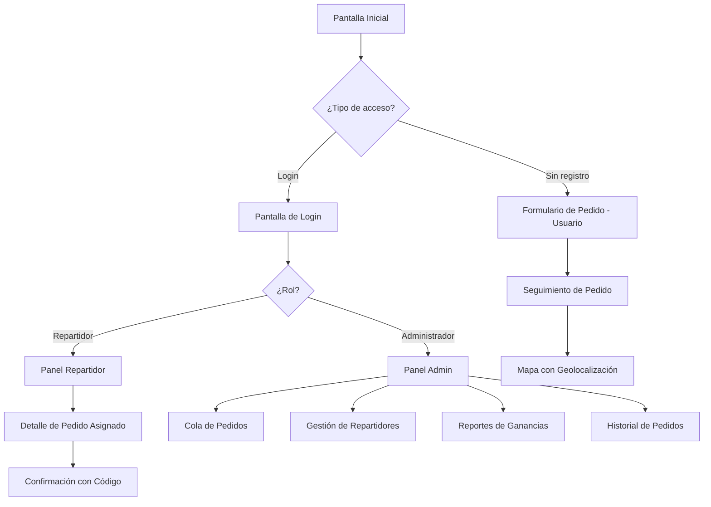
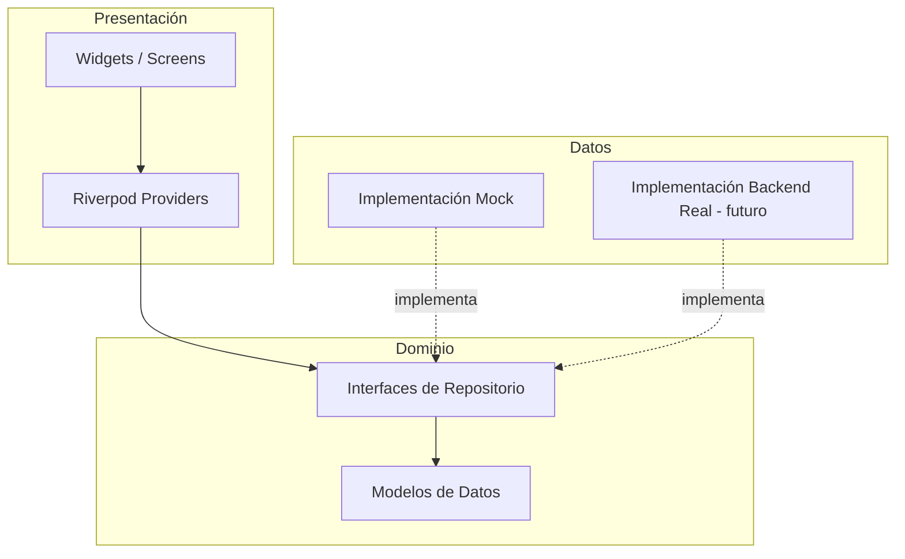

# Documento de Diseño Técnico — Delivery App (Domicilios)

## Visión General

Esta aplicación Flutter de domicilios implementa tres interfaces principales: una para Usuarios (sin registro), una para Repartidores y una para Administradores. La arquitectura sigue un patrón de capas con separación clara entre UI, lógica de negocio y datos. En esta fase inicial, todos los datos se manejan mediante una capa mock que implementa las mismas interfaces que el backend futuro, facilitando la migración.

La app utiliza un tema oscuro inspirado en Nequi (morados/magenta) con influencias de navegación de Rappi y Uber. Se implementan tres flujos principales:

1. **Flujo Usuario**: Solicitar pedido → ver código de confirmación → rastrear repartidor → recibir notificaciones → confirmar entrega
2. **Flujo Repartidor**: Login → ver pedidos asignados → actualizar estado → ingresar código de confirmación → completar entrega
3. **Flujo Administrador**: Login → gestionar cola de pedidos → asignar repartidores → ver historial → consultar reportes de ganancias



## Arquitectura

### Patrón Arquitectónico

Se utiliza una arquitectura de capas basada en **Clean Architecture** adaptada para Flutter con el patrón de gestión de estado **Riverpod**:



### Decisiones de Diseño

| Decisión | Elección | Justificación |
|---|---|---|
| Gestión de estado | Riverpod | Tipado fuerte, inyección de dependencias nativa, testeable |
| Navegación | GoRouter | Rutas declarativas, soporte para deep linking, guards por rol |
| Mapas | google_maps_flutter | Estándar de la industria, buena documentación |
| Notificaciones locales | flutter_local_notifications | Simula push notifications en modo mock |
| Generación de códigos | uuid + substring | Códigos de 6 caracteres alfanuméricos únicos |
| Identificación de usuario | Número de teléfono | Sin registro, identificación simple y directa |

### Estructura de Carpetas

```
lib/
├── main.dart
├── app.dart
├── core/
│   ├── theme/
│   │   └── app_theme.dart
│   ├── router/
│   │   └── app_router.dart
│   └── constants.dart
├── models/
│   ├── pedido.dart
│   ├── usuario.dart
│   ├── repartidor.dart
│   ├── administrador.dart
│   └── ubicacion.dart
├── repositories/
│   ├── pedido_repository.dart
│   ├── auth_repository.dart
│   ├── repartidor_repository.dart
│   └── geolocalizacion_repository.dart
├── data/
│   └── mock/
│       ├── mock_pedido_repository.dart
│       ├── mock_auth_repository.dart
│       ├── mock_repartidor_repository.dart
│       ├── mock_geolocalizacion_repository.dart
│       └── mock_data.dart
├── providers/
│   ├── pedido_providers.dart
│   ├── auth_providers.dart
│   ├── repartidor_providers.dart
│   └── geolocalizacion_providers.dart
└── screens/
    ├── usuario/
    │   ├── formulario_pedido_screen.dart
    │   ├── seguimiento_pedido_screen.dart
    │   └── historial_usuario_screen.dart
    ├── repartidor/
    │   ├── panel_repartidor_screen.dart
    │   ├── detalle_pedido_screen.dart
    │   └── confirmacion_entrega_screen.dart
    ├── admin/
    │   ├── panel_admin_screen.dart
    │   ├── cola_pedidos_screen.dart
    │   ├── gestion_repartidores_screen.dart
    │   ├── historial_pedidos_screen.dart
    │   └── reportes_ganancias_screen.dart
    └── auth/
        └── login_screen.dart
```


## Componentes e Interfaces

### Interfaces de Repositorio

Estas interfaces abstractas definen el contrato entre la capa de dominio y la capa de datos. La implementación mock las cumple ahora; el backend real las cumplirá en el futuro.

#### PedidoRepository

```dart
abstract class PedidoRepository {
  /// Crea un nuevo pedido activo y retorna el pedido con su código de confirmación
  Future<Pedido> crearPedido(CrearPedidoRequest request);

  /// Obtiene todos los pedidos activos (para admin)
  Future<List<Pedido>> obtenerPedidosActivos();

  /// Obtiene el pedido activo de un usuario por su teléfono
  Future<Pedido?> obtenerPedidoActivoPorUsuario(String telefono);

  /// Asigna un repartidor a un pedido activo
  Future<Pedido> asignarRepartidor(String pedidoId, String repartidorId);

  /// Actualiza el estado de un pedido (recogido, en_camino, en_destino)
  Future<Pedido> actualizarEstadoPedido(String pedidoId, EstadoPedido estado);

  /// Confirma la entrega con el código de confirmación.
  /// Mueve el pedido de activos a historial.
  /// Retorna true si el código es correcto, false si no.
  Future<bool> confirmarEntrega(String pedidoId, String codigoConfirmacion);

  /// Obtiene el historial de pedidos completados con filtros opcionales
  Future<List<PedidoHistorial>> obtenerHistorial({
    DateTime? fechaInicio,
    DateTime? fechaFin,
    String? repartidorId,
    String? telefonoUsuario,
  });

  /// Obtiene el historial de pedidos de un usuario específico
  Future<List<PedidoHistorial>> obtenerHistorialUsuario(String telefono);
}
```

#### AuthRepository

```dart
abstract class AuthRepository {
  /// Autentica un repartidor o administrador
  Future<AuthResult> login(String usuario, String password, TipoUsuario tipo);

  /// Cierra la sesión actual
  Future<void> logout();

  /// Obtiene la sesión activa actual (si existe)
  Future<SesionActiva?> obtenerSesionActiva();
}
```

#### RepartidorRepository

```dart
abstract class RepartidorRepository {
  /// Obtiene todos los repartidores (para admin)
  Future<List<Repartidor>> obtenerRepartidores();

  /// Obtiene repartidores disponibles para asignación
  Future<List<Repartidor>> obtenerRepartidoresDisponibles();

  /// Obtiene los pedidos activos asignados a un repartidor
  Future<List<Pedido>> obtenerPedidosAsignados(String repartidorId);

  /// Obtiene el historial de entregas de un repartidor con filtros
  Future<List<PedidoHistorial>> obtenerHistorialRepartidor(
    String repartidorId, {
    DateTime? fechaInicio,
    DateTime? fechaFin,
  });

  /// Obtiene el resumen diario de un repartidor (entregas y ganancias del día)
  Future<ResumenDiario> obtenerResumenDiario(String repartidorId);
}
```

#### GeolocalizacionRepository

```dart
abstract class GeolocalizacionRepository {
  /// Inicia el rastreo de ubicación de un repartidor para un pedido
  Future<void> iniciarRastreo(String repartidorId, String pedidoId);

  /// Detiene el rastreo de ubicación
  Future<void> detenerRastreo(String repartidorId, String pedidoId);

  /// Obtiene la ubicación actual del repartidor
  Future<Ubicacion?> obtenerUbicacion(String repartidorId);

  /// Stream de actualizaciones de ubicación (cada 10 segundos)
  Stream<Ubicacion> streamUbicacion(String repartidorId);
}
```

### Interfaces de Reportes

#### ReporteGananciasRepository

```dart
abstract class ReporteGananciasRepository {
  /// Obtiene ganancias del día actual y listado diario del mes
  Future<ReporteGanancias> obtenerReporteDiario();

  /// Obtiene ganancias del mes actual y listado mensual del año
  Future<ReporteGanancias> obtenerReporteMensual();

  /// Obtiene ganancias del año actual y comparativo con años anteriores
  Future<ReporteGanancias> obtenerReporteAnual();
}
```

### Servicio de Notificaciones

```dart
abstract class NotificacionService {
  /// Notifica al usuario que un repartidor fue asignado
  Future<void> notificarRepartidorAsignado(String telefono, String nombreRepartidor);

  /// Notifica al usuario un cambio de estado del pedido
  Future<void> notificarCambioEstado(String telefono, EstadoPedido nuevoEstado);

  /// Notifica al usuario que la entrega fue completada
  Future<void> notificarEntregaCompletada(String telefono);
}
```


## Modelos de Datos

### Pedido (Activo)

```dart
class Pedido {
  final String id;
  final String direccionEntrega;
  final String nombreUsuario;
  final String telefonoUsuario;
  final String descripcion;
  final double precioproducto;
  final TipoEntrega tipoEntrega;
  final String codigoConfirmacion; // 6 caracteres alfanuméricos
  final EstadoPedido estado;
  final String? repartidorId;
  final DateTime fechaCreacion;
}

enum EstadoPedido {
  pendiente,    // Creado, esperando asignación
  asignado,     // Repartidor asignado
  recogido,     // Repartidor recogió el producto
  enCamino,     // Repartidor en camino al destino
  enDestino,    // Repartidor llegó al destino
  completado,   // Entrega confirmada con código
}

enum TipoEntrega {
  estandar,
  express,
}
```

### PedidoHistorial

```dart
class PedidoHistorial {
  final String id;
  final String pedidoOriginalId;
  final String direccionEntrega;
  final String nombreUsuario;
  final String telefonoUsuario;
  final String descripcion;
  final double precioProducto;
  final TipoEntrega tipoEntrega;
  final String nombreRepartidor;
  final String repartidorId;
  final DateTime fechaCreacion;
  final DateTime fechaCompletacion;
  final String nombreReceptor;
}
```

### Usuario

```dart
class Usuario {
  final String telefono; // Identificador principal
  final String nombre;
}
```

### Repartidor

```dart
class Repartidor {
  final String id;
  final String nombreCompleto;
  final int totalEntregas;
  final EstadoRepartidor estado;
  final String usuario; // Para login
  final String password; // Para login (hash en backend real)
}

enum EstadoRepartidor {
  disponible,
  enEntrega,
  inactivo,
}
```

### Administrador

```dart
class Administrador {
  final String id;
  final String nombre;
  final String usuario;
  final String password;
}
```

### Ubicacion

```dart
class Ubicacion {
  final double latitud;
  final double longitud;
  final DateTime timestamp;
}
```

### Modelos de Autenticación

```dart
class AuthResult {
  final bool exitoso;
  final String? mensaje;
  final String? userId;
  final TipoUsuario? tipo;
}

class SesionActiva {
  final String userId;
  final TipoUsuario tipo;
}

enum TipoUsuario {
  repartidor,
  administrador,
}
```

### Modelos de Reportes

```dart
class ReporteGanancias {
  final double totalActual; // Total del período actual (día/mes/año)
  final List<GananciaPeriodo> desglose; // Listado por período
}

class GananciaPeriodo {
  final String etiqueta; // "2024-01-15", "Enero 2024", "2024"
  final double total;
  final int cantidadPedidos;
}

class ResumenDiario {
  final int entregasCompletadas;
  final double gananciasDia;
}
```

### CrearPedidoRequest

```dart
class CrearPedidoRequest {
  final String direccionEntrega;
  final String nombreUsuario;
  final String telefonoUsuario;
  final String descripcion;
  final double precioProducto;
  final TipoEntrega tipoEntrega;
}
```

### Diagrama de Relaciones

```mermaid
erDiagram
    USUARIO ||--o| PEDIDO_ACTIVO : "solicita (máx 1)"
    REPARTIDOR ||--o{ PEDIDO_ACTIVO : "tiene asignados"
    PEDIDO_ACTIVO ||--|| PEDIDO_HISTORIAL : "se mueve a"
    REPARTIDOR ||--o{ PEDIDO_HISTORIAL : "realizó"
    ADMINISTRADOR ||--o{ PEDIDO_ACTIVO : "gestiona"
    REPARTIDOR ||--o| UBICACION : "tiene ubicación actual"

    USUARIO {
        string telefono PK
        string nombre
    }
    PEDIDO_ACTIVO {
        string id PK
        string direccionEntrega
        string nombreUsuario
        string telefonoUsuario
        string descripcion
        double precioProducto
        enum tipoEntrega
        string codigoConfirmacion
        enum estado
        string repartidorId FK
        datetime fechaCreacion
    }
    PEDIDO_HISTORIAL {
        string id PK
        string pedidoOriginalId
        string direccionEntrega
        string nombreUsuario
        string telefonoUsuario
        string descripcion
        double precioProducto
        enum tipoEntrega
        string nombreRepartidor
        string repartidorId FK
        datetime fechaCreacion
        datetime fechaCompletacion
        string nombreReceptor
    }
    REPARTIDOR {
        string id PK
        string nombreCompleto
        int totalEntregas
        enum estado
        string usuario
        string password
    }
    ADMINISTRADOR {
        string id PK
        string nombre
        string usuario
        string password
    }
    UBICACION {
        double latitud
        double longitud
        datetime timestamp
    }
```




## Propiedades de Correctitud

*Una propiedad es una característica o comportamiento que debe mantenerse verdadero en todas las ejecuciones válidas de un sistema — esencialmente, una declaración formal sobre lo que el sistema debe hacer. Las propiedades sirven como puente entre especificaciones legibles por humanos y garantías de correctitud verificables por máquina.*

### Propiedad 1: Creación de pedido genera código único

*Para cualquier* conjunto de datos de formulario válidos (todos los campos obligatorios completos), al crear un pedido, el sistema debe producir un Pedido_Activo con un Código_Confirmación único que no coincida con ningún otro código existente en el sistema.

**Valida: Requisitos 1.2**

### Propiedad 2: Campos vacíos son rechazados con validación

*Para cualquier* combinación de campos obligatorios donde al menos uno esté vacío o compuesto solo de espacios en blanco, el sistema debe rechazar la creación del pedido y retornar mensajes de validación que identifiquen los campos faltantes.

**Valida: Requisitos 1.3**

### Propiedad 3: Invariante de pedido único por usuario

*Para cualquier* usuario identificado por su número de teléfono que ya tenga un Pedido_Activo en curso, cualquier intento de crear un nuevo pedido debe ser rechazado, manteniendo exactamente 1 pedido activo como máximo por usuario.

**Valida: Requisitos 1.4, 8.2**

### Propiedad 4: Pedidos activos ordenados por fecha descendente

*Para cualquier* conjunto de Pedidos_Activos, al listarlos en el Panel_Admin, deben estar ordenados por fecha de creación de más reciente a más antiguo.

**Valida: Requisitos 2.1**

### Propiedad 5: Nuevo pedido aparece en lista de activos

*Para cualquier* pedido creado exitosamente, al consultar la lista de Pedidos_Activos, esta debe contener el pedido recién creado.

**Valida: Requisitos 2.2**

### Propiedad 6: Visualización de pedido contiene campos requeridos

*Para cualquier* Pedido_Activo, su representación en el Panel_Admin debe incluir: nombre del Usuario, dirección de entrega, descripción del pedido, precio del producto y estado actual.

**Valida: Requisitos 2.3**

### Propiedad 7: Round-trip de completación de pedido

*Para cualquier* Pedido_Activo con repartidor asignado, al confirmar la entrega con el código correcto: (a) el pedido debe aparecer en Pedido_Historial con todos los datos originales más nombre del repartidor, fecha de completación y nombre del receptor, y (b) el pedido debe desaparecer de la lista de Pedidos_Activos.

**Valida: Requisitos 3.2, 3.4, 3.5, 9.1, 9.2**

### Propiedad 8: Código de confirmación incorrecto es rechazado

*Para cualquier* Pedido_Activo y cualquier código que no coincida con su Código_Confirmación, el intento de confirmación debe ser rechazado y el pedido debe permanecer en estado activo sin cambios.

**Valida: Requisitos 3.3**

### Propiedad 9: Información de repartidor contiene campos requeridos

*Para cualquier* Repartidor, su representación en el Panel_Admin debe incluir: nombre completo, número total de entregas realizadas y estado actual (disponible, en entrega, inactivo).

**Valida: Requisitos 4.1**

### Propiedad 10: Autenticación redirige al panel correcto según rol

*Para cualquier* credencial válida de Repartidor o Administrador, el resultado de autenticación debe indicar el tipo de usuario correcto, permitiendo la redirección al panel correspondiente (Panel_Repartidor o Panel_Admin).

**Valida: Requisitos 5.2, 5.3**

### Propiedad 11: Credenciales inválidas son rechazadas

*Para cualquier* combinación de usuario y contraseña que no coincida con ningún Repartidor o Administrador registrado, el sistema debe rechazar el login y retornar un resultado no exitoso.

**Valida: Requisitos 5.4**

### Propiedad 12: Agregación de ganancias es correcta

*Para cualquier* conjunto de registros en Pedido_Historial y cualquier período de tiempo (día, mes, año), las ganancias reportadas deben ser iguales a la suma de los precios de productos de los pedidos completados dentro de ese período.

**Valida: Requisitos 6.2, 6.3, 6.4, 6.5**

### Propiedad 13: Usuario solo accede a sus propios pedidos

*Para cualquier* usuario identificado por teléfono, al consultar pedidos activos o historial, el sistema debe retornar únicamente los pedidos asociados a ese número de teléfono y ningún pedido de otro usuario.

**Valida: Requisitos 8.1, 8.3**

### Propiedad 14: Filtros de historial retornan solo registros coincidentes

*Para cualquier* combinación de filtros (rango de fechas, repartidor, usuario) aplicada al Pedido_Historial, todos los registros retornados deben cumplir con todos los criterios de filtro especificados.

**Valida: Requisitos 4.3, 9.3**

### Propiedad 15: Contraste de tema cumple accesibilidad

*Para cualquier* par de colores texto/fondo definido en el tema de la aplicación, la relación de contraste debe ser igual o superior a 4.5:1.

**Valida: Requisitos 11.2**

### Propiedad 16: Cambios de estado generan notificaciones

*Para cualquier* cambio de estado en un Pedido_Activo (asignación de repartidor, recogido, en camino, completado), el sistema debe generar una notificación dirigida al Usuario solicitante que incluya información relevante del cambio.

**Valida: Requisitos 12.1, 12.2, 12.3**

### Propiedad 17: Panel de repartidor muestra pedidos asignados con campos requeridos

*Para cualquier* Repartidor con pedidos asignados, la lista de pedidos en su panel debe incluir para cada pedido: dirección de entrega, nombre del Usuario, descripción del pedido y precio del producto.

**Valida: Requisitos 13.1**

### Propiedad 18: Resumen diario del repartidor agrega correctamente

*Para cualquier* Repartidor y conjunto de entregas completadas en el día actual, el resumen diario debe mostrar el conteo correcto de entregas y la suma correcta de ganancias del día.

**Valida: Requisitos 13.3**


## Manejo de Errores

### Errores de Validación de Formulario

| Error | Causa | Manejo |
|---|---|---|
| Campos vacíos | Usuario no completó campos obligatorios | Mostrar mensaje específico por campo faltante, resaltar campo en rojo |
| Teléfono inválido | Formato de teléfono incorrecto | Validar formato antes de envío, mostrar formato esperado |
| Precio inválido | Valor no numérico o negativo | Validar que sea número positivo, mostrar mensaje de corrección |

### Errores de Lógica de Negocio

| Error | Causa | Manejo |
|---|---|---|
| Pedido duplicado | Usuario ya tiene pedido activo | Mostrar mensaje "Ya tienes un pedido en curso" con opción de ver estado |
| Código incorrecto | Repartidor ingresó código que no coincide | Mostrar "Código incorrecto, intenta de nuevo", permitir reintentos |
| Repartidor no disponible | Todos los repartidores están ocupados | Mostrar lista vacía de disponibles, admin puede esperar |
| Credenciales inválidas | Usuario/contraseña incorrectos | Mostrar "Credenciales incorrectas", no revelar qué campo falló |

### Errores de Geolocalización

| Error | Causa | Manejo |
|---|---|---|
| Ubicación no disponible | GPS desactivado o sin señal | Mostrar mensaje "Ubicación no disponible temporalmente" al usuario |
| Timeout de ubicación | No se recibe actualización en tiempo esperado | Mostrar última ubicación conocida con indicador de "última actualización" |

### Errores de Capa Mock

| Error | Causa | Manejo |
|---|---|---|
| Datos no encontrados | ID de pedido/repartidor inexistente | Retornar null o lista vacía según el caso, UI muestra estado vacío |
| Operación no permitida | Intento de acceder a datos de otro usuario | Retornar error de acceso denegado, UI muestra mensaje de privacidad |

### Estrategia General

- Todos los repositorios retornan tipos que permiten manejar errores (Future con excepciones tipadas o Result types)
- La capa de presentación captura errores y muestra mensajes amigables al usuario
- Los errores de red (futuros) se manejarán con retry automático y mensajes de conectividad
- Se utiliza un patrón de `Either<Failure, Success>` o excepciones tipadas para distinguir tipos de error

## Estrategia de Testing

### Enfoque Dual: Tests Unitarios + Tests Basados en Propiedades

La estrategia de testing combina tests unitarios para casos específicos y edge cases con tests basados en propiedades para verificar comportamientos universales.

### Tests Unitarios

Los tests unitarios cubren:

- **Ejemplos específicos**: Verificar que el formulario tiene los campos requeridos (1.1), que la pantalla de login muestra selector de rol (5.1), que el mock genera datos realistas (10.4)
- **Edge cases**: Estado vacío del panel de repartidor (13.4), geolocalización no disponible (7.5)
- **Integración**: Flujo completo de creación → asignación → confirmación → historial
- **UI widgets**: Verificar renderizado correcto de componentes clave

### Tests Basados en Propiedades

Se utiliza la librería **fast_check** (o **glados** para Dart) para implementar tests basados en propiedades. Cada test debe:

- Ejecutar un mínimo de **100 iteraciones**
- Referenciar la propiedad del documento de diseño con un comentario en formato:
  **Feature: delivery-app, Property {número}: {texto de la propiedad}**
- Implementar exactamente **un test por propiedad** del documento de diseño

#### Mapeo de Propiedades a Tests

| Propiedad | Descripción | Generadores Necesarios |
|---|---|---|
| P1 | Creación genera código único | Generador de CrearPedidoRequest válidos |
| P2 | Campos vacíos rechazados | Generador de requests con campos vacíos aleatorios |
| P3 | Máximo 1 pedido activo por usuario | Generador de usuarios con pedidos existentes |
| P4 | Ordenamiento por fecha descendente | Generador de listas de pedidos con fechas aleatorias |
| P5 | Nuevo pedido en lista de activos | Generador de pedidos válidos |
| P6 | Campos requeridos en visualización de pedido | Generador de Pedido con datos aleatorios |
| P7 | Round-trip de completación | Generador de pedidos con repartidor y código |
| P8 | Código incorrecto rechazado | Generador de pedidos + códigos aleatorios incorrectos |
| P9 | Campos requeridos de repartidor | Generador de Repartidor con datos aleatorios |
| P10 | Auth redirige según rol | Generador de credenciales válidas con roles |
| P11 | Credenciales inválidas rechazadas | Generador de credenciales aleatorias no registradas |
| P12 | Agregación de ganancias correcta | Generador de PedidoHistorial con fechas y precios aleatorios |
| P13 | Acceso solo a pedidos propios | Generador de múltiples usuarios con pedidos |
| P14 | Filtros de historial correctos | Generador de historial + combinaciones de filtros |
| P15 | Contraste >= 4.5:1 | Generador de pares de colores del tema |
| P16 | Notificaciones por cambio de estado | Generador de pedidos + transiciones de estado |
| P17 | Pedidos asignados con campos requeridos | Generador de pedidos asignados a repartidor |
| P18 | Resumen diario correcto | Generador de entregas completadas en un día |

### Herramientas

- **flutter_test**: Framework de testing estándar de Flutter
- **glados** (o **fast_check**): Librería de property-based testing para Dart
- **mocktail**: Mocking para tests unitarios
- **golden_toolkit**: Tests de golden files para verificar UI (opcional)

### Estructura de Tests

```
test/
├── unit/
│   ├── models/
│   │   └── pedido_test.dart
│   ├── repositories/
│   │   ├── mock_pedido_repository_test.dart
│   │   ├── mock_auth_repository_test.dart
│   │   └── mock_repartidor_repository_test.dart
│   └── services/
│       └── notificacion_service_test.dart
├── property/
│   ├── pedido_creation_property_test.dart
│   ├── validation_property_test.dart
│   ├── order_completion_property_test.dart
│   ├── auth_property_test.dart
│   ├── earnings_property_test.dart
│   ├── privacy_property_test.dart
│   ├── filter_property_test.dart
│   ├── notification_property_test.dart
│   └── theme_contrast_property_test.dart
└── widget/
    ├── formulario_pedido_test.dart
    ├── panel_repartidor_test.dart
    └── panel_admin_test.dart
```
