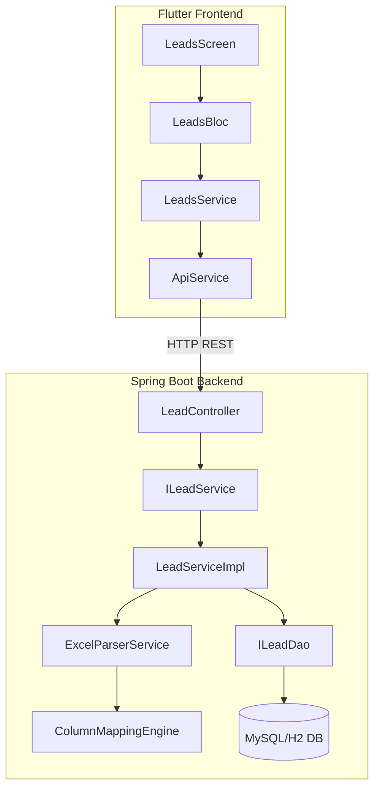
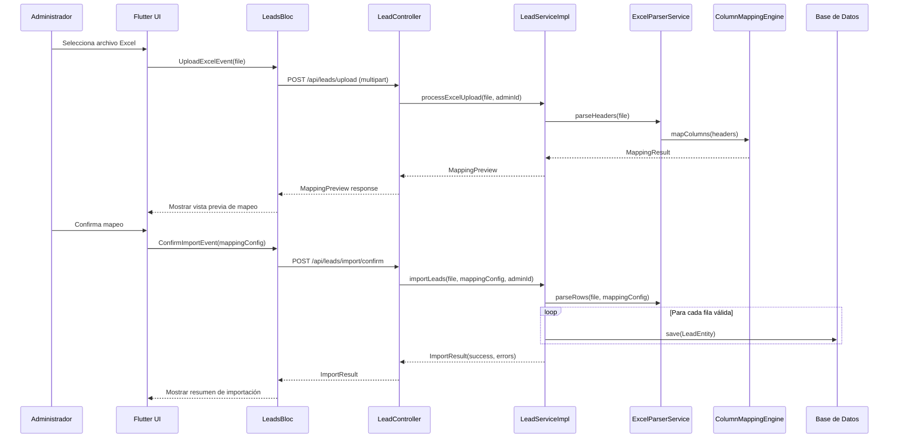

# Documento de Diseño Técnico - Módulo de Leads por Excel

## Visión General

Este documento describe el diseño técnico del módulo de gestión de leads importados desde archivos Excel. El módulo se integra al panel administrativo existente de la aplicación Flutter y utiliza el backend Spring Boot para el procesamiento, almacenamiento y consulta de datos.

El flujo principal es:
1. El administrador sube un archivo Excel (.xlsx/.xls)
2. El backend parsea el archivo con Apache POI y analiza los encabezados
3. El Motor de Mapeo asocia columnas a campos del Lead por similitud de texto
4. El administrador revisa/confirma el mapeo en una vista previa
5. El backend importa las filas válidas como registros de Lead
6. El administrador puede listar, buscar, ver detalle y editar leads

### Decisiones de Diseño Clave

| Decisión | Justificación |
|----------|---------------|
| Apache POI para parsing Excel | Librería estándar Java para archivos .xlsx/.xls, madura y bien documentada |
| Similitud de texto con Levenshtein normalizado | Permite detectar variaciones de encabezados sin configuración manual |
| Paginación server-side con Spring Data Pageable | Eficiente para datasets grandes, consistente con el patrón existente del proyecto |
| BLoC pattern para estado en Flutter | Consistente con la arquitectura existente del panel administrativo |
| Multipart upload para archivos | Patrón ya utilizado en el proyecto para subida de documentos |

---

## Arquitectura



### Flujo de Importación



---

## Componentes e Interfaces

### Backend (Spring Boot)

#### Paquete: `models.entity`

**LeadEntity.java** - Entidad JPA para el lead

**LeadImportEntity.java** - Entidad para registrar cada operación de importación

#### Paquete: `models.dao`

**ILeadDao.java** - Repositorio JPA con métodos de búsqueda y paginación

#### Paquete: `models.services`

**ILeadService.java** - Interfaz del servicio de leads

**LeadServiceImpl.java** - Implementación del servicio

**ExcelParserService.java** - Servicio para parsear archivos Excel con Apache POI

**ColumnMappingEngine.java** - Motor de mapeo automático de columnas

#### Paquete: `controllers`

**LeadController.java** - Controlador REST para operaciones de leads

### Frontend (Flutter)

#### Directorio: `lib/features/admin/leads/`

**bloc/leads_bloc.dart** - BLoC para gestión de estado de leads

**bloc/leads_event.dart** - Eventos del BLoC

**bloc/leads_state.dart** - Estados del BLoC

**models/lead_model.dart** - Modelo de datos del lead

**models/mapping_result.dart** - Modelo para resultado de mapeo

**screens/leads_list_screen.dart** - Pantalla de listado con tabla paginada

**screens/lead_detail_screen.dart** - Pantalla de detalle/edición

**screens/leads_upload_screen.dart** - Pantalla de carga y mapeo

**services/leads_service.dart** - Servicio HTTP para comunicación con backend

---

## Modelos de Datos

### Backend - LeadEntity

```java
@Entity
@Table(name = "leads")
public class LeadEntity implements Serializable {

    @Id
    @GeneratedValue(strategy = GenerationType.IDENTITY)
    private Long id;

    @Column(name = "nombre")
    private String nombre;

    @Column(name = "apellido")
    private String apellido;

    @Column(name = "last_call_status")
    private String lastCallStatus;

    @Column(name = "pais")
    private String pais;

    @Column(name = "telefono")
    private String telefono;

    @Column(name = "email")
    private String email;

    @Column(name = "campana")
    private String campana;

    @Column(name = "fecha_registro")
    @Temporal(TemporalType.TIMESTAMP)
    private Date fechaRegistro;

    @Column(name = "comentarios", length = 2000)
    private String comentarios;

    @Column(name = "import_id")
    private Long importId;

    @Column(name = "created_at")
    @Temporal(TemporalType.TIMESTAMP)
    private Date createdAt;

    @Column(name = "updated_at")
    @Temporal(TemporalType.TIMESTAMP)
    private Date updatedAt;

    private static final long serialVersionUID = 1L;
}
```

### Backend - LeadImportEntity

```java
@Entity
@Table(name = "lead_imports")
public class LeadImportEntity implements Serializable {

    @Id
    @GeneratedValue(strategy = GenerationType.IDENTITY)
    private Long id;

    @Column(name = "file_name")
    private String fileName;

    @Column(name = "admin_id")
    private Long adminId;

    @Column(name = "total_rows")
    private Integer totalRows;

    @Column(name = "success_count")
    private Integer successCount;

    @Column(name = "error_count")
    private Integer errorCount;

    @Column(name = "status")
    private String status; // PROCESSING, COMPLETED, FAILED

    @Column(name = "created_at")
    @Temporal(TemporalType.TIMESTAMP)
    private Date createdAt;

    private static final long serialVersionUID = 1L;
}
```

### Backend - ILeadDao

```java
public interface ILeadDao extends JpaRepository<LeadEntity, Long> {

    Page<LeadEntity> findAll(Pageable pageable);

    @Query("SELECT l FROM LeadEntity l WHERE " +
           "LOWER(l.nombre) LIKE LOWER(CONCAT('%', :term, '%')) OR " +
           "LOWER(l.apellido) LIKE LOWER(CONCAT('%', :term, '%')) OR " +
           "LOWER(l.lastCallStatus) LIKE LOWER(CONCAT('%', :term, '%')) OR " +
           "LOWER(l.pais) LIKE LOWER(CONCAT('%', :term, '%')) OR " +
           "LOWER(l.telefono) LIKE LOWER(CONCAT('%', :term, '%')) OR " +
           "LOWER(l.email) LIKE LOWER(CONCAT('%', :term, '%')) OR " +
           "LOWER(l.campana) LIKE LOWER(CONCAT('%', :term, '%')) OR " +
           "LOWER(l.comentarios) LIKE LOWER(CONCAT('%', :term, '%'))")
    Page<LeadEntity> searchByTerm(@Param("term") String term, Pageable pageable);

    List<LeadEntity> findByImportId(Long importId);
}
```

### Backend - ColumnMappingEngine

```java
public class ColumnMappingEngine {

    // Mapa de sinónimos para cada campo del Lead
    private static final Map<String, List<String>> FIELD_SYNONYMS = Map.of(
        "nombre", List.of("nombre", "name", "first_name", "firstname", "primer nombre", "nombres"),
        "apellido", List.of("apellido", "lastname", "last_name", "surname", "apellidos", "segundo nombre"),
        "lastCallStatus", List.of("last_call_status", "estado_llamada", "call_status", "status", "estado"),
        "pais", List.of("pais", "país", "country", "nacionalidad"),
        "telefono", List.of("telefono", "teléfono", "phone", "tel", "celular", "mobile", "número"),
        "email", List.of("email", "correo", "e-mail", "mail", "correo electrónico"),
        "campana", List.of("campaña", "campana", "campaign", "camp"),
        "fechaRegistro", List.of("fecha_registro", "fecha registro", "registration_date", "date", "fecha"),
        "comentarios", List.of("comentarios", "comments", "notas", "notes", "observaciones")
    );

    /**
     * Mapea los encabezados del Excel a campos del Lead.
     * Retorna un Map<Integer, String> donde key=índice de columna, value=nombre del campo.
     * Las columnas no mapeadas se incluyen con value=null.
     */
    public MappingResult mapColumns(List<String> headers) { ... }

    /**
     * Calcula la similitud normalizada entre dos strings usando distancia de Levenshtein.
     * Retorna un valor entre 0.0 (sin similitud) y 1.0 (idénticos).
     */
    public double calculateSimilarity(String s1, String s2) { ... }
}
```

### Backend - ExcelParserService

```java
@Service
public class ExcelParserService {

    /**
     * Extrae los encabezados de la primera fila del archivo Excel.
     */
    public List<String> parseHeaders(MultipartFile file) throws IOException { ... }

    /**
     * Parsea todas las filas del Excel según el mapeo proporcionado.
     * Retorna una lista de LeadEntity (filas válidas) y una lista de errores.
     */
    public ParseResult parseRows(MultipartFile file, Map<Integer, String> columnMapping) throws IOException { ... }
}
```

### Backend - LeadController (Endpoints REST)

| Método | Endpoint | Descripción |
|--------|----------|-------------|
| POST | `/api/leads/upload` | Sube archivo Excel y retorna vista previa de mapeo |
| POST | `/api/leads/import/confirm` | Confirma importación con mapeo definido |
| GET | `/api/leads` | Lista leads paginados (params: page, size, sort, direction) |
| GET | `/api/leads/search` | Busca leads por término (params: term, page, size) |
| GET | `/api/leads/{id}` | Obtiene detalle de un lead |
| PUT | `/api/leads/{id}` | Actualiza un lead |
| GET | `/api/leads/imports` | Lista historial de importaciones |

### Frontend - LeadModel

```dart
class LeadModel {
  final int? id;
  final String nombre;
  final String apellido;
  final String lastCallStatus;
  final String pais;
  final String telefono;
  final String email;
  final String campana;
  final DateTime? fechaRegistro;
  final String comentarios;
  final int? importId;
  final DateTime? createdAt;
  final DateTime? updatedAt;

  // Constructor, fromJson, toJson, copyWith
}
```

### Frontend - MappingResult

```dart
class MappingResult {
  final Map<int, String?> columnMapping; // índice -> campo (null si no mapeado)
  final List<String> headers; // encabezados originales del Excel
  final List<List<String>> previewRows; // primeras 5 filas para vista previa
  final bool hasUnmappedColumns;
}
```

### Frontend - LeadsBloc Events/States

```dart
// Events
abstract class LeadsEvent {}
class LoadLeads extends LeadsEvent { final int page; final String? sortBy; final String? direction; }
class SearchLeads extends LeadsEvent { final String term; final int page; }
class UploadExcel extends LeadsEvent { final File file; }
class ConfirmImport extends LeadsEvent { final Map<int, String?> mapping; }
class LoadLeadDetail extends LeadsEvent { final int leadId; }
class UpdateLead extends LeadsEvent { final LeadModel lead; }

// States
abstract class LeadsState {}
class LeadsInitial extends LeadsState {}
class LeadsLoading extends LeadsState {}
class LeadsLoaded extends LeadsState { final List<LeadModel> leads; final int totalPages; final int currentPage; }
class LeadDetailLoaded extends LeadsState { final LeadModel lead; }
class MappingPreviewLoaded extends LeadsState { final MappingResult mapping; }
class ImportCompleted extends LeadsState { final int successCount; final int errorCount; }
class LeadsError extends LeadsState { final String message; }
```

---

## Propiedades de Correctitud

*Una propiedad es una característica o comportamiento que debe mantenerse verdadero en todas las ejecuciones válidas de un sistema — esencialmente, una declaración formal sobre lo que el sistema debe hacer. Las propiedades sirven como puente entre especificaciones legibles por humanos y garantías de correctitud verificables por máquinas.*

### Propiedad 1: Validación de extensión de archivo

*Para cualquier* nombre de archivo, el sistema debe aceptar el archivo si y solo si su extensión es `.xlsx` o `.xls` (sin importar mayúsculas/minúsculas). Cualquier otra extensión debe ser rechazada.

**Valida: Requisitos 1.4**

### Propiedad 2: Mapeo de columnas por similitud de texto

*Para cualquier* encabezado de columna que sea una variación reconocible de un campo del Lead (incluyendo sinónimos, variaciones de mayúsculas, guiones bajos vs espacios), el Motor de Mapeo debe asociarlo correctamente al campo correspondiente del Lead.

**Valida: Requisitos 2.1, 2.3**

### Propiedad 3: Procesamiento de importación con tolerancia a errores

*Para cualquier* archivo Excel con N filas donde M son válidas y (N-M) son inválidas, el sistema debe crear exactamente M registros de Lead y reportar exactamente (N-M) errores, sin que las filas inválidas afecten el procesamiento de las válidas.

**Valida: Requisitos 3.1, 3.3**

### Propiedad 4: Persistencia round-trip de datos del Lead

*Para cualquier* Lead con datos válidos, al guardarlo en la base de datos y luego recuperarlo, todos los campos (nombre, apellido, lastCallStatus, país, teléfono, email, campaña, fechaRegistro, comentarios) deben ser idénticos a los valores originales.

**Valida: Requisitos 3.2, 3.5, 7.3**

### Propiedad 5: Invariante de paginación

*Para cualquier* conjunto de leads almacenados y cualquier número de página solicitado, la respuesta paginada debe contener como máximo 20 registros por página, y la unión de todas las páginas debe contener exactamente todos los leads del sistema sin duplicados ni omisiones.

**Valida: Requisitos 4.2**

### Propiedad 6: Correctitud del ordenamiento

*Para cualquier* conjunto de leads y cualquier columna de ordenamiento (nombre, apellido, lastCallStatus, país, teléfono, email, campaña), los resultados ordenados de forma ascendente deben satisfacer que cada elemento es menor o igual al siguiente según el criterio de la columna seleccionada.

**Valida: Requisitos 4.4**

### Propiedad 7: Correctitud de la búsqueda

*Para cualquier* término de búsqueda y conjunto de leads, todos los leads retornados deben contener el término en al menos uno de sus campos (nombre, apellido, lastCallStatus, país, teléfono, email, campaña, comentarios), y ningún lead que contenga el término en algún campo debe ser omitido de los resultados.

**Valida: Requisitos 5.2**

### Propiedad 8: Validación de formato de email y teléfono

*Para cualquier* string, la validación de email debe aceptar solo strings que cumplan el formato estándar de email (contiene @, dominio válido), y la validación de teléfono debe aceptar solo strings que contengan dígitos y caracteres permitidos (+, -, espacios, paréntesis) con longitud razonable.

**Valida: Requisitos 7.2**

### Propiedad 9: Control de acceso

*Para cualquier* solicitud HTTP al módulo de leads, el sistema debe permitir el acceso si y solo si el token de autenticación corresponde a un usuario con rol de administrador. Cualquier solicitud sin token válido o con rol insuficiente debe ser rechazada con código 403.

**Valida: Requisitos 8.1, 8.3**

---

## Manejo de Errores

### Backend

| Escenario | Código HTTP | Mensaje | Acción |
|-----------|-------------|---------|--------|
| Archivo no es .xlsx/.xls | 400 | "Formato de archivo no soportado. Use .xlsx o .xls" | Rechazar inmediatamente |
| Archivo excede 10MB | 413 | "El archivo excede el tamaño máximo de 10MB" | Rechazar inmediatamente |
| Archivo Excel corrupto/ilegible | 400 | "No se pudo leer el archivo Excel" | Rechazar con detalle del error |
| Fila con datos inválidos durante importación | N/A | Se registra en error_log | Continuar con siguiente fila |
| Lead no encontrado por ID | 404 | "Lead no encontrado" | Retornar error |
| Email con formato inválido en edición | 400 | "Formato de email inválido" | Rechazar actualización |
| Teléfono con formato inválido en edición | 400 | "Formato de teléfono inválido" | Rechazar actualización |
| Usuario sin permisos de admin | 403 | "Acceso denegado" | Rechazar solicitud |
| Error interno del servidor | 500 | "Error interno del servidor" | Log + respuesta genérica |

### Frontend

| Escenario | Comportamiento UI |
|-----------|-------------------|
| Error de red/timeout | Snackbar con mensaje "Error de conexión. Intente nuevamente" |
| Archivo inválido seleccionado | Diálogo con mensaje de formato no soportado |
| Importación parcial (con errores) | Pantalla de resumen mostrando éxitos y errores |
| Error al guardar edición | Snackbar de error sin perder datos del formulario |
| Sesión expirada | Redirigir a login |

---

## Estrategia de Testing

### Tests Unitarios (Backend)

- **ColumnMappingEngine**: Verificar mapeo correcto para variaciones conocidas de encabezados
- **ExcelParserService**: Verificar parsing de archivos con diferentes estructuras
- **LeadServiceImpl**: Verificar lógica de importación, validación y búsqueda
- **LeadController**: Verificar respuestas HTTP correctas para cada endpoint

### Tests Unitarios (Frontend)

- **LeadsBloc**: Verificar transiciones de estado correctas para cada evento
- **LeadModel**: Verificar serialización/deserialización JSON
- **Validaciones**: Verificar validación de email y teléfono

### Tests de Propiedad (Property-Based Testing)

**Librería**: JUnit 5 + jqwik (backend Java)

Cada propiedad del documento se implementará como un test de propiedad con mínimo 100 iteraciones:

| Propiedad | Test | Generador |
|-----------|------|-----------|
| 1: Validación extensión | Generar nombres de archivo aleatorios con diversas extensiones | Strings aleatorios + extensiones (.xlsx, .xls, .pdf, .csv, .doc, etc.) |
| 2: Mapeo columnas | Generar variaciones de encabezados (mayúsculas, espacios, sinónimos) | Combinaciones de campos con transformaciones aleatorias |
| 3: Importación tolerante | Generar filas con mezcla de datos válidos e inválidos | Listas de Map<String,String> con campos opcionales nulos |
| 4: Persistencia round-trip | Generar LeadEntity con datos aleatorios válidos | Strings, fechas y emails aleatorios válidos |
| 5: Paginación | Generar conjuntos de N leads y solicitar páginas | Enteros para tamaño de dataset y número de página |
| 6: Ordenamiento | Generar leads con valores aleatorios y ordenar por columna | Listas de LeadEntity con campos string aleatorios |
| 7: Búsqueda | Generar leads y términos de búsqueda que coincidan/no coincidan | Strings aleatorios insertados en campos específicos |
| 8: Validación email/teléfono | Generar strings aleatorios válidos e inválidos | Emails válidos (user@domain.ext) vs strings arbitrarios |
| 9: Control acceso | Generar tokens con diferentes roles | Tokens con roles ADMIN, USER, null |

**Configuración de tests de propiedad**:
- Mínimo 100 iteraciones por propiedad
- Cada test debe incluir un comentario referenciando la propiedad del diseño
- Formato de tag: `Feature: admin-excel-leads-module, Property {N}: {descripción}`

### Tests de Integración

- Upload de archivo Excel completo y verificación de respuesta de mapeo
- Flujo completo de importación (upload → mapeo → confirmación → verificación en DB)
- Búsqueda con paginación end-to-end
- Verificación de control de acceso con tokens reales

### Dependencia Nueva Requerida (pom.xml)

```xml
<!-- Apache POI para parsing de archivos Excel -->
<dependency>
    <groupId>org.apache.poi</groupId>
    <artifactId>poi-ooxml</artifactId>
    <version>4.1.2</version>
</dependency>

<!-- jqwik para property-based testing -->
<dependency>
    <groupId>net.jqwik</groupId>
    <artifactId>jqwik</artifactId>
    <version>1.3.10</version>
    <scope>test</scope>
</dependency>
```
