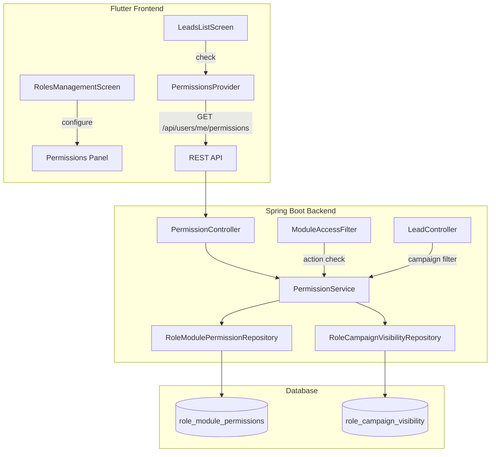
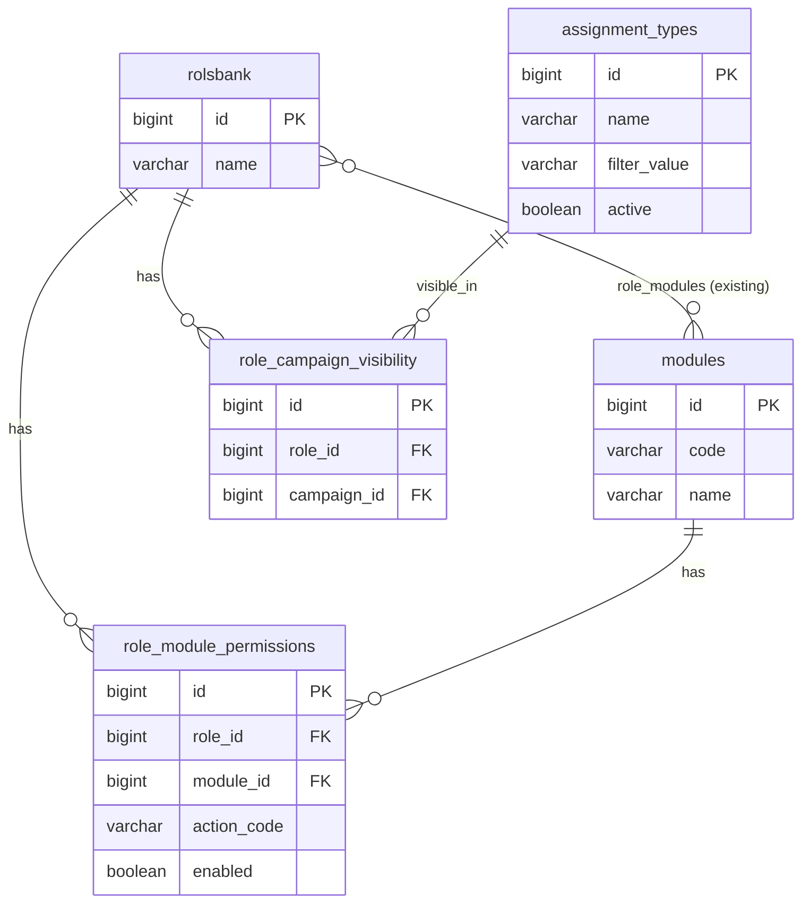

# Design Document: Granular Module Permissions

## Overview

This design extends TrustBank's existing role-based module access system to support fine-grained action permissions and campaign-based visibility within the LEADS module. Currently, the `role_modules` join table grants binary access (has module or doesn't). This feature adds two new dimensions of control:

1. **Action Permissions** — Per-role boolean flags controlling which operations (assign, unassign, import, export, edit, delete) a user can perform within the LEADS module.
2. **Campaign Visibility** — Per-role restrictions on which campaigns' leads are visible, filtering at the database query level.

The system follows the existing architecture: Spring Boot REST API with JPA/Hibernate on the backend, Flutter web with BLoC pattern on the frontend, MySQL in production.

## Architecture



**Key architectural decisions:**

- **Separate tables** for action permissions and campaign visibility rather than a single JSON column — enables efficient querying and indexing.
- **Filter-level enforcement** — Action permissions are checked in the `ModuleAccessFilter` (extended) so that direct API calls are also blocked.
- **Query-level campaign filtering** — Campaign visibility is applied as a WHERE clause in the leads DAO, ensuring pagination and search remain consistent.
- **Single permissions endpoint** — The frontend fetches all permissions in one call and caches them for the session, avoiding repeated network requests.

## Components and Interfaces

### Backend Components

#### 1. `RoleModulePermissionEntity` (New)

JPA entity mapping to the `role_module_permissions` table. Stores one row per role-module-action combination.

```java
@Entity
@Table(name = "role_module_permissions",
       uniqueConstraints = @UniqueConstraint(columnNames = {"role_id", "module_id", "action_code"}))
public class RoleModulePermissionEntity implements Serializable {
    @Id @GeneratedValue(strategy = GenerationType.IDENTITY)
    private Long id;

    @ManyToOne(fetch = FetchType.LAZY)
    @JoinColumn(name = "role_id", nullable = false)
    private RolEntity role;

    @ManyToOne(fetch = FetchType.LAZY)
    @JoinColumn(name = "module_id", nullable = false)
    private ModuleEntity module;

    @Column(name = "action_code", nullable = false, length = 30)
    private String actionCode; // e.g., "ASSIGN_ADVISOR", "EXPORT_EXCEL"

    @Column(nullable = false)
    private Boolean enabled = true;
}
```

#### 2. `RoleCampaignVisibilityEntity` (New)

JPA entity mapping to the `role_campaign_visibility` table. Stores which campaigns a role can see.

```java
@Entity
@Table(name = "role_campaign_visibility",
       uniqueConstraints = @UniqueConstraint(columnNames = {"role_id", "campaign_id"}))
public class RoleCampaignVisibilityEntity implements Serializable {
    @Id @GeneratedValue(strategy = GenerationType.IDENTITY)
    private Long id;

    @ManyToOne(fetch = FetchType.LAZY)
    @JoinColumn(name = "role_id", nullable = false)
    private RolEntity role;

    @ManyToOne(fetch = FetchType.LAZY)
    @JoinColumn(name = "campaign_id", nullable = false)
    private AssignmentTypeEntity campaign;
}
```

#### 3. `IPermissionService` (New Interface)

```java
public interface IPermissionService {
    // Action permissions
    List<ActionPermissionDto> getActionPermissions(Long roleId, String moduleCode);
    void updateActionPermission(Long roleId, String moduleCode, String actionCode, boolean enabled);
    void initializeDefaultPermissions(Long roleId, Long moduleId);
    void deletePermissionsForRoleModule(Long roleId, Long moduleId);
    boolean hasActionPermission(Long userId, String moduleCode, String actionCode);

    // Campaign visibility
    List<Long> getVisibleCampaignIds(Long roleId);
    void updateCampaignVisibility(Long roleId, List<Long> campaignIds);
    List<Long> getUserVisibleCampaignIds(Long userId);

    // Combined user permissions response
    UserPermissionsDto getUserPermissions(Long userId, String moduleCode);
}
```

#### 4. `PermissionController` (New)

REST controller exposing permission management and retrieval endpoints.

| Method | Path | Description |
|--------|------|-------------|
| GET | `/api/users/me/permissions?module=LEADS` | Get current user's permissions |
| GET | `/api/roles/{roleId}/permissions?module=LEADS` | Get role's action permissions (admin) |
| PUT | `/api/roles/{roleId}/permissions` | Update action permission (admin) |
| GET | `/api/roles/{roleId}/campaign-visibility` | Get role's campaign visibility (admin) |
| PUT | `/api/roles/{roleId}/campaign-visibility` | Update campaign visibility (admin) |

#### 5. `ModuleAccessFilter` (Extended)

The existing filter is extended with an action-level check. After verifying module access, it maps specific HTTP method + path combinations to action codes and checks the permission.

```java
// New mapping: method + path pattern -> action code
private static final Map<String, Map<String, String>> ACTION_ENDPOINT_MAP = new LinkedHashMap<>();
static {
    Map<String, String> leadsActions = new LinkedHashMap<>();
    leadsActions.put("POST:/api/admin/leads/assign", "ASSIGN_ADVISOR");
    leadsActions.put("POST:/api/admin/leads/unassign", "UNASSIGN_ADVISOR");
    leadsActions.put("POST:/api/leads/upload", "IMPORT_EXCEL");
    leadsActions.put("POST:/api/leads/import/confirm", "IMPORT_EXCEL");
    leadsActions.put("GET:/api/leads/export", "EXPORT_EXCEL");
    leadsActions.put("PUT:/api/leads/*", "EDIT_LEADS");
    leadsActions.put("DELETE:/api/leads/*", "DELETE_LEADS");
    ACTION_ENDPOINT_MAP.put("LEADS", leadsActions);
}
```

#### 6. `ILeadDao` (Extended)

New repository methods for campaign-filtered queries:

```java
@Query("SELECT l FROM LeadEntity l WHERE l.campana IN :campaigns")
Page<LeadEntity> findByCampanaIn(@Param("campaigns") List<String> campaigns, Pageable pageable);

@Query("SELECT l FROM LeadEntity l WHERE l.campana IN :campaigns AND l.advisor IS NULL")
Page<LeadEntity> findByCampanaInAndAdvisorIsNull(@Param("campaigns") List<String> campaigns, Pageable pageable);
```

### Frontend Components

#### 7. `PermissionsProvider` (New — Flutter)

A provider/service that fetches and caches the current user's permissions for the session.

```dart
class UserPermissions {
  final Map<String, bool> actionPermissions; // actionCode -> enabled
  final List<int> visibleCampaignIds; // empty = unrestricted

  bool canAssign() => actionPermissions['ASSIGN_ADVISOR'] ?? true;
  bool canUnassign() => actionPermissions['UNASSIGN_ADVISOR'] ?? true;
  bool canImport() => actionPermissions['IMPORT_EXCEL'] ?? true;
  bool canExport() => actionPermissions['EXPORT_EXCEL'] ?? true;
  bool canEdit() => actionPermissions['EDIT_LEADS'] ?? true;
  bool canDelete() => actionPermissions['DELETE_LEADS'] ?? true;
  bool hasUnrestrictedVisibility() => visibleCampaignIds.isEmpty;
}
```

#### 8. `PermissionsConfigPanel` (New Widget)

A widget displayed within the RolesManagementScreen when a role has the LEADS module assigned. Shows checkboxes for each action permission and a campaign visibility section.

#### 9. `LeadsListScreen` (Modified)

Conditionally renders action buttons based on `UserPermissions`. Uses `Visibility` or conditional rendering to show/hide buttons.

### API Response Formats

**GET `/api/users/me/permissions?module=LEADS`**
```json
{
  "moduleCode": "LEADS",
  "actions": {
    "ASSIGN_ADVISOR": true,
    "UNASSIGN_ADVISOR": true,
    "IMPORT_EXCEL": false,
    "EXPORT_EXCEL": true,
    "EDIT_LEADS": false,
    "DELETE_LEADS": false
  },
  "visibleCampaignIds": [1, 3, 5]
}
```

**PUT `/api/roles/{roleId}/permissions`**
```json
{
  "moduleCode": "LEADS",
  "actionCode": "IMPORT_EXCEL",
  "enabled": false
}
```

**PUT `/api/roles/{roleId}/campaign-visibility`**
```json
{
  "campaignIds": [1, 3, 5]
}
```

## Data Models

### New Tables

#### `role_module_permissions`

| Column | Type | Constraints |
|--------|------|-------------|
| id | BIGINT | PK, AUTO_INCREMENT |
| role_id | BIGINT | FK → rolsbank(id), NOT NULL |
| module_id | BIGINT | FK → modules(id), NOT NULL |
| action_code | VARCHAR(30) | NOT NULL |
| enabled | BOOLEAN | NOT NULL, DEFAULT TRUE |
| created_at | TIMESTAMP | DEFAULT CURRENT_TIMESTAMP |
| updated_at | TIMESTAMP | DEFAULT CURRENT_TIMESTAMP ON UPDATE |

**Unique constraint:** (role_id, module_id, action_code)
**Indexes:** idx_rmp_role_module (role_id, module_id)

#### `role_campaign_visibility`

| Column | Type | Constraints |
|--------|------|-------------|
| id | BIGINT | PK, AUTO_INCREMENT |
| role_id | BIGINT | FK → rolsbank(id), NOT NULL |
| campaign_id | BIGINT | FK → assignment_types(id), NOT NULL |
| created_at | TIMESTAMP | DEFAULT CURRENT_TIMESTAMP |

**Unique constraint:** (role_id, campaign_id)
**Index:** idx_rcv_role (role_id)

### Action Code Enum

| Action Code | Description | Maps to |
|-------------|-------------|---------|
| ASSIGN_ADVISOR | Assign advisor to leads | POST /api/admin/leads/assign |
| UNASSIGN_ADVISOR | Unassign advisor from leads | POST /api/admin/leads/unassign |
| IMPORT_EXCEL | Import leads from Excel | POST /api/leads/upload, /import/confirm |
| EXPORT_EXCEL | Export leads to Excel | GET /api/leads/export |
| EDIT_LEADS | Edit lead details | PUT /api/leads/{id} |
| DELETE_LEADS | Delete leads | DELETE /api/leads/{id} |

### Entity Relationship Diagram



### Lifecycle Rules

1. **On role-module assignment (LEADS):** Insert 6 rows into `role_module_permissions` with `enabled = true` for all action codes.
2. **On role-module removal (LEADS):** Delete all rows from `role_module_permissions` for that role+module. Delete all rows from `role_campaign_visibility` for that role.
3. **Campaign visibility semantics:** Empty set in `role_campaign_visibility` = unrestricted access. Non-empty set = only those campaigns visible.
4. **Campaign filtering join:** The `leads.campana` (String) field is matched against `assignment_types.filter_value` for the visible campaign IDs.


## Correctness Properties

*A property is a characteristic or behavior that should hold true across all valid executions of a system — essentially, a formal statement about what the system should do. Properties serve as the bridge between human-readable specifications and machine-verifiable correctness guarantees.*

### Property 1: Permission Independence

*For any* role with the LEADS module assigned and any single action permission toggle, changing the enabled state of one action permission SHALL leave all other action permissions for that role-module unchanged.

**Validates: Requirements 1.2**

### Property 2: Default Initialization

*For any* role that is newly assigned the LEADS module, the system SHALL create exactly 6 action permission records (ASSIGN_ADVISOR, UNASSIGN_ADVISOR, IMPORT_EXCEL, EXPORT_EXCEL, EDIT_LEADS, DELETE_LEADS) all with enabled = true.

**Validates: Requirements 1.1, 1.3**

### Property 3: Action Permission Round-Trip

*For any* valid set of action permissions saved for a role-module combination, retrieving those permissions via the REST API SHALL return the same enabled/disabled states that were persisted.

**Validates: Requirements 1.4**

### Property 4: Cleanup on Module Removal

*For any* role that has the LEADS module with existing action permissions and campaign visibility records, removing the LEADS module from that role SHALL result in zero action permission records and zero campaign visibility records for that role-module combination.

**Validates: Requirements 2.4**

### Property 5: Button Visibility Matches Permission State

*For any* permission configuration (a map of action codes to boolean enabled states), the visibility of each action button in the Leads UI SHALL equal the enabled state of its corresponding action permission. Specifically: button is visible if and only if its permission is enabled.

**Validates: Requirements 3.2, 3.3, 3.4, 3.5, 3.6, 3.7**

### Property 6: API Enforcement of Action Permissions

*For any* user whose role has a specific action permission disabled, calling the corresponding API endpoint SHALL return HTTP 403 Forbidden, regardless of the request payload.

**Validates: Requirements 3.8**

### Property 7: Campaign Visibility Round-Trip

*For any* set of campaign IDs assigned to a role's visibility configuration, retrieving the campaign visibility via the REST API SHALL return the same set of campaign IDs.

**Validates: Requirements 4.1, 4.4**

### Property 8: Campaign Filtering Correctness

*For any* user whose role has one or more campaigns assigned for visibility, and for any leads query (with any pagination, sort, or filter parameters), every lead in the response SHALL have its `campana` field matching one of the user's visible campaigns.

**Validates: Requirements 4.3, 6.1**

### Property 9: Unrestricted Visibility Returns All Leads

*For any* user whose role has no campaign visibility restrictions (empty campaign set), the leads query SHALL return the same results as an unfiltered query (no campaign WHERE clause applied).

**Validates: Requirements 4.2, 6.2**

### Property 10: Campaign Filter Pagination Consistency

*For any* paginated leads query with campaign filtering applied, the reported total count in the pagination metadata SHALL equal the total number of leads in the database whose `campana` matches one of the user's visible campaigns.

**Validates: Requirements 6.3**

### Property 11: Direct Access Enforcement for Campaign Visibility

*For any* user with campaign restrictions, requesting a specific lead (GET /api/leads/{id}) whose `campana` does not match any of the user's visible campaigns SHALL return HTTP 403 Forbidden.

**Validates: Requirements 6.4**

### Property 12: Permissions Response Completeness

*For any* user with the LEADS module assigned, the permissions endpoint response SHALL contain exactly 6 action permission entries (one per defined action code) and a `visibleCampaignIds` list (empty list if unrestricted).

**Validates: Requirements 7.2**

## Error Handling

### Backend Error Scenarios

| Scenario | Response | HTTP Status |
|----------|----------|-------------|
| User lacks module access | `{"error": "MODULE_ACCESS_DENIED", "message": "No tienes acceso a este módulo"}` | 403 |
| User lacks action permission | `{"error": "ACTION_PERMISSION_DENIED", "message": "No tienes permiso para realizar esta acción", "action": "<actionCode>"}` | 403 |
| User accesses lead outside visible campaigns | `{"error": "CAMPAIGN_ACCESS_DENIED", "message": "No tienes acceso a este lead"}` | 403 |
| Role not found | `{"error": "ROLE_NOT_FOUND", "message": "Rol no encontrado"}` | 404 |
| Invalid action code in update request | `{"error": "INVALID_ACTION_CODE", "message": "Código de acción inválido"}` | 400 |
| Campaign ID not found | `{"error": "CAMPAIGN_NOT_FOUND", "message": "Campaña no encontrada"}` | 404 |
| Database constraint violation (duplicate) | `{"error": "DUPLICATE_ENTRY", "message": "El registro ya existe"}` | 409 |

### Frontend Error Handling

- **Permission fetch failure:** Default to hiding all action buttons (fail-closed). Show a non-blocking error toast and retry on next navigation.
- **Permission update failure (admin):** Show error toast, revert checkbox to previous state, allow retry.
- **Stale permissions:** Permissions are refreshed on app startup and on navigation to the Leads screen. No real-time push; acceptable staleness window is the duration of a session tab.

### Race Conditions

- **Admin changes permissions while user is active:** The user's cached permissions remain until next refresh. This is acceptable since permission changes are infrequent administrative actions.
- **Module removal while editing permissions:** The `deletePermissionsForRoleModule` method uses a transaction. If the admin UI is open, the next save attempt will fail gracefully with a 404 (role-module not found).

## Testing Strategy

### Property-Based Testing

This feature is well-suited for property-based testing because:
- The permission logic is pure (input → output with no side effects beyond persistence)
- The input space is combinatorial (6 actions × N roles × M campaigns)
- Universal properties hold across all valid inputs

**Library:** [jqwik](https://jqwik.net/) for the Spring Boot backend (Java property-based testing framework, integrates with JUnit 5).

**Configuration:**
- Minimum 100 iterations per property test
- Each test tagged with: `Feature: granular-module-permissions, Property {N}: {title}`

**Properties to implement as PBT:**
- Property 1 (Permission Independence) — Generate random permission states, toggle one, verify others unchanged
- Property 2 (Default Initialization) — Generate random role IDs, verify initialization produces 6 enabled records
- Property 3 (Action Permission Round-Trip) — Generate random permission maps, save and retrieve, verify equality
- Property 6 (API Enforcement) — Generate random user/action/permission-state combinations, verify 403 when disabled
- Property 8 (Campaign Filtering) — Generate random lead sets with various campaigns, apply filter, verify all results match
- Property 9 (Unrestricted Visibility) — Generate random lead sets, verify no filtering when campaign set is empty
- Property 10 (Pagination Consistency) — Generate random lead sets and page sizes, verify total count matches filter
- Property 12 (Response Completeness) — Generate random permission configurations, verify response structure

### Unit Tests (Example-Based)

- Permission service: specific scenarios for initialization, update, deletion
- ModuleAccessFilter: specific request paths mapped to correct action codes
- Campaign visibility: edge cases (empty campaigns, single campaign, all campaigns)
- DTO serialization/deserialization
- Flutter widget tests: button visibility with specific permission configurations

### Integration Tests

- Full API flow: create role → assign module → verify permissions initialized → toggle permission → verify enforcement
- Campaign filtering with real database queries and pagination
- Permission endpoint response time under load (< 200ms)
- Concurrent permission updates (optimistic locking)

### Flutter Widget Tests

- RolesManagementScreen: permissions panel appears/disappears with module toggle
- LeadsListScreen: buttons conditionally rendered based on mocked permissions
- PermissionsProvider: caching behavior, refresh on navigation
