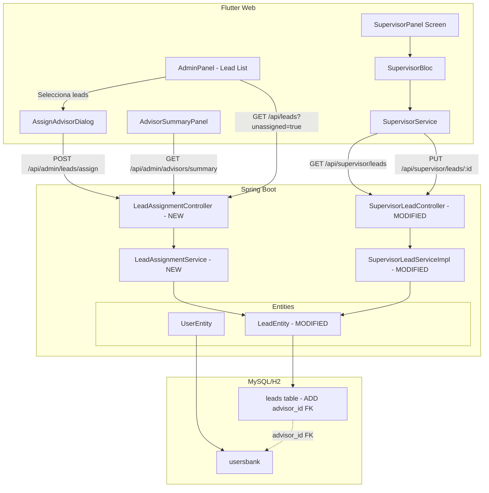
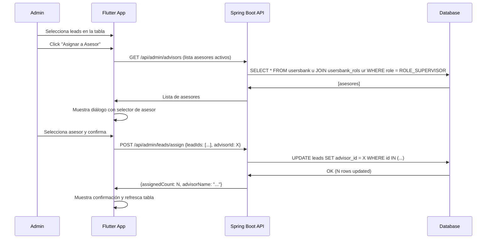
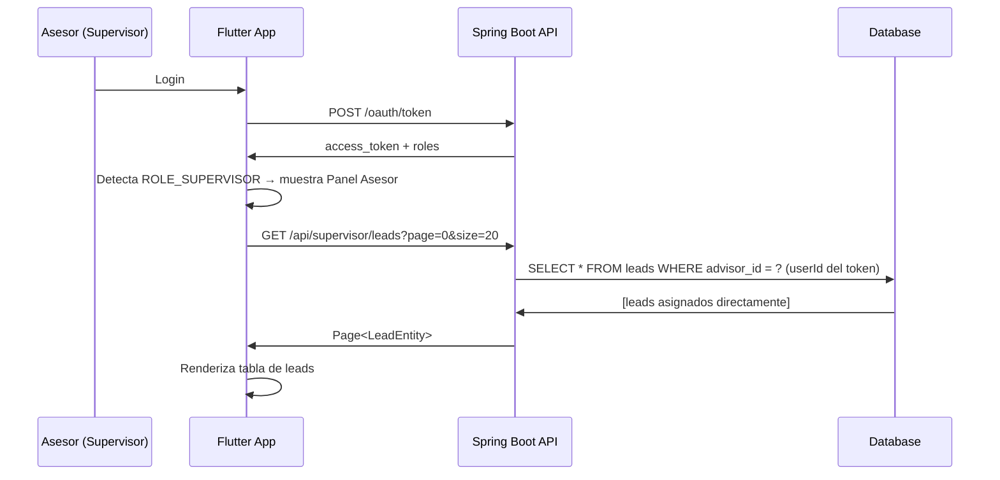

# Documento de Diseño: Asignación Directa de Leads a Asesores

## Overview

Este diseño reemplaza el sistema actual de filtrado de leads por campaña (`campana` → `filterValue` del tipo de asignación) con un modelo de asignación directa donde cada lead tiene una referencia explícita al asesor responsable mediante un campo `advisor_id` en la tabla `leads`.

### Decisiones de Diseño Clave

1. **Columna `advisor_id` en la tabla `leads`**: FK nullable hacia `usersbank(id)`. Reemplaza la lógica indirecta de `campana` → `filterValue` → `assignment_type` → `supervisor_assignments` con una relación directa lead → asesor.
2. **Modificación de `SupervisorLeadServiceImpl`**: El filtrado cambia de `findByCampana(filterValue)` a `findByAdvisorId(userId)`, eliminando la dependencia del sistema de tipos de asignación para la visibilidad de leads.
3. **Nuevo endpoint de asignación masiva**: `POST /api/admin/leads/assign` permite al administrador asignar múltiples leads a un asesor en una sola petición.
4. **Filtro de leads no asignados**: Nuevo query `findByAdvisorIdIsNull()` para que el administrador identifique leads pendientes de asignación.
5. **Compatibilidad con importación**: Los leads importados desde Excel se crean con `advisor_id = null`, manteniendo el flujo de importación sin cambios.
6. **Deprecación gradual del sistema de tipos de asignación**: El `AssignmentTypeEntity` y `SupervisorAssignmentEntity` se mantienen en la base de datos pero dejan de ser el mecanismo principal de filtrado de leads. Pueden usarse como agrupación secundaria o metadata del asesor.

### Motivación del Cambio

El sistema actual requiere que el administrador configure tipos de asignación con `filterValue`, que los leads tengan el campo `campana` coincidente, y que el supervisor tenga una entrada en `supervisor_assignments` vinculada al tipo correcto. Este flujo indirecto:
- No permite asignar leads individuales a asesores específicos
- Depende de que el campo `campana` del lead coincida exactamente con el `filterValue`
- No soporta reasignación de leads individuales entre asesores
- No permite identificar leads sin asesor asignado

La asignación directa simplifica todo esto a: "este lead pertenece a este asesor".

## Architecture



### Flujo de Datos: Asignación Masiva de Leads



### Flujo de Datos: Asesor Consulta sus Leads (Nuevo Modelo)



## Components and Interfaces

### Backend Components

#### 1. LeadEntity (Modificada)

Se agrega el campo `advisor_id` como FK nullable hacia `usersbank`:

```java
@Entity
@Table(name = "leads")
public class LeadEntity implements Serializable {
    // ... campos existentes ...

    @ManyToOne(fetch = FetchType.LAZY)
    @JoinColumn(name = "advisor_id", nullable = true)
    private UserEntity advisor;

    public UserEntity getAdvisor() { return advisor; }
    public void setAdvisor(UserEntity advisor) { this.advisor = advisor; }
}
```

#### 2. LeadAssignmentController (Nuevo)

Endpoints exclusivos para administradores para gestionar la asignación de leads:

| Endpoint | Method | Description | Auth |
|----------|--------|-------------|------|
| `POST /api/admin/leads/assign` | POST | Asignar leads a un asesor (bulk) | ROLE_ADMIN |
| `POST /api/admin/leads/unassign` | POST | Desasignar leads (set advisor_id = null) | ROLE_ADMIN |
| `POST /api/admin/leads/reassign` | POST | Reasignar leads de un asesor a otro | ROLE_ADMIN |
| `GET /api/admin/advisors/summary` | GET | Resumen de asesores con conteo de leads | ROLE_ADMIN |
| `GET /api/admin/advisors/{advisorId}/leads` | GET | Leads asignados a un asesor específico | ROLE_ADMIN |

#### 3. LeadAssignmentService (Nuevo)

```java
@Service
public class LeadAssignmentService {

    /**
     * Asigna múltiples leads a un asesor.
     * Valida que el advisorId corresponda a un usuario con ROLE_SUPERVISOR.
     */
    public AssignmentResult assignLeads(List<Long> leadIds, Long advisorId);

    /**
     * Desasigna leads (establece advisor_id = null).
     */
    public int unassignLeads(List<Long> leadIds);

    /**
     * Reasigna leads de un asesor a otro.
     */
    public AssignmentResult reassignLeads(Long fromAdvisorId, Long toAdvisorId, List<Long> leadIds);

    /**
     * Retorna resumen de asesores con conteo de leads asignados.
     * Incluye asesores con 0 leads.
     */
    public List<AdvisorSummaryDTO> getAdvisorSummary();

    /**
     * Valida que el usuario tiene rol ROLE_SUPERVISOR.
     */
    private void validateAdvisorRole(Long userId);
}
```

#### 4. SupervisorLeadServiceImpl (Modificada)

El cambio principal: filtrar por `advisor_id` en lugar de `campana`/`filterValue`:

```java
@Service
public class SupervisorLeadServiceImpl implements ISupervisorLeadService {

    @Override
    @Transactional(readOnly = true)
    public Page<LeadEntity> findLeadsBySupervisor(Long userId, Pageable pageable) {
        // ANTES: String filterValue = getFilterValueForSupervisor(userId);
        //        return leadDao.findByCampana(filterValue, pageable);
        // AHORA:
        return leadDao.findByAdvisorId(userId, pageable);
    }

    @Override
    @Transactional(readOnly = true)
    public Page<LeadEntity> searchLeadsBySupervisor(Long userId, String term, Pageable pageable) {
        // ANTES: String filterValue = getFilterValueForSupervisor(userId);
        //        return leadDao.searchByCampanaAndTerm(filterValue, term, pageable);
        // AHORA:
        return leadDao.searchByAdvisorIdAndTerm(userId, term, pageable);
    }

    @Override
    @Transactional(readOnly = true)
    public boolean isLeadInSupervisorAssignment(Long leadId, Long userId) {
        // ANTES: comparaba lead.getCampana() con filterValue
        // AHORA:
        LeadEntity lead = leadDao.findById(leadId).orElse(null);
        if (lead == null) return false;
        return lead.getAdvisor() != null && lead.getAdvisor().getId().equals(userId);
    }
}
```

#### 5. ILeadDao (Extensión)

Nuevos métodos de repositorio:

```java
public interface ILeadDao extends JpaRepository<LeadEntity, Long> {
    // ... métodos existentes ...

    // Nuevos métodos para asignación directa
    Page<LeadEntity> findByAdvisorId(Long advisorId, Pageable pageable);

    Page<LeadEntity> findByAdvisorIsNull(Pageable pageable);

    @Query("SELECT l FROM LeadEntity l WHERE l.advisor.id = :advisorId AND (" +
           "LOWER(l.nombre) LIKE LOWER(CONCAT('%', :term, '%')) OR " +
           "LOWER(l.apellido) LIKE LOWER(CONCAT('%', :term, '%')) OR " +
           "LOWER(l.telefono) LIKE LOWER(CONCAT('%', :term, '%')) OR " +
           "LOWER(l.email) LIKE LOWER(CONCAT('%', :term, '%')))")
    Page<LeadEntity> searchByAdvisorIdAndTerm(
        @Param("advisorId") Long advisorId,
        @Param("term") String term,
        Pageable pageable);

    @Query("SELECT COUNT(l) FROM LeadEntity l WHERE l.advisor.id = :advisorId")
    Long countByAdvisorId(@Param("advisorId") Long advisorId);

    @Modifying
    @Query("UPDATE LeadEntity l SET l.advisor.id = :advisorId WHERE l.id IN :leadIds")
    int bulkAssign(@Param("leadIds") List<Long> leadIds, @Param("advisorId") Long advisorId);

    @Modifying
    @Query("UPDATE LeadEntity l SET l.advisor = null WHERE l.id IN :leadIds")
    int bulkUnassign(@Param("leadIds") List<Long> leadIds);
}
```

### Frontend Components

#### 1. LeadAssignmentService (Nuevo - Flutter)

```dart
class LeadAssignmentService {
  /// POST /api/admin/leads/assign
  static Future<AssignmentResult> assignLeads({
    required List<int> leadIds,
    required int advisorId,
  }) async { ... }

  /// POST /api/admin/leads/unassign
  static Future<int> unassignLeads(List<int> leadIds) async { ... }

  /// POST /api/admin/leads/reassign
  static Future<AssignmentResult> reassignLeads({
    required int fromAdvisorId,
    required int toAdvisorId,
    required List<int> leadIds,
  }) async { ... }

  /// GET /api/admin/advisors/summary
  static Future<List<AdvisorSummary>> getAdvisorSummary() async { ... }

  /// GET /api/admin/advisors/{advisorId}/leads
  static Future<PaginatedResponse<LeadModel>> getAdvisorLeads(int advisorId, {int page = 0, int size = 20}) async { ... }
}
```

#### 2. AssignAdvisorDialog (Nuevo Widget)

Diálogo modal para asignar leads seleccionados a un asesor:
- Carga lista de asesores activos (ROLE_SUPERVISOR)
- Muestra selector con nombre y email del asesor
- Si los leads seleccionados ya tienen asesor, muestra advertencia de reasignación
- Botones "Confirmar" y "Cancelar"

#### 3. AdvisorSummaryPanel (Nuevo Widget)

Panel que muestra el resumen de asesores con conteo de leads:
- Tabla con columnas: Nombre, Email, Leads Asignados
- Click en un asesor navega a la lista de sus leads
- Incluye asesores con 0 leads

#### 4. Modificación del AdminPanel (Lead List)

- Agregar columna "Asesor" en la tabla de leads (muestra nombre o "Sin asignar")
- Agregar filtro dropdown: "Todos", "Sin asignar", o por asesor específico
- Agregar checkboxes para selección múltiple de leads
- Agregar botón "Asignar a Asesor" (habilitado cuando hay leads seleccionados)
- Indicador visual (badge/color) para leads sin asignar

## Data Models

### Database Schema Changes

```sql
-- Agregar columna advisor_id a la tabla leads
ALTER TABLE leads ADD COLUMN advisor_id BIGINT NULL;

-- Crear FK hacia usersbank
ALTER TABLE leads ADD CONSTRAINT fk_leads_advisor
    FOREIGN KEY (advisor_id) REFERENCES usersbank(id)
    ON DELETE SET NULL;

-- Índice para optimizar consultas por advisor_id
CREATE INDEX idx_leads_advisor_id ON leads(advisor_id);
```

### API DTOs (Nuevos)

```java
// Request: Asignación masiva de leads
public class LeadAssignmentRequest {
    @NotNull
    @Size(min = 1)
    private List<Long> leadIds;

    @NotNull
    private Long advisorId;
}

// Request: Desasignación de leads
public class LeadUnassignRequest {
    @NotNull
    @Size(min = 1)
    private List<Long> leadIds;
}

// Request: Reasignación de leads
public class LeadReassignRequest {
    @NotNull
    private Long fromAdvisorId;

    @NotNull
    private Long toAdvisorId;

    @NotNull
    @Size(min = 1)
    private List<Long> leadIds;
}

// Response: Resultado de asignación
public class AssignmentResultDTO {
    private int assignedCount;
    private String advisorName;
    private String advisorEmail;
    private List<Long> failedLeadIds; // IDs que no se pudieron asignar (no existen)
}

// Response: Resumen de asesor
public class AdvisorSummaryDTO {
    private Long advisorId;
    private String advisorName;
    private String advisorEmail;
    private Long assignedLeadCount;
}
```

### Flutter Models (Nuevos/Modificados)

```dart
// Modelo de resultado de asignación
class AssignmentResult {
  final int assignedCount;
  final String advisorName;
  final String advisorEmail;
  final List<int> failedLeadIds;

  AssignmentResult.fromJson(Map<String, dynamic> json);
}

// Modelo de resumen de asesor
class AdvisorSummary {
  final int advisorId;
  final String advisorName;
  final String advisorEmail;
  final int assignedLeadCount;

  AdvisorSummary.fromJson(Map<String, dynamic> json);
}

// LeadModel modificado - agregar campo advisor
class LeadModel {
  // ... campos existentes ...
  final int? advisorId;
  final String? advisorName; // Nombre del asesor asignado (para display)

  LeadModel.fromJson(Map<String, dynamic> json);
}
```


## Correctness Properties

*Una propiedad es una característica o comportamiento que debe mantenerse verdadero en todas las ejecuciones válidas de un sistema — esencialmente, una declaración formal sobre lo que el sistema debe hacer. Las propiedades sirven como puente entre especificaciones legibles por humanos y garantías de corrección verificables por máquina.*

### Property 1: Asignación masiva persiste correctamente (Round-trip)

*Para cualquier* conjunto no vacío de IDs de leads existentes y cualquier ID de asesor válido (usuario con ROLE_SUPERVISOR), después de ejecutar la asignación masiva, cada lead especificado debe tener su campo `advisor_id` igual al ID del asesor elegido.

**Validates: Requirements 1.1, 1.3, 2.3, 3.3**

### Property 2: Desasignación establece advisor_id en nulo

*Para cualquier* conjunto de leads con `advisor_id` no nulo, después de ejecutar la desasignación, cada lead especificado debe tener su campo `advisor_id` igual a nulo.

**Validates: Requirements 1.2, 3.4**

### Property 3: Validación de rol de asesor

*Para cualquier* ID de usuario, la operación de asignación de leads debe tener éxito si y solo si el usuario existe y tiene el rol ROLE_SUPERVISOR. Si el usuario no existe o no tiene ese rol, la operación debe ser rechazada con un error de validación.

**Validates: Requirements 1.4**

### Property 4: Un lead tiene a lo sumo un asesor

*Para cualquier* secuencia de operaciones de asignación sobre un mismo lead (asignar a asesor A, luego reasignar a asesor B), el lead siempre debe tener exactamente un valor en `advisor_id` (el último asesor asignado), nunca múltiples.

**Validates: Requirements 1.5**

### Property 5: Asesor solo accede a leads asignados directamente

*Para cualquier* asesor autenticado y cualquier lead en el sistema, el asesor puede obtener (GET) y actualizar (PUT) el lead si y solo si `lead.advisor_id` es igual al ID del asesor. Si el lead no le está asignado, la respuesta debe ser HTTP 403.

**Validates: Requirements 5.1, 6.1, 6.2, 6.3, 6.4**

### Property 6: Búsqueda del asesor filtra dentro de leads asignados

*Para cualquier* término de búsqueda y cualquier asesor autenticado, todos los leads retornados por el endpoint de búsqueda deben cumplir dos condiciones: (a) `advisor_id` es igual al ID del asesor, Y (b) al menos uno de los campos nombre, apellido, teléfono o email contiene el término de búsqueda.

**Validates: Requirements 5.2**

### Property 7: Asesor no puede crear ni eliminar leads

*Para cualquier* asesor autenticado, cualquier petición POST (creación) o DELETE (eliminación) dirigida a endpoints de leads debe retornar HTTP 403, independientemente del contenido de la petición.

**Validates: Requirements 6.5**

### Property 8: Filtro de leads no asignados retorna exactamente los leads sin asesor

*Para cualquier* conjunto de leads en el sistema (algunos con `advisor_id` no nulo, otros con `advisor_id` nulo), el endpoint de leads no asignados debe retornar exactamente aquellos leads donde `advisor_id` es nulo, sin omitir ninguno y sin incluir leads asignados.

**Validates: Requirements 4.2**

### Property 9: Leads importados se crean sin asignación

*Para cualquier* lead creado a través del proceso de importación de Excel, el campo `advisor_id` debe ser nulo inmediatamente después de la creación, independientemente del contenido del archivo Excel.

**Validates: Requirements 4.4, 8.1, 8.4**

### Property 10: Resumen de asesores refleja conteos correctos y es completo

*Para cualquier* distribución de leads entre asesores, el endpoint de resumen debe retornar una entrada por cada usuario con ROLE_SUPERVISOR (incluyendo aquellos con 0 leads), y el conteo de leads de cada asesor debe ser igual al número real de leads donde `advisor_id` coincide con el ID de ese asesor.

**Validates: Requirements 7.1, 7.3**

## Error Handling

### Respuestas de Error del Backend

| Escenario | HTTP Code | Response Body |
|-----------|-----------|---------------|
| Advisor ID no es un usuario con ROLE_SUPERVISOR | 400 | `{"error": "INVALID_ADVISOR", "message": "El usuario especificado no existe o no tiene rol de asesor"}` |
| Lead IDs vacíos en request de asignación | 400 | `{"error": "EMPTY_LEAD_LIST", "message": "Debe especificar al menos un lead para asignar"}` |
| Algunos lead IDs no existen | 207 | `{"assignedCount": N, "failedLeadIds": [...], "advisorName": "..."}` |
| Asesor intenta acceder a lead no asignado | 403 | `{"error": "LEAD_NOT_IN_ASSIGNMENT", "message": "No tienes acceso a este lead"}` |
| Asesor intenta crear/eliminar leads | 403 | `{"error": "OPERATION_NOT_ALLOWED", "message": "Los asesores solo pueden editar leads asignados"}` |
| Asesor sin leads asignados consulta lista | 200 | `{"content": [], "totalElements": 0, ...}` (página vacía) |
| Token inválido/expirado | 401 | `{"error": "UNAUTHORIZED", "message": "Token inválido o expirado"}` |
| Error interno al asignar | 500 | `{"error": "ASSIGNMENT_FAILED", "message": "Error al procesar la asignación"}` |

### Manejo de Errores en Frontend

- **Error de red**: Mostrar snackbar con mensaje de error y opción de reintentar.
- **403 en acceso a lead**: Mostrar mensaje "No tienes acceso a este lead" y redirigir a la lista.
- **403 en operación no permitida**: Mostrar mensaje "Operación no permitida para asesores".
- **207 en asignación parcial**: Mostrar mensaje indicando cuántos leads se asignaron y cuáles fallaron.
- **400 en validación de asesor**: Mostrar mensaje "El usuario seleccionado no es un asesor válido".
- **Timeout**: Reintentar automáticamente una vez, luego mostrar error con opción manual.

### Logging

- Asignación masiva: `INFO [LeadAssignmentService] Bulk assign: adminId={}, advisorId={}, leadCount={}, successCount={}`
- Reasignación: `INFO [LeadAssignmentService] Reassign: adminId={}, fromAdvisorId={}, toAdvisorId={}, leadCount={}`
- Desasignación: `INFO [LeadAssignmentService] Unassign: adminId={}, leadCount={}`
- Acceso denegado: `WARN [SupervisorLeadServiceImpl] Unauthorized access: userId={}, leadId={}, leadAdvisorId={}`
- Validación fallida de asesor: `WARN [LeadAssignmentService] Invalid advisor: userId={}, hasRole=false`

## Testing Strategy

### Unit Tests (Backend - JUnit 5 + Mockito)

- **LeadAssignmentService**: Validación de rol de asesor, asignación masiva, desasignación, reasignación, manejo de IDs inexistentes.
- **SupervisorLeadServiceImpl (modificado)**: Filtrado por `advisor_id`, verificación de pertenencia, búsqueda scoped.
- **LeadAssignmentController**: Validación de requests, respuestas HTTP correctas, manejo de errores.
- **SupervisorLeadController**: Acceso denegado para leads no asignados, bloqueo de POST/DELETE.

### Unit Tests (Frontend - Flutter test)

- **LeadAssignmentService**: Serialización/deserialización de requests y responses.
- **AssignAdvisorDialog**: Comportamiento del diálogo (carga de asesores, selección, advertencia de reasignación).
- **AdvisorSummaryPanel**: Renderizado correcto de tabla con conteos.
- **AdminPanel (modificaciones)**: Filtro de leads no asignados, selección múltiple, botón de asignación.

### Property-Based Tests (Backend - jqwik)

Se utilizará **jqwik** como framework de property-based testing para Java/Spring Boot.

Configuración:
- Mínimo 100 iteraciones por propiedad
- Cada test referencia su propiedad del documento de diseño

**Tests a implementar:**

1. **Feature: lead-advisor-assignment, Property 1: Asignación masiva persiste correctamente** — Generar conjuntos aleatorios de lead IDs y advisor IDs válidos, ejecutar asignación, verificar que todos los leads tienen el advisor_id correcto.
2. **Feature: lead-advisor-assignment, Property 2: Desasignación establece advisor_id en nulo** — Generar leads con advisor asignado, desasignar, verificar que advisor_id es null.
3. **Feature: lead-advisor-assignment, Property 3: Validación de rol de asesor** — Generar user IDs aleatorios (algunos con ROLE_SUPERVISOR, otros sin), verificar que solo los válidos son aceptados.
4. **Feature: lead-advisor-assignment, Property 4: Un lead tiene a lo sumo un asesor** — Ejecutar secuencias aleatorias de asignaciones sobre un lead, verificar que siempre tiene exactamente un advisor_id.
5. **Feature: lead-advisor-assignment, Property 5: Asesor solo accede a leads asignados** — Crear leads con diferentes advisor_ids, verificar que GET/PUT retorna 200 solo para leads del asesor y 403 para los demás.
6. **Feature: lead-advisor-assignment, Property 6: Búsqueda filtra dentro de leads asignados** — Generar términos de búsqueda y leads con diferentes asesores, verificar que resultados cumplen ambos criterios.
7. **Feature: lead-advisor-assignment, Property 7: Asesor no puede crear ni eliminar** — Para cualquier asesor, verificar que POST y DELETE retornan 403.
8. **Feature: lead-advisor-assignment, Property 8: Filtro de no asignados** — Crear leads con y sin advisor, verificar que el filtro retorna exactamente los sin advisor.
9. **Feature: lead-advisor-assignment, Property 9: Leads importados sin asignación** — Simular importación de leads, verificar que todos tienen advisor_id = null.
10. **Feature: lead-advisor-assignment, Property 10: Resumen de asesores correcto y completo** — Crear distribución aleatoria de leads entre asesores, verificar que el resumen refleja conteos exactos e incluye asesores con 0 leads.

### Integration Tests

- Flujo completo: importar leads → verificar advisor_id null → asignar a asesor → login como asesor → ver solo leads asignados → editar lead.
- Reasignación: asignar leads a asesor A → reasignar a asesor B → verificar que asesor A ya no ve los leads y asesor B sí.
- Desasignación: asignar leads → desasignar → verificar que aparecen en filtro de no asignados.
- Acceso denegado: login como asesor → intentar GET/PUT de lead de otro asesor → verificar 403.
- Compatibilidad de importación: importar Excel con columna de asesor → verificar que se ignora y advisor_id es null.
