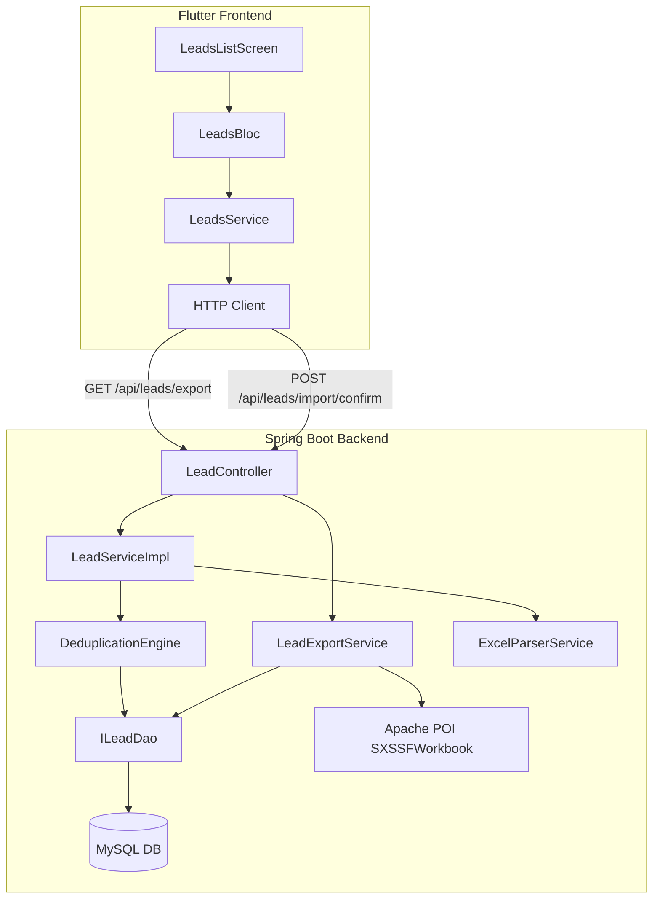
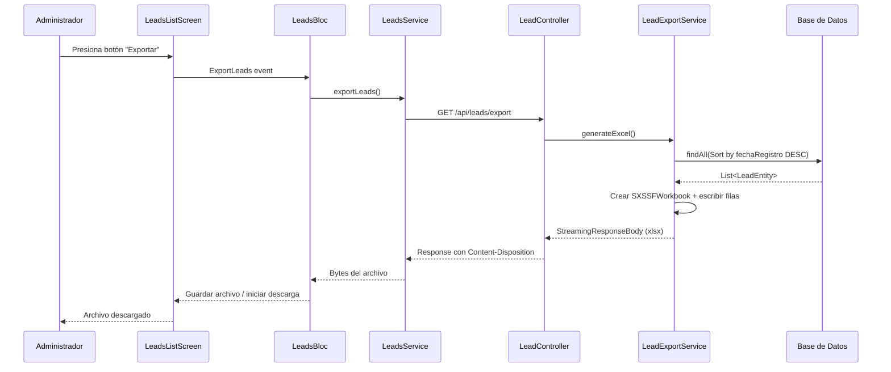
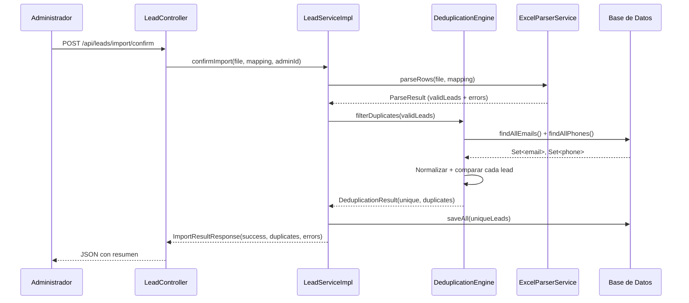

# Documento de Diseño Técnico - Exportación y Deduplicación de Leads

## Visión General

Este documento describe el diseño técnico de dos funcionalidades complementarias para el módulo de leads existente:

1. **Exportación a Excel**: Endpoint REST que genera un archivo `.xlsx` con todos los leads y lo transmite como descarga al cliente Flutter.
2. **Motor de Deduplicación**: Componente que, durante la importación, detecta y omite filas cuyo email o teléfono ya existen en la base de datos.

Ambas funcionalidades se integran al sistema existente (Spring Boot backend + Flutter frontend) sin modificar la lógica de importación actual, sino extendiéndola.

### Decisiones de Diseño Clave

| Decisión | Justificación |
|----------|---------------|
| Apache POI (SXSSFWorkbook) para exportación | Streaming de filas para eficiencia de memoria en datasets grandes; ya configurado en el proyecto |
| Normalización en capa de servicio (no en DB) | Permite lógica de normalización de teléfono compleja sin funciones SQL custom |
| Consulta batch de emails/teléfonos existentes | Evita N+1 queries; carga todos los valores existentes una vez antes de iterar filas |
| Deduplicación intra-archivo con Set en memoria | Detecta duplicados entre filas del mismo archivo sin acceso adicional a DB |
| Streaming de respuesta con StreamingResponseBody | Evita cargar el archivo completo en memoria del servidor |
| Timeout configurable con @Async + Future | Permite cancelar la generación si excede el límite de tiempo |

---

## Arquitectura



### Flujo de Exportación



### Flujo de Importación con Deduplicación



---

## Componentes e Interfaces

### Backend - Nuevos Componentes

#### `models.services.LeadExportService`

Servicio dedicado a la generación del archivo Excel de exportación.

```java
@Service
public class LeadExportService {

    @Autowired
    private ILeadDao leadDao;

    /**
     * Genera un archivo Excel (.xlsx) con todos los leads ordenados por fecha de registro DESC.
     * Usa SXSSFWorkbook para streaming eficiente de memoria.
     * @param outputStream OutputStream donde se escribe el archivo
     * @throws IOException si ocurre un error de escritura
     */
    public void generateExcelExport(OutputStream outputStream) throws IOException;
}
```

#### `models.services.DeduplicationEngine`

Componente que encapsula la lógica de detección de duplicados.

```java
@Component
public class DeduplicationEngine {

    @Autowired
    private ILeadDao leadDao;

    /**
     * Filtra los leads que son duplicados según email o teléfono.
     * @param candidates Lista de leads candidatos a importar
     * @return DeduplicationResult con leads únicos y lista de duplicados
     */
    public DeduplicationResult filterDuplicates(List<LeadEntity> candidates);

    /**
     * Normaliza un email: trim + lowercase.
     * @param email Email a normalizar
     * @return Email normalizado o null si es vacío/null
     */
    public String normalizeEmail(String email);

    /**
     * Normaliza un teléfono: elimina espacios, guiones y paréntesis.
     * @param phone Teléfono a normalizar
     * @return Teléfono normalizado o null si es vacío/null
     */
    public String normalizePhone(String phone);
}
```

#### `models.services.DeduplicationResult`

DTO para el resultado de la deduplicación.

```java
public class DeduplicationResult {
    private List<LeadEntity> uniqueLeads;
    private List<LeadEntity> duplicateLeads;
    private int duplicateCount;

    // Constructor, getters, setters
}
```

### Backend - Modificaciones a Componentes Existentes

#### `ILeadDao` - Nuevos métodos de consulta

```java
public interface ILeadDao extends JpaRepository<LeadEntity, Long> {
    // ... métodos existentes ...

    @Query("SELECT LOWER(TRIM(l.email)) FROM LeadEntity l WHERE l.email IS NOT NULL AND TRIM(l.email) <> ''")
    List<String> findAllNormalizedEmails();

    @Query("SELECT l.telefono FROM LeadEntity l WHERE l.telefono IS NOT NULL AND TRIM(l.telefono) <> ''")
    List<String> findAllPhones();

    List<LeadEntity> findAll(Sort sort);
}
```

#### `ImportResultResponse` - Campo adicional

```java
public class ImportResultResponse {
    private int successCount;
    private int errorCount;
    private int duplicateCount;  // NUEVO
    private int totalRows;
    private Long importId;

    public ImportResultResponse(int successCount, int errorCount, int duplicateCount, int totalRows, Long importId) {
        this.successCount = successCount;
        this.errorCount = errorCount;
        this.duplicateCount = duplicateCount;
        this.totalRows = totalRows;
        this.importId = importId;
    }

    // getters y setters incluyendo duplicateCount
}
```

#### `LeadImportEntity` - Campo adicional

```java
@Entity
@Table(name = "lead_imports")
public class LeadImportEntity implements Serializable {
    // ... campos existentes ...

    @Column(name = "duplicate_count")
    private Integer duplicateCount;  // NUEVO

    // getter y setter
}
```

#### `LeadServiceImpl.confirmImport()` - Integración con DeduplicationEngine

El método `confirmImport` se modifica para invocar al `DeduplicationEngine` después del parsing y antes del guardado.

#### `LeadController` - Nuevo endpoint de exportación

```java
@Secured("ROLE_ADMIN")
@GetMapping("/export")
public ResponseEntity<StreamingResponseBody> exportLeads();
```

### Frontend - Modificaciones

#### `LeadsBloc` - Nuevo evento y estado

```dart
// Nuevo evento
class ExportLeads extends LeadsEvent {}

// Nuevo estado
class ExportInProgress extends LeadsState {}
class ExportCompleted extends LeadsState { final String filePath; }

// Modificación al estado existente
class ImportCompleted extends LeadsState {
  final int successCount;
  final int errorCount;
  final int duplicateCount;  // NUEVO
}
```

#### `LeadsService` - Nuevo método de exportación

```dart
static Future<List<int>> exportLeads() async {
  final response = await http.get(
    Uri.parse('$_baseUrl/leads/export'),
    headers: await _headers,
  );
  if (response.statusCode == 200) {
    return response.bodyBytes;
  } else {
    throw Exception('Error al exportar leads: ${response.statusCode}');
  }
}
```

#### `LeadsListScreen` - Botón de exportación

Se agrega un botón de exportación en la barra de acciones del AppBar, junto al botón existente de "Cargar Excel".

#### `LeadsUploadScreen` - Resumen con duplicados

Se modifica `_buildImportSummary` para mostrar tres contadores: exitosos, duplicados omitidos y errores.

---

## Modelos de Datos

### Cambio en tabla `lead_imports` (migración SQL)

```sql
ALTER TABLE lead_imports ADD COLUMN duplicate_count INT DEFAULT 0;
```

### DeduplicationEngine - Algoritmo de Normalización

**Email:**
```
normalizeEmail("  Juan@Email.COM  ") → "juan@email.com"
normalizeEmail("") → null
normalizeEmail(null) → null
```

**Teléfono:**
```
normalizePhone("+1 (555) 123-4567") → "+15551234567"
normalizePhone("  555 123 4567  ") → "5551234567"
normalizePhone("") → null
normalizePhone(null) → null
```

Caracteres eliminados del teléfono: espacios (` `), guiones (`-`), paréntesis (`(`, `)`)

### Estructura del archivo Excel exportado

| Columna | Campo de LeadEntity | Formato |
|---------|---------------------|---------|
| A | nombre | Texto |
| B | apellido | Texto |
| C | lastCallStatus | Texto |
| D | pais | Texto |
| E | telefono | Texto |
| F | email | Texto |
| G | campana | Texto |
| H | fechaRegistro | Fecha (dd/MM/yyyy) |
| I | comentarios | Texto |

### ImportResultResponse actualizado (JSON)

```json
{
  "successCount": 45,
  "errorCount": 3,
  "duplicateCount": 12,
  "totalRows": 60,
  "importId": 7
}
```

### Flutter - ImportResult actualizado

```dart
class ImportResult {
  final int successCount;
  final int errorCount;
  final int duplicateCount;  // NUEVO
  final int totalRows;
  final int importId;

  ImportResult({
    required this.successCount,
    required this.errorCount,
    required this.duplicateCount,
    required this.totalRows,
    required this.importId,
  });

  factory ImportResult.fromJson(Map<String, dynamic> json) {
    return ImportResult(
      successCount: json['successCount'] ?? 0,
      errorCount: json['errorCount'] ?? 0,
      duplicateCount: json['duplicateCount'] ?? 0,
      totalRows: json['totalRows'] ?? 0,
      importId: json['importId'] ?? 0,
    );
  }
}
```


---

## Propiedades de Correctitud

*Una propiedad es una característica o comportamiento que debe mantenerse verdadero en todas las ejecuciones válidas de un sistema — esencialmente, una declaración formal sobre lo que el sistema debe hacer. Las propiedades sirven como puente entre especificaciones legibles por humanos y garantías de correctitud verificables por máquinas.*

### Propiedad 1: Round-trip de exportación preserva todos los leads

*Para cualquier* conjunto de leads almacenados en la base de datos, al generar el archivo Excel de exportación y parsear su contenido, el número de filas de datos debe ser exactamente igual al número de leads en la base de datos, y cada lead debe estar representado en el archivo con sus campos correctos.

**Valida: Requisitos 1.2, 1.4, 3.1**

### Propiedad 2: Normalización de email es idempotente y case-insensitive

*Para cualquier* string de email, aplicar la función `normalizeEmail` debe producir un resultado en minúsculas y sin espacios al inicio/final, y aplicar la normalización dos veces debe producir el mismo resultado que aplicarla una vez (idempotencia). Además, *para cualquier* par de emails que difieran solo en mayúsculas/minúsculas o espacios al inicio/final, la normalización debe producir el mismo valor.

**Valida: Requisitos 2.2**

### Propiedad 3: Normalización de teléfono es idempotente y elimina caracteres de formato

*Para cualquier* string de teléfono, aplicar la función `normalizePhone` debe producir un resultado sin espacios, guiones ni paréntesis, y aplicar la normalización dos veces debe producir el mismo resultado que aplicarla una vez (idempotencia). Además, *para cualquier* par de teléfonos que difieran solo en la presencia de espacios, guiones o paréntesis, la normalización debe producir el mismo valor.

**Valida: Requisitos 2.3**

### Propiedad 4: Deduplicación excluye leads con email O teléfono coincidente

*Para cualquier* conjunto de leads existentes en la base de datos y cualquier lista de leads candidatos a importar, un candidato debe ser marcado como duplicado si y solo si su email normalizado coincide con algún email existente normalizado O su teléfono normalizado coincide con algún teléfono existente normalizado. Candidatos con ambos campos vacíos nunca deben ser marcados como duplicados.

**Valida: Requisitos 2.1, 2.4, 2.7, 2.8, 2.10**

### Propiedad 5: Deduplicación intra-archivo preserva solo la primera ocurrencia

*Para cualquier* lista de leads candidatos donde dos o más filas comparten el mismo email normalizado o el mismo teléfono normalizado, el motor de deduplicación debe marcar como duplicadas todas las ocurrencias excepto la primera (según orden de aparición en el archivo).

**Valida: Requisitos 2.9**

### Propiedad 6: Invariante aritmética del resumen de importación

*Para cualquier* operación de importación, la suma de `successCount + duplicateCount + errorCount` debe ser exactamente igual a `totalRows`. Ningún lead procesado puede quedar sin clasificar en una de estas tres categorías.

**Valida: Requisitos 2.5, 4.1, 4.3**

### Propiedad 7: Exportación ordena leads por fecha de registro descendente

*Para cualquier* conjunto de leads con fechas de registro distintas, al exportar el archivo Excel, las filas de datos deben estar ordenadas de forma que cada fila tiene una fecha de registro mayor o igual a la fila siguiente (orden descendente).

**Valida: Requisitos 3.1**

---

## Manejo de Errores

### Backend

| Escenario | Código HTTP | Mensaje | Acción |
|-----------|-------------|---------|--------|
| Exportación exitosa | 200 | N/A (archivo binario) | Retornar stream del .xlsx |
| No hay leads para exportar | 200 | N/A | Retornar .xlsx con solo encabezados |
| Timeout en exportación (>30s) | 504 | "La exportación excedió el tiempo límite" | Cancelar operación |
| Error interno en exportación | 500 | "Error al generar archivo de exportación" | Log + respuesta genérica |
| Usuario sin autenticación | 401 | "No autenticado" | Rechazar solicitud |
| Usuario sin rol admin | 403 | "Acceso denegado" | Rechazar solicitud |
| Importación con duplicados | 200 | N/A (JSON con contadores) | Omitir duplicados, importar únicos |
| Error de parsing en fila | N/A | Se cuenta en errorCount | Continuar con siguiente fila |

### Frontend

| Escenario | Comportamiento UI |
|-----------|-------------------|
| Exportación en progreso | Indicador de carga + botón deshabilitado |
| Exportación exitosa | Descarga automática del archivo + rehabilitar botón |
| Error en exportación | Snackbar con mensaje de error + rehabilitar botón |
| Timeout en exportación | Snackbar "La exportación excedió el tiempo límite" |
| Importación con duplicados | Pantalla de resumen con 3 contadores separados |
| Error de red durante exportación | Snackbar "Error de conexión. Intente nuevamente" |

---

## Estrategia de Testing

### Tests Unitarios (Backend)

- **DeduplicationEngine.normalizeEmail()**: Verificar normalización con emails en mayúsculas, con espacios, vacíos, nulos
- **DeduplicationEngine.normalizePhone()**: Verificar normalización con teléfonos con guiones, paréntesis, espacios, vacíos, nulos
- **DeduplicationEngine.filterDuplicates()**: Verificar detección correcta con duplicados por email, por teléfono, por ambos, sin duplicados
- **LeadExportService.generateExcelExport()**: Verificar generación con 0 leads, 1 lead, múltiples leads
- **ImportResultResponse**: Verificar serialización JSON incluye duplicateCount

### Tests Unitarios (Frontend)

- **LeadsBloc**: Verificar emisión de ExportInProgress → ExportCompleted/LeadsError
- **ImportResult.fromJson()**: Verificar deserialización con campo duplicateCount
- **LeadsUploadScreen**: Verificar que el resumen muestra 3 contadores

### Tests de Propiedad (Property-Based Testing)

**Librería**: JUnit 5 + jqwik (backend Java)

Cada propiedad se implementa como un test con mínimo 100 iteraciones:

| Propiedad | Generador | Verificación |
|-----------|-----------|--------------|
| 1: Export round-trip | Listas aleatorias de LeadEntity (0-500 leads) con campos string aleatorios y fechas | Parsear el .xlsx generado, verificar count y contenido de cada fila |
| 2: Email normalización | Strings aleatorios con variaciones de case y whitespace | `normalizeEmail(e) == normalizeEmail(normalizeEmail(e))` y equivalencia case-insensitive |
| 3: Phone normalización | Strings con dígitos + mezcla aleatoria de espacios/guiones/paréntesis | `normalizePhone(p) == normalizePhone(normalizePhone(p))` y equivalencia sin formato |
| 4: Deduplicación DB | Pares (existingLeads, candidateLeads) con solapamiento parcial de emails/phones | Verificar que duplicados detectados == candidatos con match en email O phone |
| 5: Deduplicación intra-archivo | Listas con filas repetidas en posiciones aleatorias | Verificar que solo la primera ocurrencia pasa el filtro |
| 6: Invariante aritmética | Escenarios aleatorios con mezcla de válidos, duplicados y errores | `success + duplicate + error == total` |
| 7: Ordenamiento export | Leads con fechas aleatorias | Verificar que filas del Excel están en orden descendente por fecha |

**Configuración de tests de propiedad**:
- Mínimo 100 iteraciones por propiedad
- Cada test incluye comentario referenciando la propiedad del diseño
- Formato de tag: `Feature: leads-export-deduplication, Property {N}: {descripción}`

### Tests de Integración

- **Exportación end-to-end**: Insertar leads en DB, llamar GET /api/leads/export, verificar archivo descargado
- **Importación con deduplicación end-to-end**: Insertar leads existentes, importar archivo con duplicados, verificar contadores y que duplicados no se insertaron
- **Control de acceso exportación**: Verificar 401/403 sin token o con rol incorrecto
- **Timeout de exportación**: Verificar comportamiento con dataset grande o mock lento

### Dependencias

```xml
<!-- jqwik para property-based testing (si no está ya en pom.xml) -->
<dependency>
    <groupId>net.jqwik</groupId>
    <artifactId>jqwik</artifactId>
    <version>1.3.10</version>
    <scope>test</scope>
</dependency>
```

Apache POI ya está configurado en el proyecto. Se usará `SXSSFWorkbook` (streaming) del mismo artefacto `poi-ooxml` existente.
