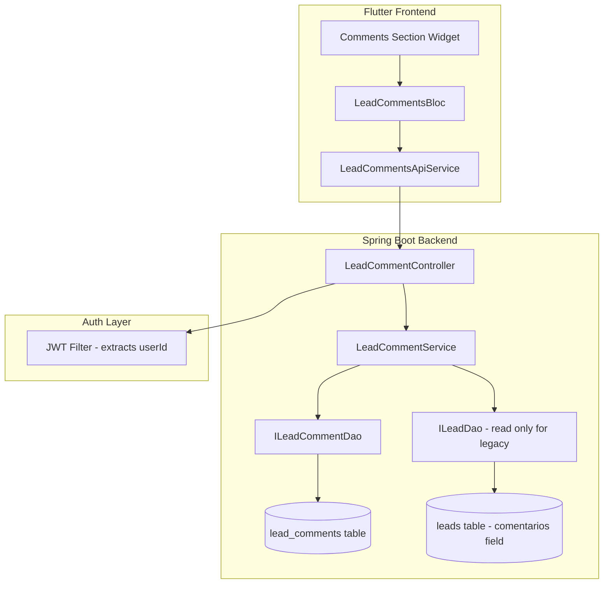

# Design Document: Protected Lead Comments

## Overview

This design introduces a protected, author-tracked commenting system for the Leads module. The current `comentarios` VARCHAR(2000) field on the `leads` table is a single monolithic text blob with no author attribution. The new system adds a dedicated `lead_comments` table where each comment row is owned by the user who created it. Ownership is enforced at the API layer: only the comment author can edit or delete their own comments, with no role-based exceptions.

The existing `comentarios` field is preserved untouched (non-destructive migration). Legacy data is surfaced as a read-only "Legacy" entry in the UI.

### Key Design Decisions

1. **Non-destructive migration** — The `lead_comments` table is additive. The `comentarios` column remains on `leads` and is never written to by the new system.
2. **Strict ownership enforcement** — `comment.user_id == authenticated user` is the sole gate for edit/delete. No admin override.
3. **Separate controller** — A new `LeadCommentController` is added rather than extending `LeadController`, for clear separation of concerns and simpler routing.
4. **Legacy comment in GET response** — The list endpoint merges legacy + authored comments into a unified response, with the legacy entry marked distinctly.

## Architecture



### Request Flow

1. Flutter widget dispatches event to BLoC.
2. BLoC calls `LeadCommentsApiService` with JWT in Authorization header.
3. Request hits `LeadCommentController`.
4. Controller extracts `userId` from `SecurityContextHolder` / `Authentication` principal.
5. Controller delegates to `LeadCommentService` which performs ownership validation for write operations.
6. Service interacts with `ILeadCommentDao` (JpaRepository).
7. Response returns DTO with author info.

## Components and Interfaces

### Backend Components

#### 1. LeadCommentEntity (JPA Entity)

**Package:** `com.bolsadeideas.springboot.backend.apirest.models.entity`

Maps to the `lead_comments` table.

```java
@Entity
@Table(name = "lead_comments")
public class LeadCommentEntity implements Serializable {

    @Id
    @GeneratedValue(strategy = GenerationType.IDENTITY)
    private Long id;

    @Column(name = "lead_id", nullable = false)
    private Long leadId;

    @ManyToOne(fetch = FetchType.LAZY)
    @JoinColumn(name = "user_id", nullable = false)
    @JsonIgnoreProperties({"hibernateLazyInitializer", "handler", "password", "rols", ...})
    private UserEntity user;

    @Column(name = "text", nullable = false, length = 2000)
    private String text;

    @Column(name = "created_at", nullable = false)
    @Temporal(TemporalType.TIMESTAMP)
    private Date createdAt;

    @Column(name = "edited_at")
    @Temporal(TemporalType.TIMESTAMP)
    private Date editedAt;

    @PrePersist
    public void prePersist() {
        this.createdAt = new Date();
    }
}
```

#### 2. ILeadCommentDao (Repository)

**Package:** `com.bolsadeideas.springboot.backend.apirest.models.dao`

```java
public interface ILeadCommentDao extends JpaRepository<LeadCommentEntity, Long> {
    List<LeadCommentEntity> findByLeadIdOrderByCreatedAtAsc(Long leadId);
}
```

#### 3. ILeadCommentService (Service Interface)

**Package:** `com.bolsadeideas.springboot.backend.apirest.models.services`

```java
public interface ILeadCommentService {
    List<LeadCommentEntity> findByLeadId(Long leadId);
    LeadCommentEntity create(Long leadId, Long userId, String text);
    LeadCommentEntity update(Long commentId, Long userId, String text);
    void delete(Long commentId, Long userId);
}
```

#### 4. LeadCommentServiceImpl (Service Implementation)

**Package:** `com.bolsadeideas.springboot.backend.apirest.models.services`

- `create`: Validates lead exists (via `ILeadDao`), creates entity with `userId` and current timestamp.
- `update`: Fetches comment, validates `comment.user.id == userId`, updates text and sets `editedAt`.
- `delete`: Fetches comment, validates ownership, calls `dao.delete()`.
- Throws custom exceptions: `ResourceNotFoundException`, `ForbiddenOperationException`.

#### 5. LeadCommentController (REST Controller)

**Package:** `com.bolsadeideas.springboot.backend.apirest.controllers`

**Base path:** `/api/leads/{leadId}/comments`

| Method | Path | Description |
|--------|------|-------------|
| GET | `/api/leads/{leadId}/comments` | List legacy + authored comments |
| POST | `/api/leads/{leadId}/comments` | Create a comment |
| PUT | `/api/leads/{leadId}/comments/{commentId}` | Edit a comment (author only) |
| DELETE | `/api/leads/{leadId}/comments/{commentId}` | Delete a comment (author only) |

The controller extracts the authenticated user ID from `SecurityContextHolder.getContext().getAuthentication()`.

### Frontend Components

#### 1. LeadCommentModel (Dart model)

```dart
class LeadCommentModel {
  final int? id;
  final int leadId;
  final int? userId;
  final String? authorName;
  final String text;
  final DateTime createdAt;
  final DateTime? editedAt;
  final bool isLegacy;

  // fromJson, toJson, copyWith...
}
```

#### 2. LeadCommentsApiService (HTTP service)

Static methods following the existing `LeadsService` pattern:
- `getComments(int leadId)` → `GET /api/leads/{leadId}/comments`
- `createComment(int leadId, String text)` → `POST`
- `updateComment(int leadId, int commentId, String text)` → `PUT`
- `deleteComment(int leadId, int commentId)` → `DELETE`

#### 3. LeadCommentsBloc (BLoC)

Events: `LoadComments`, `AddComment`, `EditComment`, `DeleteComment`
States: `CommentsInitial`, `CommentsLoading`, `CommentsLoaded`, `CommentsError`

#### 4. CommentsSection Widget

Renders the comment list within the Lead Detail Panel. Shows:
- Legacy comment (if exists) with "Legacy" badge, no action controls.
- Authored comments with author name, timestamp, "edited" badge, and edit/delete buttons (only for the current user's own comments).
- Text input + submit button at the bottom.

## Data Models

### Database Schema

```sql
CREATE TABLE lead_comments (
    id BIGINT NOT NULL AUTO_INCREMENT,
    lead_id BIGINT NOT NULL,
    user_id BIGINT NOT NULL,
    text VARCHAR(2000) NOT NULL,
    created_at TIMESTAMP NOT NULL DEFAULT CURRENT_TIMESTAMP,
    edited_at TIMESTAMP NULL,
    PRIMARY KEY (id),
    CONSTRAINT fk_lead_comments_lead FOREIGN KEY (lead_id) REFERENCES leads(id) ON DELETE CASCADE,
    CONSTRAINT fk_lead_comments_user FOREIGN KEY (user_id) REFERENCES usersbank(id) ON DELETE RESTRICT,
    INDEX idx_lead_comments_lead_id (lead_id),
    INDEX idx_lead_comments_user_id (user_id)
);
```

**Design rationale:**
- `ON DELETE CASCADE` on `lead_id`: if a lead is deleted, its comments are removed.
- `ON DELETE RESTRICT` on `user_id`: prevent user deletion if they have comments (data integrity).
- Indexes on `lead_id` and `user_id` for query performance.

### API Response Format

**GET /api/leads/{leadId}/comments**

```json
{
  "legacyComment": {
    "text": "Old comment text from comentarios field",
    "isLegacy": true
  },
  "comments": [
    {
      "id": 1,
      "leadId": 42,
      "userId": 5,
      "authorName": "Juan Pérez",
      "text": "Called the client, no answer.",
      "createdAt": "2025-01-15T10:30:00",
      "editedAt": null,
      "isLegacy": false
    }
  ]
}
```

**POST /api/leads/{leadId}/comments** — Request body:

```json
{
  "text": "New comment content"
}
```

Response: the created `LeadCommentEntity` as JSON (201 Created).

**PUT /api/leads/{leadId}/comments/{commentId}** — Request body:

```json
{
  "text": "Updated comment content"
}
```

Response: the updated `LeadCommentEntity` as JSON (200 OK).

**DELETE /api/leads/{leadId}/comments/{commentId}**

Response: 204 No Content on success.

### Error Response Format

```json
{
  "error": "Descriptive error message",
  "status": 400
}
```

| Status | Scenario |
|--------|----------|
| 400 | Empty/blank text, text exceeds 2000 chars |
| 401 | Missing or invalid JWT token |
| 403 | User is not the comment author |
| 404 | Lead not found, comment not found |


## Correctness Properties

*A property is a characteristic or behavior that should hold true across all valid executions of a system — essentially, a formal statement about what the system should do. Properties serve as the bridge between human-readable specifications and machine-verifiable correctness guarantees.*

### Property 1: Ownership enforcement on mutations

*For any* comment owned by user A and *for any* user B where A ≠ B, attempting to edit or delete that comment as user B SHALL be rejected with a 403 status, and the comment SHALL remain unchanged in the database.

**Validates: Requirements 3.1, 3.2, 4.1, 4.2, 8.3**

### Property 2: Whitespace-only text rejection

*For any* string composed entirely of whitespace characters (empty string, spaces, tabs, newlines, or combinations thereof), creating or editing a comment with that text SHALL be rejected with a 400 status, and no database state SHALL change.

**Validates: Requirements 2.2, 3.4**

### Property 3: Over-length text rejection

*For any* string with length greater than 2000 characters, creating a comment with that text SHALL be rejected with a 400 status, and no comment SHALL be persisted.

**Validates: Requirements 2.3**

### Property 4: Create preserves author identity

*For any* valid comment text and *for any* authenticated user, creating a comment SHALL produce an entity where `user_id` equals the authenticated user's ID and `created_at` is a non-null timestamp within a reasonable delta of the current server time.

**Validates: Requirements 2.1**

### Property 5: Delete removes permanently

*For any* comment that exists in the database, when the comment's author deletes it, the comment SHALL no longer be retrievable from the repository.

**Validates: Requirements 4.3**

### Property 6: Edit updates text and sets edited timestamp

*For any* existing comment and *for any* valid new text value, when the comment's author edits it, the resulting entity SHALL have the new text and a non-null `edited_at` timestamp, while `created_at` remains unchanged.

**Validates: Requirements 3.3**

### Property 7: List returns complete ordered results

*For any* lead with N authored comments, the list endpoint SHALL return exactly N authored comments ordered by `created_at` ascending, plus the legacy comment (if non-empty) positioned before all authored comments.

**Validates: Requirements 5.1, 5.3, 7.1**

### Property 8: Author information present in responses

*For any* authored comment returned by the API, the response SHALL include a non-null `authorName` field composed of the comment author's `fistName` and `lastName`.

**Validates: Requirements 5.4, 7.2**

## Error Handling

### Backend Error Strategy

The service layer throws typed exceptions which are caught and translated by the controller (or a `@ControllerAdvice`):

| Exception | HTTP Status | When |
|-----------|-------------|------|
| `ResourceNotFoundException` | 404 | Lead or comment not found |
| `ForbiddenOperationException` | 403 | User is not comment author |
| `MethodArgumentNotValidException` | 400 | Blank text, text > 2000 chars |
| `AuthenticationException` | 401 | Missing/invalid JWT |

**Response body format for errors:**

```json
{
  "error": "El comentario no fue encontrado",
  "status": 404
}
```

### Validation Rules

| Field | Rule | Error Message |
|-------|------|---------------|
| `text` | Not null, not blank | "El texto del comentario no puede estar vacío" |
| `text` | Max 2000 chars | "El texto del comentario no puede exceder 2000 caracteres" |
| `leadId` | Must reference existing lead | "El lead con id {leadId} no fue encontrado" |
| `commentId` | Must reference existing comment | "El comentario con id {commentId} no fue encontrado" |

### Frontend Error Handling

- Network errors: show snackbar with retry option.
- 400 errors: show validation message inline below the input field.
- 403 errors: show "No tienes permiso para realizar esta acción" dialog.
- 404 errors: refresh the comments list (comment may have been deleted by another session).
- 401 errors: redirect to login.

## Testing Strategy

### Unit Tests (Example-based)

**Backend:**
- Controller returns 404 when lead does not exist (Req 2.4)
- Controller returns 404 when comment does not exist on delete (Req 4.4)
- GET response structure: legacy comment has `isLegacy: true`, no author (Req 5.2, 6.2)
- GET response omits legacy when `comentarios` is null/empty (Req 6.3)
- Auth filter rejects requests without valid JWT (Req 8.1)
- User ID correctly extracted from JWT on create (Req 8.2)

**Frontend:**
- Widget renders "Legacy" badge on legacy comment (Req 6.2)
- Widget shows edit/delete buttons only for current user's comments (Req 7.4)
- Widget renders "edited" indicator when `editedAt` is non-null (Req 7.3)
- Widget contains text input and submit button (Req 7.5)
- `LeadCommentModel.fromJson` correctly parses all fields

### Property-Based Tests

**Library:** [jqwik](https://jqwik.net/) for Java (JUnit 5 compatible PBT library)

Each property test runs a **minimum of 100 iterations** with randomly generated inputs.

| Property | Test Description | Tag |
|----------|-----------------|-----|
| 1 | Generate random (ownerUserId, requesterUserId) pairs; verify edit/delete rejected when mismatch | `Feature: protected-lead-comments, Property 1: Ownership enforcement on mutations` |
| 2 | Generate random whitespace-only strings; verify create and edit return 400 | `Feature: protected-lead-comments, Property 2: Whitespace-only text rejection` |
| 3 | Generate random strings with length 2001–10000; verify create returns 400 | `Feature: protected-lead-comments, Property 3: Over-length text rejection` |
| 4 | Generate random valid text + userId pairs; verify create returns entity with correct userId and non-null createdAt | `Feature: protected-lead-comments, Property 4: Create preserves author identity` |
| 5 | Generate comments, delete as owner, verify not found in repository | `Feature: protected-lead-comments, Property 5: Delete removes permanently` |
| 6 | Generate existing comments + new valid text; verify edit returns updated text and non-null editedAt | `Feature: protected-lead-comments, Property 6: Edit updates text and sets edited timestamp` |
| 7 | Generate leads with N random comments; verify list returns exactly N items in created_at ASC order | `Feature: protected-lead-comments, Property 7: List returns complete ordered results` |
| 8 | Generate comments by different users; verify authorName present and matches user's name | `Feature: protected-lead-comments, Property 8: Author information present in responses` |

### Integration Tests

- Full flow: create → list → edit → list → delete → list (verify state at each step)
- Legacy comment displayed when `comentarios` is non-empty
- Foreign key enforcement: create comment for non-existent lead fails at DB level
- Concurrent edits: two users editing different comments on same lead (no interference)

### Test Infrastructure

- Backend: JUnit 5 + jqwik + H2 in-memory database for property tests, MySQL testcontainer for integration tests
- Frontend: `flutter_test` + `bloc_test` for BLoC tests, `mockito` for service mocking
