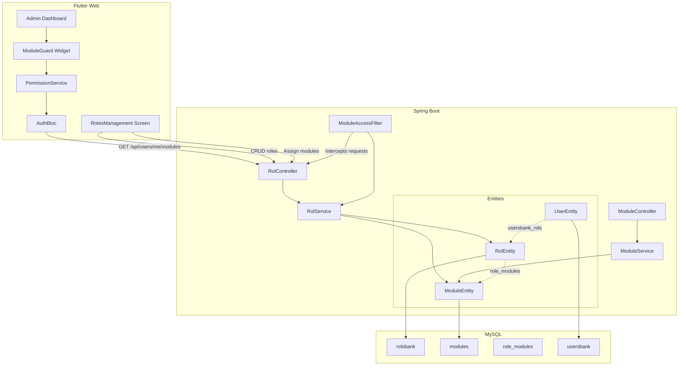
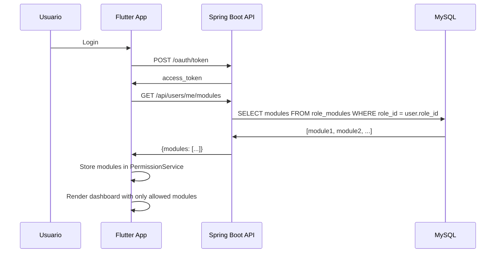

# Design Document: Role-Based Module Access

## Overview

Este diseño reemplaza el sistema estático de permisos de TrustBank (enum `Permission` + mapa `RolePermissions` hardcodeado en Flutter) por un sistema dinámico donde los roles y sus módulos asignados se gestionan desde la base de datos. El administrador puede crear/editar roles, asignar módulos a cada rol, y los usuarios solo ven los módulos que su rol tiene habilitados.

### Decisiones de Diseño Clave

1. **Catálogo de módulos en BD**: Los módulos se almacenan como registros en una tabla `modules`, permitiendo agregar nuevos módulos sin cambios en el frontend.
2. **Tabla junction `role_modules`**: Relación many-to-many entre roles y módulos.
3. **Backend como fuente de verdad**: El frontend obtiene los módulos permitidos del backend al iniciar sesión, eliminando la dependencia del mapa estático.
4. **Anotación personalizada `@ModuleAccess`**: Reemplaza `@Secured` para validar acceso a módulos en el backend.
5. **Compatibilidad hacia atrás**: Se mantiene la estructura existente de `UserEntity` → `RolEntity` (relación `@ManyToMany`), extendiendo `RolEntity` con la relación a módulos.

## Architecture



### Flujo de Datos Principal



## Components and Interfaces

### Backend Components

#### 1. ModuleEntity (Nueva)

```java
@Entity
@Table(name = "modules")
public class ModuleEntity implements Serializable {
    @Id
    @GeneratedValue(strategy = GenerationType.IDENTITY)
    private Long id;

    @Column(unique = true, nullable = false, length = 50)
    private String code;  // e.g., "LEADS", "DOCUMENTS", "DOCUMENT_APPROVAL"

    @Column(nullable = false, length = 100)
    private String name;  // e.g., "Leads", "Documentos"

    @Column(length = 255)
    private String description;

    @Column(length = 50)
    private String icon;  // Material icon name

    @Column(nullable = false)
    private Integer displayOrder;
}
```

#### 2. RolEntity (Extendida)

```java
@Entity
@Table(name = "rolsbank")
public class RolEntity implements Serializable {
    @Id
    @GeneratedValue(strategy = GenerationType.IDENTITY)
    private Long id;

    @Column(unique = true, length = 50)
    private String name;

    @ManyToMany(fetch = FetchType.EAGER)
    @JoinTable(
        name = "role_modules",
        joinColumns = @JoinColumn(name = "role_id"),
        inverseJoinColumns = @JoinColumn(name = "module_id")
    )
    private Set<ModuleEntity> modules = new HashSet<>();
}
```

#### 3. RolController (Nuevo)

| Endpoint | Method | Description | Auth |
|----------|--------|-------------|------|
| `/api/roles` | GET | Listar todos los roles con conteo de usuarios | ROLE_ADMIN |
| `/api/roles/{id}` | GET | Obtener rol con sus módulos | ROLE_ADMIN |
| `/api/roles` | POST | Crear nuevo rol | ROLE_ADMIN |
| `/api/roles/{id}` | PUT | Actualizar nombre del rol | ROLE_ADMIN |
| `/api/roles/{id}` | DELETE | Eliminar rol (sin usuarios) | ROLE_ADMIN |
| `/api/roles/{id}/modules` | PUT | Asignar módulos al rol (batch) | ROLE_ADMIN |
| `/api/modules` | GET | Listar catálogo de módulos | ROLE_ADMIN |
| `/api/users/me/modules` | GET | Obtener módulos del usuario actual | Authenticated |

#### 4. ModuleAccessFilter (Nuevo)

Filtro de Spring Security que intercepta requests a endpoints protegidos y verifica que el usuario tenga el módulo correspondiente asignado a su rol.

```java
@Component
public class ModuleAccessFilter extends OncePerRequestFilter {
    // Maps URL patterns to required module codes
    private static final Map<String, String> MODULE_ENDPOINT_MAP = Map.of(
        "/api/leads/**", "LEADS",
        "/api/documents/**", "DOCUMENTS",
        "/api/document-approval/**", "DOCUMENT_APPROVAL",
        "/api/users/**", "USER_MANAGEMENT",
        "/api/roles/**", "ROLE_MANAGEMENT"
    );
}
```

### Frontend Components

#### 1. PermissionService (Reemplaza RolePermissions estático)

```dart
class PermissionService {
  static final PermissionService _instance = PermissionService._();
  factory PermissionService() => _instance;
  PermissionService._();

  List<ModulePermission> _allowedModules = [];

  Future<void> loadPermissions() async {
    final response = await ApiService.getUserModules();
    _allowedModules = response.map((m) => ModulePermission.fromJson(m)).toList();
  }

  bool hasModuleAccess(String moduleCode) {
    return _allowedModules.any((m) => m.code == moduleCode);
  }

  List<ModulePermission> get allowedModules => _allowedModules;
}
```

#### 2. ModuleGuard Widget (Reemplaza RoleGuard)

```dart
class ModuleGuard extends StatelessWidget {
  final String requiredModule;  // Module code, e.g., "LEADS"
  final Widget child;
  final Widget? fallback;

  // Uses PermissionService to check access
}
```

#### 3. RolesManagementScreen (Nueva)

Pantalla accesible desde el Panel Administrativo que permite:
- Ver lista de roles con conteo de usuarios
- Crear/editar/eliminar roles
- Asignar módulos a roles mediante toggles

#### 4. RolesBloc (Nuevo)

```dart
// Events
abstract class RolesEvent {}
class LoadRoles extends RolesEvent {}
class CreateRole extends RolesEvent { final String name; }
class UpdateRole extends RolesEvent { final int id; final String name; }
class DeleteRole extends RolesEvent { final int id; }
class UpdateRoleModules extends RolesEvent { final int roleId; final List<int> moduleIds; }

// States
abstract class RolesState {}
class RolesLoading extends RolesState {}
class RolesLoaded extends RolesState { final List<Role> roles; final List<Module> allModules; }
class RolesError extends RolesState { final String message; }
```

## Data Models

### Database Schema

```sql
-- Tabla de módulos (catálogo)
CREATE TABLE modules (
    id BIGINT AUTO_INCREMENT PRIMARY KEY,
    code VARCHAR(50) NOT NULL UNIQUE,
    name VARCHAR(100) NOT NULL,
    description VARCHAR(255),
    icon VARCHAR(50),
    display_order INT NOT NULL DEFAULT 0
);

-- Tabla junction role-modules
CREATE TABLE role_modules (
    role_id BIGINT NOT NULL,
    module_id BIGINT NOT NULL,
    PRIMARY KEY (role_id, module_id),
    FOREIGN KEY (role_id) REFERENCES rolsbank(id) ON DELETE CASCADE,
    FOREIGN KEY (module_id) REFERENCES modules(id) ON DELETE CASCADE
);

-- Datos iniciales del catálogo
INSERT INTO modules (code, name, description, icon, display_order) VALUES
('LEADS', 'Leads', 'Gestión de leads y prospectos', 'leaderboard', 1),
('DOCUMENTS', 'Documentos', 'Gestión de documentos de usuarios', 'description', 2),
('DOCUMENT_APPROVAL', 'Aprobación de Documentos', 'Aprobar o rechazar documentos', 'verified', 3),
('USER_MANAGEMENT', 'Gestión de Usuarios', 'Administrar usuarios del sistema', 'group', 4),
('ROLE_MANAGEMENT', 'Gestión de Roles', 'Administrar roles y permisos', 'admin_panel_settings', 5);
```

### API DTOs

```java
// Request: Crear/Actualizar rol
public class RolRequest {
    @NotBlank
    @Size(min = 3, max = 50)
    @Pattern(regexp = "^[a-zA-Z0-9_\\s]+$")
    private String name;
}

// Request: Asignar módulos
public class RoleModulesRequest {
    @NotNull
    private List<Long> moduleIds;
}

// Response: Rol con módulos y conteo
public class RolResponse {
    private Long id;
    private String name;
    private List<ModuleResponse> modules;
    private Integer userCount;
}

// Response: Módulo
public class ModuleResponse {
    private Long id;
    private String code;
    private String name;
    private String description;
    private String icon;
    private Integer displayOrder;
}

// Response: Configuración de rol (todos los módulos con estado)
public class RoleConfigResponse {
    private Long roleId;
    private String roleName;
    private List<ModuleAssignmentResponse> modules;
}

public class ModuleAssignmentResponse {
    private Long moduleId;
    private String code;
    private String name;
    private String description;
    private String icon;
    private boolean assigned;
}
```

### Flutter Models

```dart
class ModulePermission {
  final int id;
  final String code;
  final String name;
  final String description;
  final String icon;
  final int displayOrder;

  ModulePermission.fromJson(Map<String, dynamic> json);
}

class RoleModel {
  final int id;
  final String name;
  final List<ModulePermission> modules;
  final int userCount;

  RoleModel.fromJson(Map<String, dynamic> json);
}
```

## Correctness Properties

*A property is a characteristic or behavior that should hold true across all valid executions of a system — essentially, a formal statement about what the system should do. Properties serve as the bridge between human-readable specifications and machine-verifiable correctness guarantees.*

### Property 1: Role Creation Round-Trip

*For any* valid role name (3-50 alphanumeric characters), creating a role and then querying it by ID should return a role with the same name and a non-null identifier.

**Validates: Requirements 1.1**

### Property 2: Role Name Validation

*For any* string, the system should accept it as a role name if and only if it has between 3 and 50 characters and contains only alphanumeric characters, underscores, or spaces.

**Validates: Requirements 1.6**

### Property 3: Duplicate Role Name Rejection

*For any* role name that already exists in the system, attempting to create another role with the same name should be rejected with an error.

**Validates: Requirements 1.2**

### Property 4: Role Deletion Depends on User Assignment

*For any* role, deletion should succeed if and only if the role has zero users assigned to it. If the role has one or more users, deletion must be rejected.

**Validates: Requirements 1.4, 1.5**

### Property 5: Module Assignment Round-Trip

*For any* role and any subset of modules from the catalog, assigning those modules to the role and then querying the role's configuration should return exactly those modules as assigned.

**Validates: Requirements 2.1, 2.2, 2.4**

### Property 6: Module Configuration Query Completeness

*For any* role, querying its module configuration should return ALL modules from the catalog, each annotated with whether it is assigned to that role or not.

**Validates: Requirements 2.3**

### Property 7: Multi-Role Module Sharing

*For any* module and any set of roles, assigning that module to all roles in the set should succeed, and querying each role should show the module as assigned.

**Validates: Requirements 2.5**

### Property 8: User Role Assignment Round-Trip

*For any* user and any existing role, assigning that role to the user and then querying the user should show the new role.

**Validates: Requirements 3.2, 3.3**

### Property 9: Invalid Role Assignment Rejection

*For any* role ID that does not exist in the system, attempting to assign it to a user should be rejected with a validation error.

**Validates: Requirements 3.4**

### Property 10: User Sees Only Assigned Modules

*For any* user with a role that has a specific set of modules assigned, the modules endpoint should return exactly those modules and no others.

**Validates: Requirements 4.1, 4.2**

### Property 11: Route Guard Denies Unassigned Modules

*For any* user whose role does NOT include a specific module, attempting to access that module's route should result in access denial (redirect or 403).

**Validates: Requirements 4.3, 7.1, 7.2**

### Property 12: Roles List Shows Correct User Counts

*For any* set of roles with varying numbers of assigned users, the roles listing should show the correct user count for each role.

**Validates: Requirements 5.2**

## Error Handling

### Backend Error Responses

| Scenario | HTTP Code | Response Body |
|----------|-----------|---------------|
| Nombre de rol duplicado | 400 | `{"error": "DUPLICATE_ROLE_NAME", "message": "El nombre del rol ya está en uso"}` |
| Nombre de rol inválido | 400 | `{"error": "INVALID_ROLE_NAME", "message": "El nombre debe tener entre 3 y 50 caracteres alfanuméricos"}` |
| Rol con usuarios asignados (delete) | 409 | `{"error": "ROLE_HAS_USERS", "message": "No se puede eliminar un rol con usuarios asignados", "userCount": N}` |
| Rol no encontrado | 404 | `{"error": "ROLE_NOT_FOUND", "message": "El rol no existe"}` |
| Módulo no encontrado | 404 | `{"error": "MODULE_NOT_FOUND", "message": "El módulo no existe"}` |
| Acceso denegado a módulo | 403 | `{"error": "MODULE_ACCESS_DENIED", "message": "No tienes acceso a este módulo"}` |
| Token inválido/expirado | 401 | `{"error": "UNAUTHORIZED", "message": "Token inválido o expirado"}` |

### Frontend Error Handling

- **Network errors**: Mostrar snackbar con mensaje de error y opción de reintentar.
- **403 en navegación**: Redirigir al dashboard con mensaje "Acceso denegado".
- **Error al guardar rol**: Mantener estado anterior del formulario, mostrar error descriptivo.
- **Timeout**: Reintentar automáticamente una vez, luego mostrar error.

### Logging

- El backend registra intentos de acceso no autorizado con: timestamp, userId, endpoint solicitado, módulo requerido.
- Formato: `WARN [ModuleAccessFilter] Unauthorized access attempt: userId={}, endpoint={}, requiredModule={}`

## Testing Strategy

### Unit Tests (Backend - JUnit 5 + Mockito)

- **RolService**: Validación de nombres, lógica de creación/actualización/eliminación.
- **ModuleAccessFilter**: Mapeo de endpoints a módulos, lógica de autorización.
- **RolController**: Respuestas HTTP correctas para cada escenario.

### Unit Tests (Frontend - Flutter test)

- **PermissionService**: Carga y consulta de módulos.
- **ModuleGuard**: Renderizado condicional basado en permisos.
- **RolesBloc**: Transiciones de estado correctas.

### Property-Based Tests (Backend - jqwik)

Se utilizará **jqwik** como framework de property-based testing para Java/Spring Boot.

Configuración:
- Mínimo 100 iteraciones por propiedad
- Cada test referencia su propiedad del documento de diseño

**Tests a implementar:**

1. **Feature: role-based-module-access, Property 1: Role Creation Round-Trip** — Generar nombres válidos aleatorios, crear roles, verificar persistencia.
2. **Feature: role-based-module-access, Property 2: Role Name Validation** — Generar strings aleatorios, verificar que solo los válidos son aceptados.
3. **Feature: role-based-module-access, Property 3: Duplicate Role Name Rejection** — Crear rol, intentar duplicar, verificar rechazo.
4. **Feature: role-based-module-access, Property 4: Role Deletion Depends on User Assignment** — Crear roles con/sin usuarios, verificar que solo los sin usuarios se eliminan.
5. **Feature: role-based-module-access, Property 5: Module Assignment Round-Trip** — Asignar subconjuntos aleatorios de módulos, verificar que la consulta retorna exactamente esos módulos.
6. **Feature: role-based-module-access, Property 6: Module Configuration Query Completeness** — Para cualquier rol, verificar que la consulta retorna TODOS los módulos del catálogo.
7. **Feature: role-based-module-access, Property 10: User Sees Only Assigned Modules** — Configurar roles con módulos aleatorios, verificar que el endpoint de usuario retorna solo los asignados.
8. **Feature: role-based-module-access, Property 11: Route Guard Denies Unassigned Modules** — Verificar que requests a endpoints sin módulo asignado retornan 403.

### Integration Tests

- Flujo completo: crear rol → asignar módulos → asignar a usuario → login → verificar acceso.
- Verificar que cambios en módulos de un rol se reflejan en la siguiente sesión.
- Verificar seed data del catálogo de módulos.

### Property-Based Tests (Frontend - dart_test + custom generators)

- **Property 10 (UI)**: Generar configuraciones aleatorias de módulos, verificar que el dashboard solo muestra los asignados.
- **Property 11 (UI)**: Generar rutas aleatorias no permitidas, verificar redirección.
