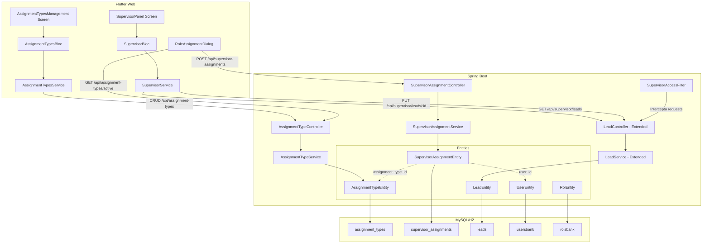
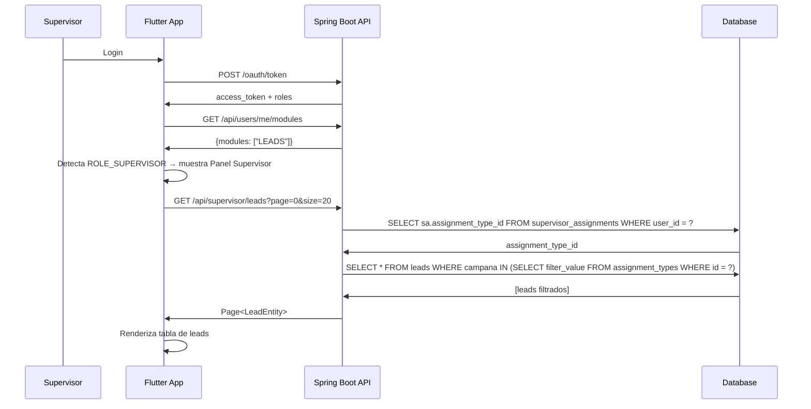
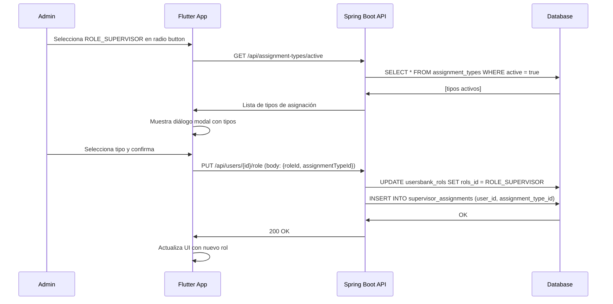

# Documento de Diseño: Supervisor Lead Assignments

## Overview

Este diseño introduce el rol SUPERVISOR al sistema TrustBank, junto con un módulo de "Tipos de Asignación" que permite al administrador categorizar y distribuir leads entre supervisores. El supervisor es un rol intermedio que puede visualizar y editar (pero no crear ni eliminar) leads filtrados según su tipo de asignación.

### Decisiones de Diseño Clave

1. **Nueva entidad `AssignmentTypeEntity`**: Tabla independiente para los tipos de asignación, gestionada por el administrador.
2. **Tabla junction `supervisor_assignments`**: Relación entre un usuario (supervisor) y un tipo de asignación. Un supervisor tiene exactamente un tipo de asignación activo.
3. **Filtrado de leads por campo `campana`**: El tipo de asignación se vincula a los leads a través del campo `campana` de la tabla `leads`, permitiendo segmentar leads por campaña u otro criterio configurable.
4. **Actualización parcial con PATCH semántico**: El endpoint PUT de leads para supervisores acepta campos nulos sin error de validación, aplicando solo los campos con valor.
5. **Reutilización del sistema de módulos existente**: Se agrega un nuevo módulo `SUPERVISOR_ASSIGNMENTS` al catálogo para controlar acceso a la gestión de tipos de asignación.
6. **Diálogo de asignación acoplado al cambio de rol**: Al seleccionar ROLE_SUPERVISOR en la UI de gestión de usuarios, se dispara un diálogo modal para elegir el tipo de asignación antes de confirmar.

## Architecture



### Flujo de Datos: Login del Supervisor



### Flujo de Datos: Asignación de Rol SUPERVISOR



## Components and Interfaces

### Backend Components

#### 1. AssignmentTypeEntity (Nueva)

```java
@Entity
@Table(name = "assignment_types")
public class AssignmentTypeEntity implements Serializable {
    @Id
    @GeneratedValue(strategy = GenerationType.IDENTITY)
    private Long id;

    @Column(unique = true, nullable = false, length = 100)
    private String name;

    @Column(length = 255)
    private String description;

    @Column(nullable = false)
    private Boolean active = true;

    @Column(name = "filter_value", length = 100)
    private String filterValue; // Valor para filtrar leads (ej: nombre de campaña)

    @Column(name = "created_at")
    @Temporal(TemporalType.TIMESTAMP)
    private Date createdAt;

    @Column(name = "updated_at")
    @Temporal(TemporalType.TIMESTAMP)
    private Date updatedAt;
}
```

#### 2. SupervisorAssignmentEntity (Nueva)

```java
@Entity
@Table(name = "supervisor_assignments")
public class SupervisorAssignmentEntity implements Serializable {
    @Id
    @GeneratedValue(strategy = GenerationType.IDENTITY)
    private Long id;

    @ManyToOne(fetch = FetchType.EAGER)
    @JoinColumn(name = "user_id", nullable = false)
    private UserEntity user;

    @ManyToOne(fetch = FetchType.EAGER)
    @JoinColumn(name = "assignment_type_id", nullable = false)
    private AssignmentTypeEntity assignmentType;

    @Column(name = "assigned_at")
    @Temporal(TemporalType.TIMESTAMP)
    private Date assignedAt;
}
```

#### 3. AssignmentTypeController (Nuevo)

| Endpoint | Method | Description | Auth |
|----------|--------|-------------|------|
| `/api/assignment-types` | GET | Listar todos los tipos de asignación | ROLE_ADMIN |
| `/api/assignment-types/active` | GET | Listar solo tipos activos | ROLE_ADMIN |
| `/api/assignment-types/{id}` | GET | Obtener tipo por ID | ROLE_ADMIN |
| `/api/assignment-types` | POST | Crear nuevo tipo de asignación | ROLE_ADMIN |
| `/api/assignment-types/{id}` | PUT | Actualizar tipo existente | ROLE_ADMIN |
| `/api/assignment-types/{id}` | DELETE | Eliminar tipo (sin supervisores) | ROLE_ADMIN |

#### 4. SupervisorAssignmentController (Nuevo)

| Endpoint | Method | Description | Auth |
|----------|--------|-------------|------|
| `/api/supervisor-assignments` | GET | Listar todas las asignaciones | ROLE_ADMIN |
| `/api/supervisor-assignments` | POST | Crear asignación supervisor-tipo | ROLE_ADMIN |
| `/api/supervisor-assignments/{userId}` | PUT | Cambiar tipo de asignación | ROLE_ADMIN |
| `/api/supervisor-assignments/{userId}` | DELETE | Eliminar asignación | ROLE_ADMIN |
| `/api/supervisor-assignments/me` | GET | Obtener mi asignación | ROLE_SUPERVISOR |

#### 5. Endpoints de Leads para Supervisor (Extensión de LeadController)

| Endpoint | Method | Description | Auth |
|----------|--------|-------------|------|
| `/api/supervisor/leads` | GET | Leads filtrados por asignación del supervisor | ROLE_SUPERVISOR |
| `/api/supervisor/leads/search` | GET | Buscar en leads asignados | ROLE_SUPERVISOR |
| `/api/supervisor/leads/{id}` | GET | Detalle de un lead asignado | ROLE_SUPERVISOR |
| `/api/supervisor/leads/{id}` | PUT | Actualización parcial de lead | ROLE_SUPERVISOR |

#### 6. SupervisorAccessFilter (Nuevo)

Filtro que intercepta requests de supervisores para:
- Verificar que solo acceden a leads de su asignación
- Bloquear POST (creación) y DELETE (eliminación) en endpoints de leads
- Registrar intentos de acceso no autorizado

```java
@Component
public class SupervisorAccessFilter extends OncePerRequestFilter {
    // Verifica que el supervisor solo accede a leads de su tipo de asignación
    // Bloquea POST/DELETE en /api/leads/** para ROLE_SUPERVISOR
    // Permite GET y PUT solo en /api/supervisor/leads/**
}
```

### Frontend Components

#### 1. SupervisorService (Nuevo)

```dart
class SupervisorService {
  static String get _baseUrl => AppConfig.apiBaseUrl;

  /// GET /api/supervisor/leads?page=X&size=Y
  static Future<PaginatedResponse<LeadModel>> getLeads({
    int page = 0,
    int size = 20,
  }) async { ... }

  /// GET /api/supervisor/leads/search?term=X&page=Y&size=Z
  static Future<PaginatedResponse<LeadModel>> searchLeads({
    required String term,
    int page = 0,
    int size = 20,
  }) async { ... }

  /// GET /api/supervisor/leads/{id}
  static Future<LeadModel> getLeadById(int id) async { ... }

  /// PUT /api/supervisor/leads/{id}
  static Future<LeadModel> updateLead(int id, Map<String, dynamic> fields) async { ... }

  /// GET /api/supervisor-assignments/me
  static Future<SupervisorAssignment> getMyAssignment() async { ... }
}
```

#### 2. AssignmentTypesService (Nuevo)

```dart
class AssignmentTypesService {
  static String get _baseUrl => AppConfig.apiBaseUrl;

  /// CRUD para tipos de asignación
  static Future<List<AssignmentType>> getAll() async { ... }
  static Future<List<AssignmentType>> getActive() async { ... }
  static Future<AssignmentType> create(AssignmentTypeRequest request) async { ... }
  static Future<AssignmentType> update(int id, AssignmentTypeRequest request) async { ... }
  static Future<void> delete(int id) async { ... }
}
```

#### 3. SupervisorBloc (Nuevo)

```dart
// Events
abstract class SupervisorEvent {}
class LoadSupervisorLeads extends SupervisorEvent { final int page; }
class SearchSupervisorLeads extends SupervisorEvent { final String term; final int page; }
class SelectLead extends SupervisorEvent { final int leadId; }
class UpdateLead extends SupervisorEvent { final int leadId; final Map<String, dynamic> fields; }

// States
abstract class SupervisorState {}
class SupervisorInitial extends SupervisorState {}
class SupervisorLoading extends SupervisorState {}
class SupervisorLeadsLoaded extends SupervisorState {
  final List<LeadModel> leads;
  final int totalPages;
  final int currentPage;
  final SupervisorAssignment assignment;
}
class SupervisorLeadDetail extends SupervisorState { final LeadModel lead; }
class SupervisorLeadUpdated extends SupervisorState { final LeadModel lead; }
class SupervisorError extends SupervisorState { final String message; }
```

#### 4. AssignmentTypesBloc (Nuevo)

```dart
// Events
abstract class AssignmentTypesEvent {}
class LoadAssignmentTypes extends AssignmentTypesEvent {}
class CreateAssignmentType extends AssignmentTypesEvent { final String name; final String description; }
class UpdateAssignmentType extends AssignmentTypesEvent { final int id; final String name; final String description; final bool active; }
class DeleteAssignmentType extends AssignmentTypesEvent { final int id; }

// States
abstract class AssignmentTypesState {}
class AssignmentTypesInitial extends AssignmentTypesState {}
class AssignmentTypesLoading extends AssignmentTypesState {}
class AssignmentTypesLoaded extends AssignmentTypesState { final List<AssignmentType> types; }
class AssignmentTypesError extends AssignmentTypesState { final String message; }
```

#### 5. RoleAssignmentDialog (Nuevo Widget)

Diálogo modal que se muestra al seleccionar ROLE_SUPERVISOR en la pantalla de gestión de usuarios:
- Carga tipos de asignación activos desde el backend
- Muestra lista seleccionable con radio buttons
- Botones "Confirmar" y "Cancelar"
- Si no hay tipos activos, muestra mensaje informativo y deshabilita confirmación

#### 6. SupervisorPanel Screen (Nueva)

Pantalla principal del supervisor con:
- Header con información del tipo de asignación actual
- Tabla de leads con paginación (usando design tokens: TBColors, TBTypography, TBSpacing)
- Campo de búsqueda
- Acción de editar al hacer clic en un lead
- Formulario de edición con campos opcionales (sin validación de requeridos)

## Data Models

### Database Schema

```sql
-- Tabla de tipos de asignación
CREATE TABLE assignment_types (
    id BIGINT AUTO_INCREMENT PRIMARY KEY,
    name VARCHAR(100) NOT NULL UNIQUE,
    description VARCHAR(255),
    active BOOLEAN NOT NULL DEFAULT TRUE,
    filter_value VARCHAR(100),
    created_at TIMESTAMP DEFAULT CURRENT_TIMESTAMP,
    updated_at TIMESTAMP DEFAULT CURRENT_TIMESTAMP
);

-- Tabla de asignaciones supervisor-tipo
CREATE TABLE supervisor_assignments (
    id BIGINT AUTO_INCREMENT PRIMARY KEY,
    user_id BIGINT NOT NULL,
    assignment_type_id BIGINT NOT NULL,
    assigned_at TIMESTAMP DEFAULT CURRENT_TIMESTAMP,
    FOREIGN KEY (user_id) REFERENCES usersbank(id) ON DELETE CASCADE,
    FOREIGN KEY (assignment_type_id) REFERENCES assignment_types(id) ON DELETE RESTRICT,
    UNIQUE (user_id)  -- Un supervisor solo tiene una asignación activa
);

-- Nuevo rol SUPERVISOR
INSERT INTO rolsbank (id, name) VALUES(4, 'ROLE_SUPERVISOR');

-- Nuevo módulo en el catálogo
INSERT INTO modules (id, code, name, description, icon, display_order) VALUES
(6, 'SUPERVISOR_ASSIGNMENTS', 'Tipos de Asignación', 'Gestionar tipos de asignación de supervisores', 'assignment', 6);

-- Asignar módulo SUPERVISOR_ASSIGNMENTS a ROLE_ADMIN
INSERT INTO role_modules (role_id, module_id) VALUES(2, 6);
INSERT INTO role_modules (role_id, module_id) VALUES(3, 6);

-- Asignar módulo LEADS a ROLE_SUPERVISOR (solo lectura/edición)
INSERT INTO role_modules (role_id, module_id) VALUES(4, 1);
```

### API DTOs

```java
// Request: Crear/Actualizar tipo de asignación
public class AssignmentTypeRequest {
    @NotBlank
    @Size(max = 100)
    private String name;

    @Size(max = 255)
    private String description;

    private Boolean active;

    @Size(max = 100)
    private String filterValue;
}

// Response: Tipo de asignación
public class AssignmentTypeResponse {
    private Long id;
    private String name;
    private String description;
    private Boolean active;
    private String filterValue;
    private Integer supervisorCount; // Cantidad de supervisores con este tipo
    private Date createdAt;
}

// Request: Crear asignación supervisor
public class SupervisorAssignmentRequest {
    @NotNull
    private Long userId;

    @NotNull
    private Long assignmentTypeId;
}

// Response: Asignación de supervisor
public class SupervisorAssignmentResponse {
    private Long id;
    private Long userId;
    private String userName;
    private String userEmail;
    private Long assignmentTypeId;
    private String assignmentTypeName;
    private Date assignedAt;
}

// Request: Actualización parcial de lead (supervisor)
public class LeadPartialUpdateRequest {
    private String nombre;       // Todos opcionales
    private String apellido;
    private String telefono;
    private String email;
    private String pais;
    private String campana;
    private String lastCallStatus;
    private String comentarios;
    // No incluye importId ni fechas (no editables)
}
```

### Flutter Models

```dart
class AssignmentType {
  final int id;
  final String name;
  final String description;
  final bool active;
  final String? filterValue;
  final int supervisorCount;
  final DateTime? createdAt;

  AssignmentType.fromJson(Map<String, dynamic> json);
  Map<String, dynamic> toJson();
}

class SupervisorAssignment {
  final int id;
  final int userId;
  final String userName;
  final int assignmentTypeId;
  final String assignmentTypeName;
  final DateTime assignedAt;

  SupervisorAssignment.fromJson(Map<String, dynamic> json);
}

class LeadModel {
  final int id;
  final String? nombre;
  final String? apellido;
  final String? telefono;
  final String? email;
  final String? pais;
  final String? campana;
  final String? lastCallStatus;
  final String? comentarios;
  final DateTime? fechaRegistro;
  final DateTime? createdAt;
  final DateTime? updatedAt;

  LeadModel.fromJson(Map<String, dynamic> json);
  Map<String, dynamic> toEditJson(); // Solo campos editables, omite nulos
}
```


## Correctness Properties

*Una propiedad es una característica o comportamiento que debe mantenerse verdadero en todas las ejecuciones válidas de un sistema — esencialmente, una declaración formal sobre lo que el sistema debe hacer. Las propiedades sirven como puente entre especificaciones legibles por humanos y garantías de corrección verificables por máquina.*

### Property 1: Round-trip de creación de Tipo de Asignación

*Para cualquier* nombre válido (1-100 caracteres, único) y descripción (0-255 caracteres), crear un tipo de asignación y luego consultarlo por ID debe retornar un registro con el mismo nombre, descripción y estado activo, y el tipo debe aparecer en la lista completa de tipos.

**Validates: Requirements 2.1, 2.2, 2.3**

### Property 2: Round-trip de actualización de Tipo de Asignación

*Para cualquier* tipo de asignación existente y cualquier combinación válida de campos actualizados (nombre, descripción, estado, filterValue), aplicar la actualización y luego consultar el tipo debe retornar los valores actualizados.

**Validates: Requirements 2.4**

### Property 3: Eliminación de Tipo de Asignación depende de supervisores asociados

*Para cualquier* tipo de asignación, la eliminación debe tener éxito si y solo si no tiene supervisores asociados. Si tiene uno o más supervisores vinculados, la eliminación debe ser rechazada con un error descriptivo.

**Validates: Requirements 2.5, 2.6**

### Property 4: Creación de Asignación Supervisor persiste correctamente

*Para cualquier* usuario y cualquier tipo de asignación activo, crear una asignación de supervisor y luego consultarla debe retornar un registro que vincule correctamente al usuario con el tipo de asignación seleccionado.

**Validates: Requirements 4.2, 4.4**

### Property 5: Supervisor solo ve leads de su tipo de asignación

*Para cualquier* supervisor autenticado con un tipo de asignación configurado, todos los leads retornados por el endpoint de consulta deben pertenecer al filtro definido por su tipo de asignación, y ningún lead fuera de ese filtro debe ser incluido.

**Validates: Requirements 5.2, 5.5, 7.1**

### Property 6: Búsqueda del supervisor filtra dentro de leads asignados

*Para cualquier* término de búsqueda y cualquier supervisor, todos los leads retornados deben: (a) contener el término en al menos uno de los campos nombre, apellido, teléfono o email, Y (b) pertenecer al tipo de asignación del supervisor.

**Validates: Requirements 5.4**

### Property 7: Actualización parcial modifica solo campos especificados

*Para cualquier* lead y cualquier subconjunto no vacío de campos con nuevos valores, aplicar una actualización parcial debe cambiar únicamente esos campos y dejar los demás campos con sus valores originales.

**Validates: Requirements 6.2, 6.3**

### Property 8: Campos nulos/vacíos aceptados sin error de validación

*Para cualquier* solicitud de actualización de lead donde uno o más campos tengan valor nulo o cadena vacía, el API debe aceptar la solicitud sin retornar error de validación (HTTP 200).

**Validates: Requirements 6.4**

### Property 9: Supervisor no puede crear ni eliminar leads

*Para cualquier* supervisor autenticado, las peticiones POST a endpoints de creación de leads y DELETE a endpoints de eliminación de leads deben retornar HTTP 403.

**Validates: Requirements 6.5, 6.6, 7.4, 7.5**

### Property 10: Supervisor solo puede actualizar leads de su asignación

*Para cualquier* supervisor y cualquier lead, la petición PUT debe tener éxito (HTTP 200) si y solo si el lead pertenece al tipo de asignación del supervisor. Si el lead no pertenece a su asignación, debe retornar HTTP 403.

**Validates: Requirements 7.2, 7.3**

### Property 11: Cambio de tipo de asignación actualiza el registro

*Para cualquier* supervisor con una asignación existente y cualquier otro tipo de asignación activo, cambiar su tipo de asignación debe actualizar el registro en `supervisor_assignments` para reflejar el nuevo tipo.

**Validates: Requirements 8.2**

### Property 12: Cambio de rol elimina la asignación de supervisor

*Para cualquier* usuario con ROLE_SUPERVISOR y una asignación activa, cambiar su rol a cualquier otro rol (ROLE_USER, ROLE_ADMIN) debe eliminar el registro correspondiente en `supervisor_assignments`.

**Validates: Requirements 8.3**

### Property 13: Lista de asignaciones de supervisores es completa

*Para cualquier* conjunto de asignaciones de supervisores creadas en el sistema, el endpoint de consulta de todas las asignaciones debe retornar exactamente todas las asignaciones existentes con sus datos correctos.

**Validates: Requirements 8.4**

## Error Handling

### Respuestas de Error del Backend

| Escenario | HTTP Code | Response Body |
|-----------|-----------|---------------|
| Nombre de tipo de asignación duplicado | 400 | `{"error": "DUPLICATE_ASSIGNMENT_TYPE", "message": "Ya existe un tipo de asignación con ese nombre"}` |
| Tipo de asignación no encontrado | 404 | `{"error": "ASSIGNMENT_TYPE_NOT_FOUND", "message": "El tipo de asignación no existe"}` |
| Tipo con supervisores asociados (delete) | 409 | `{"error": "ASSIGNMENT_TYPE_HAS_SUPERVISORS", "message": "No se puede eliminar un tipo con supervisores asociados", "supervisorCount": N}` |
| Supervisor sin asignación configurada | 400 | `{"error": "NO_ASSIGNMENT_CONFIGURED", "message": "El supervisor no tiene un tipo de asignación configurado"}` |
| Lead no pertenece a la asignación | 403 | `{"error": "LEAD_NOT_IN_ASSIGNMENT", "message": "No tienes acceso a este lead"}` |
| Supervisor intenta crear/eliminar lead | 403 | `{"error": "OPERATION_NOT_ALLOWED", "message": "Los supervisores solo pueden editar leads"}` |
| No hay tipos de asignación activos | 400 | `{"error": "NO_ACTIVE_ASSIGNMENT_TYPES", "message": "No existen tipos de asignación activos. Cree uno primero"}` |
| Usuario ya tiene asignación | 409 | `{"error": "ASSIGNMENT_ALREADY_EXISTS", "message": "El usuario ya tiene una asignación de supervisor"}` |
| Token inválido/expirado | 401 | `{"error": "UNAUTHORIZED", "message": "Token inválido o expirado"}` |

### Manejo de Errores en Frontend

- **Error de red**: Mostrar snackbar con mensaje de error y opción de reintentar.
- **403 en acceso a lead**: Mostrar mensaje "No tienes acceso a este lead" y redirigir a la lista.
- **403 en operación no permitida**: Mostrar mensaje "Operación no permitida para supervisores".
- **Error al guardar lead**: Mantener formulario con datos actuales, mostrar error descriptivo.
- **Diálogo sin tipos activos**: Mostrar mensaje informativo, deshabilitar botón de confirmar.
- **Timeout**: Reintentar automáticamente una vez, luego mostrar error con opción manual.

### Logging

- Intentos de acceso no autorizado: `WARN [SupervisorAccessFilter] Unauthorized access: userId={}, endpoint={}, method={}, leadId={}`
- Cambios de asignación: `INFO [SupervisorAssignmentService] Assignment changed: userId={}, oldTypeId={}, newTypeId={}`
- Eliminación de asignación por cambio de rol: `INFO [SupervisorAssignmentService] Assignment removed: userId={}, reason=ROLE_CHANGED`

## Testing Strategy

### Unit Tests (Backend - JUnit 5 + Mockito)

- **AssignmentTypeService**: Validación de nombres únicos, lógica CRUD, protección contra eliminación con supervisores.
- **SupervisorAssignmentService**: Creación/actualización/eliminación de asignaciones, limpieza al cambiar rol.
- **SupervisorAccessFilter**: Verificación de pertenencia de leads, bloqueo de POST/DELETE.
- **LeadService (extensión)**: Filtrado por tipo de asignación, actualización parcial sin validación de requeridos.

### Unit Tests (Frontend - Flutter test)

- **SupervisorBloc**: Transiciones de estado correctas para carga, búsqueda, edición.
- **AssignmentTypesBloc**: Transiciones de estado para CRUD de tipos.
- **RoleAssignmentDialog**: Comportamiento del diálogo (apertura, selección, cancelación).
- **SupervisorPanel**: Renderizado de tabla, paginación, campo de búsqueda.

### Property-Based Tests (Backend - jqwik)

Se utilizará **jqwik** como framework de property-based testing para Java/Spring Boot.

Configuración:
- Mínimo 100 iteraciones por propiedad
- Cada test referencia su propiedad del documento de diseño

**Tests a implementar:**

1. **Feature: supervisor-lead-assignments, Property 1: Round-trip de creación de Tipo de Asignación** — Generar nombres y descripciones aleatorios válidos, crear tipos, verificar persistencia y aparición en lista.
2. **Feature: supervisor-lead-assignments, Property 2: Round-trip de actualización de Tipo de Asignación** — Crear tipo, generar actualizaciones aleatorias, verificar que los campos se actualizan correctamente.
3. **Feature: supervisor-lead-assignments, Property 3: Eliminación depende de supervisores asociados** — Crear tipos con/sin supervisores, verificar que solo los sin supervisores se eliminan.
4. **Feature: supervisor-lead-assignments, Property 4: Creación de Asignación Supervisor** — Generar usuarios y tipos aleatorios, crear asignaciones, verificar persistencia.
5. **Feature: supervisor-lead-assignments, Property 5: Supervisor solo ve leads de su asignación** — Configurar supervisores con diferentes tipos, crear leads con diferentes campañas, verificar filtrado correcto.
6. **Feature: supervisor-lead-assignments, Property 6: Búsqueda filtra dentro de leads asignados** — Generar términos de búsqueda aleatorios, verificar que resultados cumplen ambos criterios (término + asignación).
7. **Feature: supervisor-lead-assignments, Property 7: Actualización parcial** — Generar subconjuntos aleatorios de campos, aplicar actualización, verificar que solo esos campos cambian.
8. **Feature: supervisor-lead-assignments, Property 8: Campos nulos aceptados** — Generar requests con combinaciones aleatorias de campos nulos/vacíos, verificar HTTP 200.
9. **Feature: supervisor-lead-assignments, Property 9: Supervisor no puede crear/eliminar** — Para cualquier supervisor, verificar que POST y DELETE retornan 403.
10. **Feature: supervisor-lead-assignments, Property 10: Supervisor solo actualiza leads de su asignación** — Crear leads dentro y fuera de la asignación, verificar que PUT solo funciona para los asignados.
11. **Feature: supervisor-lead-assignments, Property 11: Cambio de tipo actualiza registro** — Cambiar tipos de asignación, verificar que el registro se actualiza.
12. **Feature: supervisor-lead-assignments, Property 12: Cambio de rol elimina asignación** — Cambiar rol de supervisor a otro, verificar que la asignación se elimina.
13. **Feature: supervisor-lead-assignments, Property 13: Lista de asignaciones completa** — Crear N asignaciones, verificar que el endpoint retorna todas.

### Integration Tests

- Flujo completo: crear tipo de asignación → asignar supervisor → login como supervisor → ver leads filtrados → editar lead.
- Verificar que cambio de tipo de asignación actualiza los leads visibles en la siguiente consulta.
- Verificar que eliminar rol SUPERVISOR limpia la asignación.
- Verificar que el diálogo de asignación se comporta correctamente con/sin tipos activos.
- Verificar seed data del rol ROLE_SUPERVISOR y módulo SUPERVISOR_ASSIGNMENTS.
